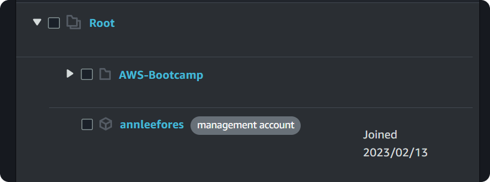

# Week 0 — Billing and Architecture

## **Getting Started**

I began by completing all of the prerequisite tasks that I did not already know/have.

- Created a new AWS account with free tier benefits.
  - A neat trick I learned is that by using aliases, you can use the same email address to create multiple AWS accounts.
  - if your email is example@example.com, you can use example+something@example.com
- Did the free CCP course from Exampro to get familiar with AWS.
- Created Gitpod account.
- Created Momento Account.
- Obtained a Custom Domain Name from Porkbun.
- Signed up for Lucid Charts.
- Signed up for HoneyComb.io.
- Signed up for Rollbar.

## Project Scenario

The first thing I learned from the live session was how to understand the project and how an organization approaches it. The manner in which this is communicated via user personas has greatly aided my understanding of how things are done in an organization.

**Cruddur** is an ephemeral first micro blogging platform ( a lot like twitter but the posts are ephemeral like snapchat posts)

- Backend uses Flask micro web framework (Python)
- Frontend uses React
- The project includes
  - SQL and NoSQL Databases
  - Realtime Modern APIs
  - Multiple Container Services ( *Microservices)
  - A CI/CD Pipeline
  - Decentralized Authentication
  - And more


## Architecting Cloud

Before building out the project, clearly understand what the business wants, so discuss with technical and business team and make sure it meets all of the project's requirements..

It should address the risks, assumptions and constraints.

There are 3 stages to designing an architectural diagram.

1. Conceptual Design
2. Logical Design
3. Physical Design

### Conceptual Design

This is a high-level design that only shows the project's basic operation. Typically used to communicate an idea to business stakeholders or other non-technical members. Because it can be done on a napkin on the spur of the moment, this type of design is also known as a **Napkin Design**.

### Logical Design

Use the services provided by CSP to create a blueprint diagram of how each service is connected and used. Don't go into specifics about each service; just an icon and a name to indicate what it is. This is also referred to as a **Blueprint**.

### Physical Design

Represents the actual thing that is built, including the specifications of each service, IP address, ARN, API gateway, and so on.

### Common Dictionary

- Ask dump questions
- Assume you are an end user interacting with this service.
- Document everything !!!

## Frameworks for building a project

### TOGAF

An architectural framework that provides methods and tools to help with the acceptance, production, use, and maintenance of enterprise architecture. Similar to the AWS Well-Architected Tool.

### AWS Well-Architected Tool

An architectural framework provided by AWS to review your workloads against current best practices.  

6 pillars of AWS Well-Architected Tool:

1. Operational Excellence
2. Security
3. Reliability
4. Performance Efficiency
5. Cost Optimization
6. Sustainability

AWS offers a service to determine whether your project complies with the framework guidelines.

**How to use AWS Well Architected Framework Service ?**  
Using the AWS Well-Architecture Framework Service fill in all of the project's basic details before answering the checklists. These checklist questions are based on the AWS Well-Architected Framework. Based on these inputs, a report will be prepared in the end.

## Architectural Diagram

### [Lucid Chart](https://lucid.app/)

An online diagramming tool that's used in this bootcamp to create the diagrams. Has a limited free tier option.

_Other diagramming tools, guides and AWS assets can be found here [AWS Architecture Icons](https://aws.amazon.com/architecture/icons/)_

**Adding AWS Icons**: Open a new document -> Import Data -> Shapes ->Select _AWS Architecture 2021_ (from Standard Libraries) -> Use Selected Shapes.

**Working with Lucid Charts**:


- Shapes sections contain a complete list of icons; use search to quickly locate icons.
- The toolbar contains all of the standard text and shape formatting tools.
- A document can contain multiple sheets.
- A page area to create diagrams
  - **Enable Infinite Canvas**:  Right click on page area -> page settings -> toggle Infinite canvas
  - **Enable Line Jumps**:   Right click on page area -> page settings -> Line Settings -> Show Line Jumps


### Create Conceptual Design

Create a conceptual design or napkin design for the project.


### Create Logical Design

- Create a logical design using AWS icons, making sure to keep the designs consistent.
- For [**Momento**](https://www.gomomento.com/) icon, go to the official website and inspect the website for the icon svg code.
- Save the code as `filename.svg` using VScode
- When importing to Lucid, the icon fill color may not appear, so import the svg file inside [Figma](https://www.figma.com/) and then save it (This will fix any issue with the icon).
- **To import icon**: Import Data -> Shapes -> Import Shapes -> Add to new library -> Choose SVG file

<div>
  <p align='center'></p>
</div>

- Use the icons to create logical diagram

**Logical Design**


### [Link to the design file in Lucid Chart](https://lucid.app/lucidchart/1c59d211-6a78-496e-bb86-1db0faf0f6a1/edit?viewport_loc=-1416%2C111%2C3751%2C1823%2Cyv5w6~Ut2Wm0&invitationId=inv_27a0a80d-9325-4670-b7ec-59ff707f157e")

<br>

## Security Considerations

Cyber security goal in an organization is to identify and inform any technical risks.  

- Protect data, applications and services associated with cloud.
- Reduce impact of breach and human errors
- Always stay up-to date of things happening in tech

## Adding MFA

- Root user is the most powerful user in an AWS account so its of the highest priority to secure this account
- MFA provides second layer of protection
- Use virtual or hardware MFA devices
- To set MFA -> profile -> security credentials -> set MFA
- Also add MFA to IAM user account.  

## Organization Unit

- Lets you manage everything centrally.
- Lets you create multiple, segregated accounts within an AWS account.
- There is no cost to AWS organisations

**Create OU(s)**  

- Go to AWS Organizations console and start creating OU inside root. Make sure name and tag them when doing so.

<div>
  <p align='center'></p>
</div>

- You have the permission to rename, delete, move OU(s), nested OU(s).

<div>
  <p align='center'></p>
</div>

- In most organizations OU(s) are created and set as standby OU(s) so that it can be allotted faster.

## AWS Cloud Trail

>Auditing service from AWS

<div>
  <p align='center'></p>
</div>

- Records most of the API calls to your AWS account
- Can be used to monitor data security, auditing, etc.

**Create Cloud Trail**

- From dashboard create a trail and enable it for all account in Organization.
- Create a new S3 bucket for it.
- Set a KMS alias and tag the resource.
- Select _Management Events_.
- Tick both API activity options.
- When deleting the Trail make sure to delete s3 bucket and any unused _KMS customer managed keys_ as it can cost money

<p align='center'></p>


## IAM User

User with lesser permission than root user. Its advised to create a IAM user and leave root user only for management related works

> Principle of least privilege

**Create IAM User**

- From IAM add user
- Add user to a group and tag
- Set MFA and Access Keys (for accessing AWS through CLI)

<div>
  <p align='center'></p>
</div>


## Roles & Policies

- Role is a type of IAM identity that can be authenticated and authorized to utilize an AWS resource
  - Role is specifically used to assign to an entity.  

- Policy defines the permissions of the IAM identity.
  - Policy apply to both a role and users/group

**Create Role**

- From IAM left pane select roles.
- When creating a new role choose AWS Services and EC2 for now.
- Select _AdministratorAccess_ policy (gives all admin access)
<div>
  <p align='center'></p>
</div>

**Attach Policy**

- From IAM left pane select policies
- Select _SecurityAudit_ (read only policy) police and attach it to a role or a user group
- Another policy we can attach is AmazonEC2FullAccess (only EC2 access)

<div>
  <p align='center'></p>
</div>

## Service control policies (SCPs)

> A type of organization policy that you can use to manage permissions in your organization

[SCP](https://docs.aws.amazon.com/organizations/latest/userguide/orgs_manage_policies_scps.html)

There are AWS managed and customer managed SCP policies
- SCPs can also be created

**SCP walkthrough**

- Search for SCP and go to features tab and select Service control policies (SCPs)
- or go to IAM and then to SCP
- or through OU

<div>
  <p align='center'></p>
</div>

- Can create a new SCP policy and add this JSON file to prevent users from leaving OU

```bash
{
    "Version": "2012-10-17",
    "Statement": [
        {
            "Effect": "Deny",
            "Action": [
                "organizations:LeaveOrganization"
            ],
            "Resource": "*"
        }
    ]
}
```

- SCP can be attached/detached to an account

## Top 5 Security Best Practices

- Data Protection & Residency in accordance to Security Policy
- Identity & Access Management with Least Privilege
- Governance & Compliance of AWS Services being used
  - Global vs Regional Services
  - Compliant Services
- Shared Responsibility of Threat Detection.
- Incident Response Plans to include Cloud

<br>

## Pricing Basics and Free tier

> Different services have different cost and cost of each service varies based on region

View cost and services that are currently running

- Profile -> Billing Dashboard -> Bills (left pane)

Free tier usage

- Profile -> Billing Dashboard -> Free tier (left pane)

## CloudWatch Alarm

> Notifies when cost threshold is breached

- Profile -> Billing Dashboard -> Billing Preference (left pane)
  - Tick all the preference that match your need
  - Click on _Manage Billing Alerts_ link found at the end of the page

> Manage Billing Alerts is the old method used to alert about spend newer one is budgets

- This opens up CloudWatch in a new tab
- Make sure to set region to N. Virginia. This is the only region where billing data is accessible.
- Click _Create alarm_ & _Click Select Metric_
- From that select _Billing → Total Estimated Charge_
- Select _USD_ metric
- Give a metric name
- Set _Threshold_ value and click next
- Select _Create new topic_ from _Notification_
- Add your notification email and click _Create Topic_
- Click _Next_ and set an _Alarm name_

> 10 alarms are free under free tier

- Review and create alarm
- It will take couple of minutes to become active
- Go back to _Billing Management Console_ page.

<div>
  <p align='center'></p>
</div>

## Budget

> Notifies when  
> 1) your actual spend reaches 85% 
> 2) your actual spend reaches 100% 
> 3) if your forecasted spend is expected to reach 100%.

> 2 budgets for free under free tier

- Profile -> Billing Dashboard -> Budgets (left pane)


- _Use a template (simplified)_
- _Monthly cost budget_
- Set a _Budget Name_
- _Enter your budgeted amount ($)_
- Add email for notification

<div>
  <p align='center'></p>
</div>

## Cost allocation tags

- Profile -> Billing Dashboard -> Cost allocation tags (left pane)
- Tagging will help to calculate the cost of a system with different services that are all tagged by a common tag

<div>
  <p align='center'></p>
</div>

## Cost Explorer

- Profile -> Billing Dashboard -> Cost Explorer (left pane)
- You can see spend based on different filters like date, frequency, region, tag, services, etc.
- View reports and other features

<div>
  <p align='center'></p>
</div>

## AWS Credit

To redeem credits, view credit balance

- Profile -> Billing Dashboard -> Credits (left pane)

Certain credit is only applicable to few services

## AWS estimates calculator

[https://calculator.aws/](https://calculator.aws/)

- Calculate estimate cost for different services
- AWS Calculator provides estimate based on 730 hrs per month
- Pricing in real use case will vary based on usage

<div>
  <p align='center'></p>
</div>

## AWS Free Tier

To view details related to AWS free tier [https://aws.amazon.com/free](https://aws.amazon.com/free)

- Each services has different types of free options

<div>
  <p align='center'></p>
</div>

<br>