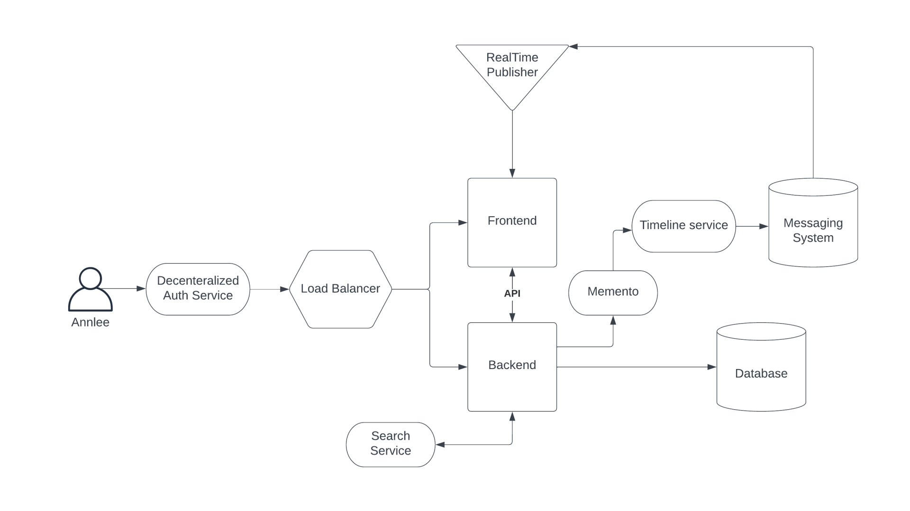
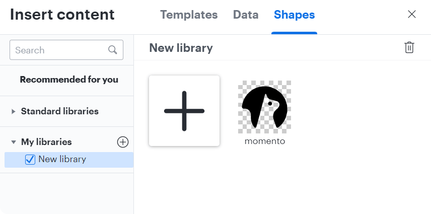

# Week 0 — Billing and Architecture

## **Getting Started**

I began by completing all of the prerequisite tasks that I did not already know/have.

- Created a new AWS account with free tier benefits.
  - A neat trick I learned is that by using aliases, you can use the same email address to create multiple AWS accounts.
  - if your email is example@example.com, you can use example+something@example.com
- Did the free CCP course from Exampro to get familiar with AWS.
- Created Gitpod account.
- Created Momento Account.
- Obtained a Custom Domain Name from Porkbun.
- Signed up for Lucid Charts.
- Signed up for HoneyComb.io.
- Signed up for Rollbar.

## Project Scenario

The first thing I learned from the live session was how to understand the project and how an organization approaches it. The manner in which this is communicated via user personas has greatly aided my understanding of how things are done in an organization.

**Cruddur** is an ephemeral first micro blogging platform ( a lot like twitter but the posts are ephemeral like snapchat posts)

- Backend uses Flask micro web framework (Python)
- Frontend uses React
- The project includes
  - SQL and NoSQL Databases
  - Realtime Modern APIs
  - Multiple Container Services ( *Microservices)
  - A CI/CD Pipeline
  - Decentralized Authentication
  - And more

## Architecting Cloud

Before building out the project, clearly understand what the business wants, so discuss with technical and business team and make sure it meets all of the project's requirements..

It should address the risks, assumptions and constraints.

There are 3 stages to designing an architectural diagram.

1. Conceptual Design
2. Logical Design
3. Physical Design

### Conceptual Design

This is a high-level design that only shows the project's basic operation. Typically used to communicate an idea to business stakeholders or other non-technical members. Because it can be done on a napkin on the spur of the moment, this type of design is also known as a **Napkin Design**.

### Logical Design

Use the services provided by CSP to create a blueprint diagram of how each service is connected and used. Don't go into specifics about each service; just an icon and a name to indicate what it is. This is also referred to as a **Blueprint**.

### Physical Design

Represents the actual thing that is built, including the specifications of each service, IP address, ARN, API gateway, and so on.

### Common Dictionary

- Ask dump questions
- Assume you are an end user interacting with this service.
- Document everything !!!

## Frameworks for building a project

### TOGAF

An architectural framework that provides methods and tools to help with the acceptance, production, use, and maintenance of enterprise architecture. Similar to the AWS Well-Architected Tool.

### AWS Well-Architected Tool

An architectural framework provided by AWS to review your workloads against current best practices.  

6 pillars of AWS Well-Architected Tool:

1. Operational Excellence
2. Security
3. Reliability
4. Performance Efficiency
5. Cost Optimization
6. Sustainability

AWS offers a service to determine whether your project complies with the framework guidelines.

**How to use AWS Well Architected Framework Service ?**  
Using the AWS Well-Architecture Framework Service fill in all of the project's basic details before answering the checklists. These checklist questions are based on the AWS Well-Architected Framework. Based on these inputs, a report will be prepared in the end.

## Architectural Diagram

### [Lucid Chart](https://lucid.app/)

An online diagramming tool that's used in this bootcamp to create the diagrams. Has a limited free tier option.

_Other diagramming tools, guides and AWS assets can be found here [AWS Architecture Icons](https://aws.amazon.com/architecture/icons/)_

**Adding AWS Icons**: Open a new document -> Import Data -> Shapes ->Select _AWS Architecture 2021_ (from Standard Libraries) -> Use Selected Shapes.

**Working with Lucid Charts**:

- Shapes sections contain a complete list of icons; use search to quickly locate icons.
- The toolbar contains all of the standard text and shape formatting tools.
- A document can contain multiple sheets.
- A page area to create diagrams
  - **Enable Infinite Canvas**:  Right click on page area -> page settings -> toggle Infinite canvas
  - **Enable Line Jumps**:   Right click on page area -> page settings -> Line Settings -> Show Line Jumps

### Create Conceptual Design

Create a conceptual design for the project with shapes and arrows.

  

**Napkin Design**

### Create Logical Design

- Create a logical design using AWS icons, making sure to keep the designs consistent.
- For [**Momento**](https://www.gomomento.com/) icon, go to the official website and inspect the website for the icon svg code.
- Save the code as `filename.svg` using VScode
- When importing to Lucid, the icon fill color may not appear, so import the svg file inside [Figma](https://www.figma.com/) and then save it (This will fix any issue with the icon).
- **To import icon**: Import Data -> Shapes -> Import Shapes -> Add to new library -> Choose SVG file

  

- Use the icons to create logical diagram

**Logical Design**

<a href="https://lucid.app/lucidchart/1c59d211-6a78-496e-bb86-1db0faf0f6a1/edit?viewport_loc=-1416%2C111%2C3751%2C1823%2Cyv5w6~Ut2Wm0&invitationId=inv_27a0a80d-9325-4670-b7ec-59ff707f157e">

Link to the design file in Lucid Chart

</a>