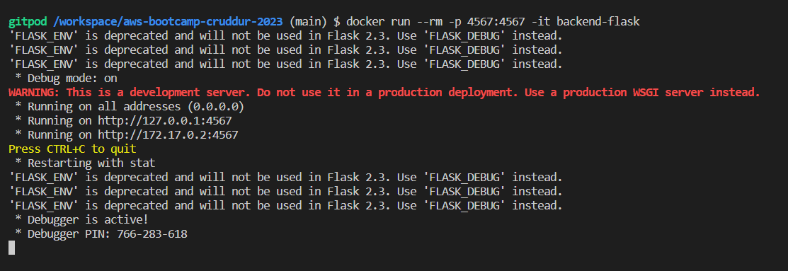

# Week 1 — App Containerization

## Required Homework

- [Live Stream](#application-containerization)  
- [Containerize Application](#application-containerization)
- [Document the Notification Endpoint](#adding-openapi-endpoint)
- [Backend Endpoint for Notifications](#define-endpoint-in-backend)
- [React Page for Notifications](#react-frontend-for-notifications)
- [DynamoDB Local Container](#dynamodb-local)
- [Postgres Container](#postgres)

## [Homework Challenges](#homework-challenges-1)

TODO

---

## Application containerization

Makes it more portable i.e., can be deployed on different systems without worrying about dependency issues.

Various community-managed application container images that adhere to best practices → [https://www.linuxserver.io/](https://www.linuxserver.io/)

### Dockerhub

[https://hub.docker.com/](https://hub.docker.com/)

Container registry provided by docker where you can host container images for free.

Similar to how Github is for code, Dockerhub is for docker images.

### OCI (Open Container Initiative)

[https://opencontainers.org/](https://opencontainers.org/)

- Standard guidelines for building images and registries.
- Docker is OCI compliant service.

## Backend

- Create a file `Dockerfile` here: `backend-flask/Dockerfile`
- Add the following docker configuration code to the file.

```docker
FROM python:3.10-slim-buster

# Inside container
# make a new directory and move into it
WORKDIR /backend-flask

# local -> inside container
# copy local requirements.txt to inside container
COPY requirements.txt requirements.txt

# install dependencies listed in requirements.txt inside the container
RUN pip3 install -r requirements.txt

# copy contents from current local directory to inside container
COPY . .

# set env variables inside container and will remain when container is running
ENV FLASK_ENV=development

#TODO
EXPOSE ${PORT}

# CMD -> command
# Run shell command to run flask app

CMD [ "python3", "-m" , "flask", "run", "--host=0.0.0.0", "--port=4567"]
```

- In `Dockerfile` each line is instructions to setup a docker image layer by layer.
- `FROM python:3.10-slim-buster` → get python image from local/dockerhub.
- Docker file uses another docker file to build image ( I like to call this **Dockerception**)
- `WORKDIR /backend-flask` → create this folder in container and move into it.
- `COPY requirements.txt requirements.txt` → Copy `requirements.txt` from local to docker container.
- `RUN pip3 install -r requirements.txt` → install dependencies listed in requirement.txt inside the container.
- `COPY . .` → Copy everything in the current directory to the docker container.
- `ENV FLASK_ENV=development` → set env variables inside container.
- `CMD [ "python3", "-m" , "flask", "run", "--host=0.0.0.0", "--port=4567"]` → shell command to launch the flask application.
- Difference b/w RUN and CMD.

    | RUN | CMD |
    | --- | --- |
    | Used to add a layer to an image. | The command that the container will execute when it boots up |
    | Install libraries, dependencies |  |
    | For example run : apt install htop |  |
- Difference b/w Container and Virtual Machine


### Running Backend locally

```bash
cd backend-flask
export FRONTEND_URL="*"
export BACKEND_URL="*"
python3 -m flask run --host=0.0.0.0 --port=4567
```

- `-m` → module (specifying to use flask module)
- `--host=0.0.0.0` → Binding to 0.0.0.0, expose an application outside the scope of the env we are running. 0.0.0.0 → everything address (needed when running containers)
- `--port=4567` → start on this port.
- Unlock the link for port 4567 in Ports. A green dot before the port indicates that it is currently active.


- To view JSON data, open the link and append `/api/activities/home`

### Build Backend Container Image

- From root directory execute this command to build docker image.

    ```bash
    docker build -t  backend-flask ./backend-flask
    ```

  - `-t` → tag : name
  - `backend-flask` →  docker image name
- Downloads dependencies and creates layers for container image.


### Run Backend Container

- To run the docker container backend-flask

    ```bash
    docker run --rm -p 4567:4567 -it backend-flask
    ```

  - `--rm` → automatically clean up the container and remove the file system when the container exits.
  - `--it` → is short for --interactive + --tty. Running docker with this command it takes you straight inside the container.  
  - `-d` → run in detached mode/ run in background:

        ```bash
         docker container run --rm -p 4567:4567 -d backend-flask
        ```

- To run the container with the environment variables set use `-e` .

```bash
# passing env value in same line
docker run --rm -p 4567:4567 -it -e FRONTEND_URL='*' -e BACKEND_URL='*' backend-flask

#OR

# passing env value that you have already set in your local machine
docker run --rm -p 4567:4567 -it  -e FRONTEND_URL -e BACKEND_URL backend-flask
```



- Unlock and open link and go to home URL


## Frontend

```bash
cd frontend-react-js
npm i #install node dependencies
```

- Create a `Dockerfile` file here: `frontend-react-js/Dockerfile`

```docker
FROM node:16.18

ENV PORT=3000

COPY . /frontend-react-js
WORKDIR /frontend-react-js
RUN npm install
EXPOSE ${PORT}
CMD ["npm", "start"]
```

### Running Frontend locally

- set env `REACT_APP_BACKEND_URL="*"`
- To run frontend locally -  `npm start`
- Go to ports, unlock, and then click the frontend link.

### Build Frontend Container Image

- From root directory execute.

```bash
docker build -t frontend-react-js ./frontend-react-js
```


### Run Frontend Container

- To run the frontend-react-js docker container, execute this from the root folder.

```bash
docker run --rm -p 3000:3000 -it -e REACT_APP_BACKEND_URL frontend-react-js
```


- Click the link under the port tab to launch the frontend.


## Useful Docker Commands & Tips

### List containers

- `docker ps` → view running containers.
- `docker ps -a` → to view active and inactive containers

### List Images

- `docker images`
- or click docker extension and under images.

### Delete an Image

```bash
docker image rm backend-flask --force
```

### Help

- Append any docker command with `--help`

### Container Logs

- From VS code → docker extension. Right click on the running container and click **View Logs.**
- or use shell commands given below.

```bash
docker logs CONTAINER_ID -f
docker logs backend-flask -f
docker logs $CONTAINER_ID -f
```

### Access Container Shell

- From VS Code, right click on running container and click **Access Shell**.
- or Connect to container shell from terminal

```bash
 docker exec CONTAINER_ID -it /bin/bash
```

### Store Container ID in ENV

```bash
CONTAINER_ID=$(docker run --rm -p 4567:4567 -d backend-flask)
```

### Overriding Ports

```bash
FLASK_ENV=production PORT=8080 docker run -p 4567:4567 -it backend-flask
```

## Docker-Compose - Multiple Containers

> Compose is a tool for defining and running multi-container Docker applications. With Compose, you use a YAML file to configure your application’s services. Then, with a single command, you create and start all the services from your configuration.
>
- Create `docker-compose.yml` at the root of your project.


- Paste this YAML code inside `docker-compose.yml` or `compose.yml` file

```yaml
version: "3.8"
services:
  backend-flask:
    environment:
      FRONTEND_URL: "https://3000-${GITPOD_WORKSPACE_ID}.${GITPOD_WORKSPACE_CLUSTER_HOST}"
      BACKEND_URL: "https://4567-${GITPOD_WORKSPACE_ID}.${GITPOD_WORKSPACE_CLUSTER_HOST}"
    build: ./backend-flask
    ports:
      - "4567:4567"
    volumes:
      - ./backend-flask:/backend-flask
  frontend-react-js:
    environment:
      REACT_APP_BACKEND_URL: "https://4567-${GITPOD_WORKSPACE_ID}.${GITPOD_WORKSPACE_CLUSTER_HOST}"
    build: ./frontend-react-js
    ports:
      - "3000:3000"
    volumes:
      - ./frontend-react-js:/frontend-react-js

# the name flag is a hack to change the default prepend folder
# name when outputting the image names
networks: 
  internal-network:
    driver: bridge
    name: cruddur
```

- We pass in the env variable, ports, volumes
- The new `volumes` key mounts the project directory (current directory) on the host to work directory inside the container, allowing you to modify the code on the fly, without having to rebuild the image.
- Launch both frontend and backend container simultaneously while configuring env, mounting, etc → `docker compose up`
- Or right click the `docker-compose.yml` file on VS code and click **Compose Up**


- Go to ports, unlock both, and launch the frontend with data.


- Because we're using mounted volumes, any changes we make to local code will be reflected in the application running inside Docker - useful for development.
- `docker compose down` → Stops containers and removes containers, networks, volumes, and images created by up
- `docker compose down --volume`  → Remove containers and volume

## DynamoDB local

[Link to Amazon Docs](https://docs.aws.amazon.com/amazondynamodb/latest/developerguide/DynamoDBLocal.DownloadingAndRunning.html)

DynamoDB Local emulates a DynamoDB database in your local environment for rapid development and table design iteration

- Add DynamoDB local setup instructions to `docker-compose.yml`

```bash
dynamodb-local:
    # https://stackoverflow.com/questions/67533058/persist-local-dynamodb-data-in-volumes-lack-permission-unable-to-open-databa
    # We needed to add user:root to get this working.
    user: root
    command: "-jar DynamoDBLocal.jar -sharedDb -dbPath ./data"
    image: "amazon/dynamodb-local:latest"
    container_name: dynamodb-local
    ports:
      - "8000:8000"
    volumes:
      - "./docker/dynamodb:/home/dynamodblocal/data"
    working_dir: /home/dynamodblocal
```

### Working with DynamoDB

- `docker compose up`  to launch Frontend, Backend & DynamoDB
- Create a table

```bash
aws dynamodb create-table \
    --endpoint-url http://localhost:8000 \
  --table-name Music \
    --attribute-definitions \
        AttributeName=Artist,AttributeType=S \
        AttributeName=SongTitle,AttributeType=S \
    --key-schema AttributeName=Artist,KeyType=HASH AttributeName=SongTitle,KeyType=RANGE \
    --provisioned-throughput ReadCapacityUnits=1,WriteCapacityUnits=1 \
    --table-class STANDARD
```


- Create an Item

```bash
aws dynamodb put-item \
    --endpoint-url http://localhost:8000 \
    --table-name Music \
    --item \
        '{"Artist": {"S": "No One You Know"}, "SongTitle": {"S": "Call Me Today"}, "AlbumTitle": {"S": "Somewhat Famous"}}' \
    --return-consumed-capacity TOTAL
```


- List Tables

```bash
aws dynamodb list-tables --endpoint-url http://localhost:8000
```


- Get Data

```bash
aws dynamodb scan --table-name Music --query "Items" --endpoint-url http://localhost:8000
```


Note:

- Add DynamoDB local files to `.gitignore`, so that it doesn’t get committed to Github
- Add this line to `.gitignore`→ `docker/*`

## Postgres

- Add Postgres setup instructions to `docker-compose.yml`

```yaml
db:
    image: postgres:13-alpine
    restart: always
    environment:
      - POSTGRES_USER=postgres
      - POSTGRES_PASSWORD=password
    ports:
      - '5432:5432'
    volumes: 
      - db:/var/lib/postgresql/data
```

- Paste this `Volume` at the end of the `docker-compose.yml` file

```yaml
volumes:
  db:
    driver: local
```

- `driver: local` storing database locally on this machine

### Working with PostgreSQL

- `docker compose up`  to launch Frontend, Backend,  Postgres Server & DynamoDB
- To work with PostgreSQL you need to have a client library to interact with the server.
- And to auto install client library, add this to `.gitpod.yml`

```yaml
- name: postgres
    init: |
      curl -fsSL https://www.postgresql.org/media/keys/ACCC4CF8.asc|sudo gpg --dearmor -o /etc/apt/trusted.gpg.d/postgresql.gpg
      echo "deb http://apt.postgresql.org/pub/repos/apt/ `lsb_release -cs`-pgdg main" |sudo tee  /etc/apt/sources.list.d/pgdg.list
      sudo apt update
      sudo apt install -y postgresql-client-13 libpq-dev
```

- Execute `psql -U postgres --host localhost` to connect the postgres server that’s already running at port `5432`
- Type password (which is password itself) to connect


- `\q` to quit

- To view PostgreSQL install this extension → `cweijan.vscode-postgresql-client2`
  - Add it to `.gitpod.yml` by clicking settings icon


**Note:**

- In the end the docker compose file should look like this [`docker-compose.yml`](media/week1/code/template.docker-compose.yml)  
- Entire .gitpod.yml should look like this [`.gitpod.yml`](media/week1/code/template.gitpod.yml)

## OpenAPI

[https://www.openapis.org/](https://www.openapis.org/)

- Used to visualize and interact with API
- OpenAPI is a standard for defining API
- Open  `openapi-3.0.yml` and click **/API** extension.


- Lots of services support OpenAPI
- While `openapi-3.0.yml` file is open, click the window with search icon on top right corner to open up the OpenAPI preview window.


## Signing Up

- Run `npm i` to install node modules if they’re not available in *frontend-react-js* folder and `docker-compose up`
- Sign Up and confirm by typing email and `1234` hard coded confirmation code.


## Notification Feature

### Adding OpenAPI endpoint

- To add an endpoint for notification use the OpenAPI extension to create a new path.


- Edit the new path for notification endpoint.

```yaml
/api/activites/notifications:
    get:
      description: 'Return a feed of activity for all of those that I follow'
      tags:
        - activities
      parameters: []
      responses:
        '200':
          description: Return an array of activities
          content:
            application/json:
              schema:
                type: array
                items:
                  $ref: '#/components/schemas/Activity'
```

- To learn more about openapi.yml → [https://spec.openapis.org/oas/v3.1.0](https://spec.openapis.org/oas/v3.1.0)

### Define endpoint in backend

- Define routes

```python
@app.route("/api/activities/notifications", methods=['GET'])
def data_notification():
  data = NotificationActivities.run()
  return data, 200
```

- Create a file `notification_activities.py` inside `services/`  with this code

```python
from datetime import datetime, timedelta, timezone

class NotificationActivities:
  def run():
    now = datetime.now(timezone.utc).astimezone()
    results = [{
      'uuid': '68f126b0-1ceb-4a33-88be-d90fa7109eee',
      'handle':  'Tron',
      'message': 'I am a character in a movie where human gets inside game.',
      'created_at': (now - timedelta(days=2)).isoformat(),
      'expires_at': (now + timedelta(days=5)).isoformat(),
      'likes_count': 5,
      'replies_count': 1,
      'reposts_count': 0,
      'replies': [{
        'uuid': '26e12864-1c26-5c3a-9658-97a10f8fea67',
        'reply_to_activity_uuid': '68f126b0-1ceb-4a33-88be-d90fa7109eee',
        'handle':  'Worf',
        'message': 'This post has no honor!',
        'likes_count': 0,
        'replies_count': 0,
        'reposts_count': 0,
        'created_at': (now - timedelta(days=2)).isoformat()
      }],
    }
    ]
    return results
```

- Import  `notification_activities.py` inside app.py
- Go to backend link and append `api/activities/notifications` to view response JSON

### React Frontend for notifications

- Open `frontend-react-js` folder
- Add this import statement in App.js

`import NotificationsFeedPage from './pages/NotificationsFeedPage';`

- Add this to `const router = createBrowserRouter([`

```jsx
{
  path: "/notifications",
  element: <NotificationsFeedPage />
},
```

- Go to `pages/` and create `NotificationsFeedPage.js` file and add this content -> [NotificationsFeedPage.js](media/week1/code/template.NotificationsFeedPage.js)

- Can create `NotificationsFeedPage.css` in the same folder if you need to add styling
- Launch frontend, sign in and go to notifications


---

## Homework Challenges
