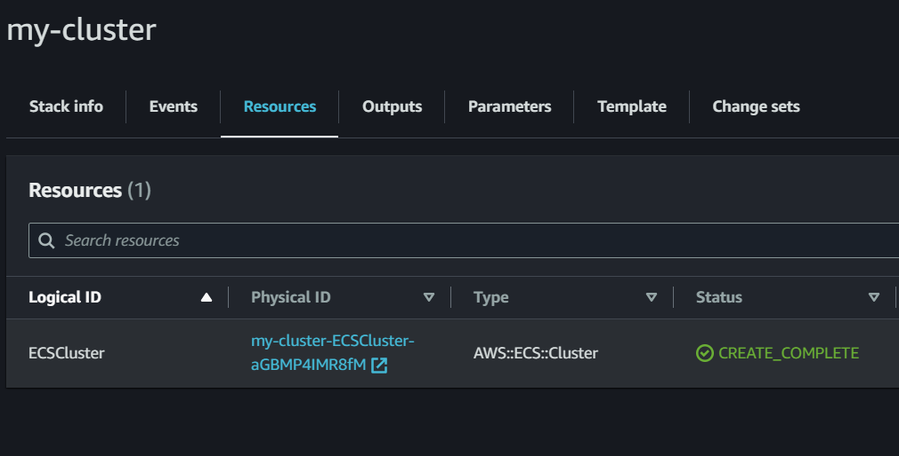
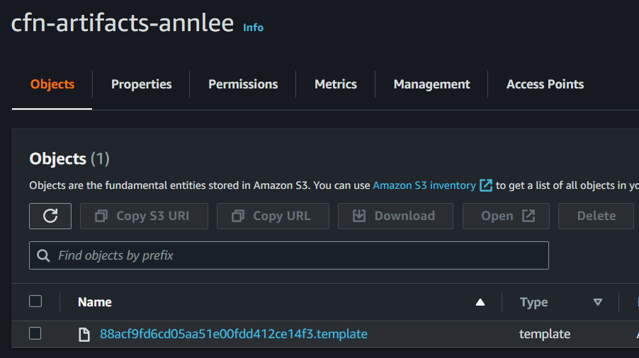
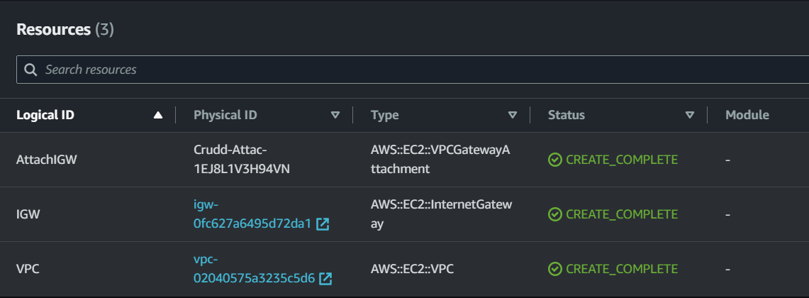
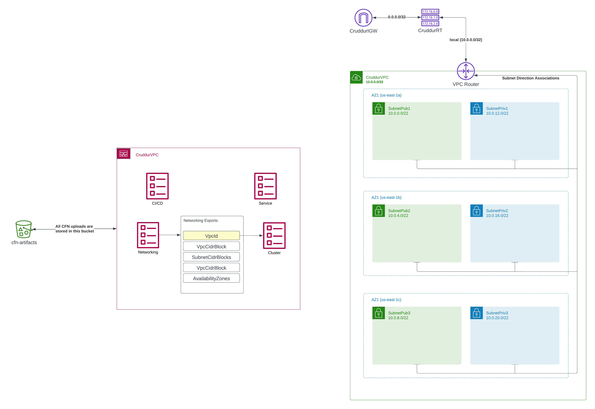

# Week 10 — CloudFormation Part 1

## [Required Homework](#required-homework-1)

- [Cluster CFN](#cluster-cfn)
- [CFN for Networking Layer](#cfn-for-networking-layer)
- [Network Layer Architecture](#network-layer-architecture)
- [CFN Cluster Layer](#cfn-cluster-layer)

AWS CloudFormation is a service provided by Amazon Web Services that enables the automation of infrastructure deployment in a repeatable and scalable way. It allows users to define infrastructure resources such as servers, databases, load balancers, and more, as code in templates, which can be version-controlled, reviewed, and tested like any other software code. With CloudFormation, users can create, update, or delete resources in a consistent and predictable manner, across multiple AWS accounts and regions. This helps to ensure the infrastructure is reliable, efficient, and easy to manage.

- State in CFN is handled by AWS as opposed to how it’s handled in Terraform.

### Multi-layer architecture

1. Web tier - VM, Serverless function, Serverless container
2. App tier - Cluster, ALB, Auto Scaling groups.
3. DB tier - DB

### Cluster CFN

You can write CloudFormation (CFN) using either JSON or YAML. To create a CFN file, you need to create a `template.yaml` file inside the `aws/cfn` folder. The first line of the file should contain the format version.

```yaml
AWSTemplateFormatVersion: "2010-09-09"
```

Add this section below for description

```yaml
Description: |
  Setup ECS Cluster
```

Splitting the CloudFormation (CFN) template for networking infrastructure and application into separate files allows you to update the infrastructure selectively without impacting the application.

[AWS CFN Sample Templates](https://aws.amazon.com/cloudformation/resources/templates/)

[Amazon Elastic Container Service template snippets](https://docs.aws.amazon.com/AWSCloudFormation/latest/UserGuide/quickref-ecs.html)

Add ECS Cluster resource.

```yaml
Resources:
  ECSCluster: # LogicalName
    Type: "AWS::ECS::Cluster"
```

LogicalName shows up in CFN for reference.

The AWS Command Line Interface (CLI) and CloudFormation (CFN) use the same AWS API. Therefore, much of what is documented in the AWS CLI documentation can also be used with CFN.

[ECS Cluster CFN Docs](https://docs.aws.amazon.com/AWSCloudFormation/latest/UserGuide/aws-resource-ecs-cluster.html)

To deploy CFN create a new bin script and make it executable.

```bash
#! /usr/bin/bash

set -e # stop execution if anything fails

# set the absolute path to the file
abs_filepath="$ABS_PATH/aws/cfn/template.yaml"

# get the relative path to the file from the current directory
FilePath=$(realpath --relative-base="$PWD" "$abs_filepath")

aws cloudformation deploy \
  --stack-name "my-cluster" \
  --template-file $FilePath \
  --no-execute-changeset \
  --capabilities CAPABILITY_NAMED_IAM
```

- Run this script to create a changes and review them first. The `--no-execute-changeset` is used for that.
- Copy and paste the returned command to view the changeset in the terminal or navigate to the CloudFormation console.
- After reviewing the changeset in the console, execute the changeset by choosing the `Roll back all stack resources` option.



To change the name of a cluster in AWS, add the `ClusterName` property to the cluster's properties.

```yaml
AWSTemplateFormatVersion: "2010-09-09"
Description: |
  Setup ECS Cluster

Resources:
  ECSCluster: # LogicalName
    Type: "AWS::ECS::Cluster"
    Properties:
      ClusterName: MyCluster
```

Note: CloudTrail can also be used to view detailed CFN logs.

#### Validate Template

`aws cloudformation validate-template`

To validate template use this CLI command.

```yaml
aws cloudformation validate-template --template-body file://<path_to_template_file>
```

On success, this is returned

```yaml
{ "Parameters": [], "Description": "Setup ECS Cluster\n" }
```

[**CFN Lint**](https://github.com/aws-cloudformation/cfn-lint)

To add CloudFormation (CFN) linting support to your integrated development environment (IDE), you can install [cfn-lint](https://github.com/aws-cloudformation/cfn-lint) using the command `pip install cfn-lint`.

To run the linter, use the command `cfn-lint <filepath>`. Additionally, you can add the cfn installation to your deploy script and `.gitpod.yaml` file.

There are several other tools available for CFN, such as [taskcat](https://github.com/aws-ia/taskcat) and [CFN guard](https://github.com/aws-cloudformation/cloudformation-guard) (policy-as-code) that can help you validate cloud environments.

[**CFN Guard**](https://github.com/aws-cloudformation/cloudformation-guard)

To install CFN Guard and validate cloud environments with policy-as-code, follow these steps:

- If you haven't already, install Rust.
- Install CFN Guard using the command `cargo install cfn-guard`.
- Create the `bin/cfn/task-definition.guard` file.

```
aws_ecs_cluster_configuration {
  rules = [
    {
      rule = "task_definition_encryption"
      description = "Ensure task definitions are encrypted"
      level = "error"
      action {
        type = "disallow"
        message = "Task definitions in the Amazon ECS cluster must be encrypted"
      }
      match {
        type = "ecs_task_definition"
        expression = "encrypt == false"
      }
    },
    {
      rule = "network_mode"
      description = "Ensure Fargate tasks use awsvpc network mode"
      level = "error"
      action {
        type = "disallow"
        message = "Fargate tasks in the Amazon ECS cluster must use awsvpc network mode"
      }
      match {
        type = "ecs_task_definition"
        expression = "network_mode != 'awsvpc'"
      }
    },
    {
      rule = "execution_role"
      description = "Ensure Fargate tasks have an execution role"
      level = "error"
      action {
        type = "disallow"
        message = "Fargate tasks in the Amazon ECS cluster must have an execution role"
      }
      match {
        type = "ecs_task_definition"
        expression = "execution_role == null"
      }
    },
  ]
}
```

- To generate a CFN Guard rule based on your CFN template, run the command `cfn-guard rulegen --template <filepath>`.
- Copy the output generated by this command and add it to the `bin/cfn/ecs_cluster.guard` file.
- To validate your CFN template against the rule created in the previous step, run the command `cfn-guard validate`.

#### Deploy CFN

To create an artifact S3 bucket for your CloudFormation (CFN) templates, follow these steps:

- Create a new S3 bucket with a name like `cfn-artifacts-<something>`.
- Update the deploy script and make changes to the CFN template, such as updating its name, to ensure that the deploy process works correctly.

```bash
#! /usr/bin/bash

set -e # stop execution if anything fails

# set the absolute path to the file
abs_filepath="$ABS_PATH/aws/cfn/template.yaml"

# get the relative path to the file from the current directory
FilePath=$(realpath --relative-base="$PWD" "$abs_filepath")

cfn-lint $FilePath

aws cloudformation deploy \
  --stack-name "my-cluster" \
  --s3-bucket "cfn-artifacts-annlee" \
  --template-file $FilePath \
  --no-execute-changeset \
  --capabilities CAPABILITY_NAMED_IAM
```

- Run deploy script



### CFN For Networking Layer

Before running any CloudFormation (CFN) template, create an S3 bucket to contain all of the artifacts used by CFN.

Additionally, if you have previously created a CFN stack that you need to delete, you can do so before running a new stack creation command.

```bash
aws s3 mk s3://cfn-artifacts-annlee
export CFN_BUCKET="cfn-artifacts-annlee"
gp env CFN_BUCKET="cfn-artifacts-annlee"
```

#### Create a VPC using CFN

[AWS VPC CFN](https://docs.aws.amazon.com/AWSCloudFormation/latest/UserGuide/aws-resource-ec2-vpc.html)

- Create `aws/cfn/networking/template.yaml`

```yaml
AWSTemplateFormatVersion: "2010-09-09"

# VPC
Resources:
  VPC:
    # https://docs.aws.amazon.com/AWSCloudFormation/latest/UserGuide/aws-resource-ec2-vpc.html
    Type: AWS::EC2::VPC
    Properties:
      CidrBlock: !Ref VpcCidrBlock
      EnableDnsHostnames: true
      EnableDnsSupport: true
      InstanceTenancy: default
      Tags:
        - Key: Name
          Value: !Sub "${AWS::StackName}VPC"
```

- Create a network specific deploy script `bin/cfn/networking-deploy`

```bash
#! /usr/bin/bash

set -e # stop execution if anything fails

# set the absolute path to the file
abs_filepath="$ABS_PATH/aws/cfn/networking/template.yaml"

# get the relative path to the file from the current directory
FilePath=$(realpath --relative-base="$PWD" "$abs_filepath")

cfn-lint $FilePath

aws cloudformation deploy \
  --stack-name "Cruddur" \
  --s3-bucket "cfn-artifacts-annlee" \
  --template-file $FilePath \
  --no-execute-changeset \
  --tags group=cruddur-cluster \
  --capabilities CAPABILITY_NAMED_IAM
```

When creating a Virtual Private Cloud (VPC) using CloudFormation (CFN), it's important to choose an appropriate CIDR block size, as this determines the number of available IP addresses. You can use a tool like [https://cidr.xyz/](https://cidr.xyz/) to help with CIDR block selection. Keep in mind that the CIDR block size should also accommodate the number of services needed for higher scalability.

After selecting an appropriate CIDR block (10.0.0.0 to 10.255.255.255), run the deploy script and review the changeset before deploying the VPC changes. Note that a route table is created by default.

If you need to delete the VPC, first delete the CFN stack associated with it.

**Create Internet Gateway CFN**

- Add this under resources to create IGW.

```yaml
IGW:
  Type: AWS::EC2::InternetGateway
  Properties:
    Tags:
      - Key: Name
        Value: !Sub "${AWS::StackName}IGW"
```

- To attach IGW add this below IGW service.

```yaml
AttachIGW:
  Type: AWS::EC2::VPCGatewayAttachment
  Properties:
    VpcId: !Ref VPC
    InternetGatewayId: !Ref IGW
```

Note: Since YAML compiles to JSON, including JSON inside an YAML is valid.

To deploy changes using CloudFormation (CFN), try running the deployment script and approving the changeset.



Note that a Network Access Control List (NACL) is created by default. If you encounter any issues, make sure to check the NACL outbound rules.

For easy reference, add a link to the documentation as a comment to the code.

#### [Creating Route Tables](https://docs.aws.amazon.com/AWSCloudFormation/latest/UserGuide/aws-resource-ec2-routetable.html)

```yaml
RouteTable:
  # https://docs.aws.amazon.com/AWSCloudFormation/latest/UserGuide/aws-resource-ec2-routetable.html
    Type: AWS::EC2::RouteTable
    Properties:
      VpcId: !Ref VPC
      Tags:
        - Key: Name
          Value: !Sub "${AWS::StackName}RT"

  RouteToIGW:
  # https://docs.aws.amazon.com/AWSCloudFormation/latest/UserGuide/aws-resource-ec2-route.html
    Type: AWS::EC2::Route
    DependsOn: AttachIGW
    Properties:
      RouteTableId: !Ref RouteTable
      GatewayId: !Ref IGW
      DestinationCidrBlock: 0.0.0.0/0
```

#### [Parameter store values](https://docs.aws.amazon.com/AWSCloudFormation/latest/UserGuide/parameters-section-structure.html)

Add this above resources

```yaml
Parameters:
  # https://docs.aws.amazon.com/AWSCloudFormation/latest/UserGuide/parameters-section-structure.html
  VpcCidrBlock:
    Type: String
    Default: 10.0.0.0/16

  Az1:
    Type: AWS::EC2::AvailabilityZone::Name
    Default: us-east-1a

  SubnetCidrBlocks:
    Description: "Comma-delimited list of CIDR blocks for our private public subnets"
    Type: CommaDelimitedList
    Default: >
      10.0.0.0/24, 
      10.0.4.0/24, 
      10.0.8.0/24, 
      10.0.12.0/24,
      10.0.16.0/24,
      10.0.20.0/24
  Az2:
    Type: AWS::EC2::AvailabilityZone::Name
    Default: us-east-1b
  Az3:
    Type: AWS::EC2::AvailabilityZone::Name
    Default: us-east-1c
```

#### [Subnets](https://docs.aws.amazon.com/AWSCloudFormation/latest/UserGuide/aws-resource-ec2-subnet.html)

```yaml
SubnetPub1:
    # https://docs.aws.amazon.com/AWSCloudFormation/latest/UserGuide/aws-resource-ec2-subnet.html
    Type: AWS::EC2::Subnet
    Properties:
      CidrBlock: !Select [0, !Ref SubnetCidrBlocks]
      EnableDns64: false
      MapPublicIpOnLaunch: true # public subnet
      VpcId: !Ref VPC
      AvailabilityZone: !Ref Az1
      Tags:
      - Key: Name
        Value: !Sub "${AWS::StackName}SubnetPub1"

  SubnetPub2:
    Type: AWS::EC2::Subnet
    Properties:
      CidrBlock: !Select [1, !Ref SubnetCidrBlocks]
      EnableDns64: false
      MapPublicIpOnLaunch: true # public subnet
      VpcId: !Ref VPC
      AvailabilityZone: !Ref Az2
      Tags:
      - Key: Name
        Value: !Sub "${AWS::StackName}SubnetPub2"

  SubnetPub3:
    Type: AWS::EC2::Subnet
    Properties:
      CidrBlock: !Select [2, !Ref SubnetCidrBlocks]
      EnableDns64: false
      MapPublicIpOnLaunch: true # public subnet
      VpcId: !Ref VPC
      AvailabilityZone: !Ref Az3
      Tags:
      - Key: Name
        Value: !Sub "${AWS::StackName}SubnetPub3"

  SubnetPriv1:
    Type: AWS::EC2::Subnet
    Properties:
      CidrBlock: !Select [3, !Ref SubnetCidrBlocks]
      EnableDns64: false
      MapPublicIpOnLaunch: false # public subnet
      VpcId: !Ref VPC
      AvailabilityZone: !Ref Az1
      Tags:
      - Key: Name
        Value: !Sub "${AWS::StackName}SubnetPub1"

  SubnetPriv2:
    Type: AWS::EC2::Subnet
    Properties:
      CidrBlock: !Select [4, !Ref SubnetCidrBlocks]
      EnableDns64: false
      MapPublicIpOnLaunch: false # public subnet
      VpcId: !Ref VPC
      AvailabilityZone: !Ref Az2
      Tags:
      - Key: Name
        Value: !Sub "${AWS::StackName}SubnetPub2"

  SubnetPriv3:
    Type: AWS::EC2::Subnet
    Properties:
      CidrBlock: !Select [5, !Ref SubnetCidrBlocks]
      EnableDns64: false
      MapPublicIpOnLaunch: false # public subnet
      VpcId: !Ref VPC
      AvailabilityZone: !Ref Az3
      Tags:
      - Key: Name
        Value: !Sub "${AWS::StackName}SubnetPub3"
```

#### [SubnetRouteTableAssociation](https://docs.aws.amazon.com/AWSCloudFormation/latest/UserGuide/aws-resource-ec2-subnetroutetableassociation.html)

```yaml
SubnetPub1RTAssociation:
  # https://docs.aws.amazon.com/AWSCloudFormation/latest/UserGuide/aws-resource-ec2-subnetroutetableassociation.html
    Type: AWS::EC2::SubnetRouteTableAssociation
    Properties:
      SubnetId: !Ref SubnetPub1
      RouteTableId: !Ref RouteTable

  SubnetPub2RTAssociation:
  # https://docs.aws.amazon.com/AWSCloudFormation/latest/UserGuide/aws-resource-ec2-subnetroutetableassociation.html
    Type: AWS::EC2::SubnetRouteTableAssociation
    Properties:
      SubnetId: !Ref SubnetPub2
      RouteTableId: !Ref RouteTable

  SubnetPub3RTAssociation:
  # https://docs.aws.amazon.com/AWSCloudFormation/latest/UserGuide/aws-resource-ec2-subnetroutetableassociation.html
    Type: AWS::EC2::SubnetRouteTableAssociation
    Properties:
      SubnetId: !Ref SubnetPub3
      RouteTableId: !Ref RouteTable

  SubnetPriv1RTAssociation:
  # https://docs.aws.amazon.com/AWSCloudFormation/latest/UserGuide/aws-resource-ec2-subnetroutetableassociation.html
    Type: AWS::EC2::SubnetRouteTableAssociation
    Properties:
      SubnetId: !Ref SubnetPriv1
      RouteTableId: !Ref RouteTable

  SubnetPriv2RTAssociation:
  # https://docs.aws.amazon.com/AWSCloudFormation/latest/UserGuide/aws-resource-ec2-subnetroutetableassociation.html
    Type: AWS::EC2::SubnetRouteTableAssociation
    Properties:
      SubnetId: !Ref SubnetPriv2
      RouteTableId: !Ref RouteTable

  SubnetPriv3RTAssociation:
  # https://docs.aws.amazon.com/AWSCloudFormation/latest/UserGuide/aws-resource-ec2-subnetroutetableassociation.html
    Type: AWS::EC2::SubnetRouteTableAssociation
    Properties:
      SubnetId: !Ref SubnetPriv3
      RouteTableId: !Ref RouteTable
```

Deploy and approve changeset.


#### [CFN Outputs](https://docs.aws.amazon.com/AWSCloudFormation/latest/UserGuide/outputs-section-structure.html)

Add this at the end of the template.yaml file.

```yaml
Outputs:
  VpcId:
    Value: !Ref VPC
    Export:
      Name: !Sub "${AWS::StackName}VpcId"
  VpcCidrBlock:
    Value: !GetAtt VPC.CidrBlock
    Export:
      Name: !Sub "${AWS::StackName}VpcCidrBlock"
  SubnetCidrBlocks:
    Value: !Join [",", !Ref SubnetCidrBlocks]
    Export:
      Name: !Sub "${AWS::StackName}SubnetCidrBlocks"
  SubnetIds:
    Value: !Join
      - ","
      - - !Ref SubnetPub1 # - - array inside an array
        - !Ref SubnetPub2
        - !Ref SubnetPub3
        - !Ref SubnetPriv1
        - !Ref SubnetPriv2
        - !Ref SubnetPriv3
    Export:
      Name: !Sub "${AWS::StackName}SubnetIds"
  AvailabilityZones:
    Value: !Join
      - ","
      - - !Ref Az1
        - !Ref Az2
        - !Ref Az3
    Export:
      Name: !Sub "${AWS::StackName}AvailabilityZones"
```

### Network Layer Architecture



[**Lucid Charts Diagram Link**](https://lucid.app/lucidchart/a754d5e7-4478-4d5b-8b9a-dfdd88b1e4e9/edit?viewport_loc=-1980%2C-682%2C6677%2C2456%2C0_0&invitationId=inv_84c3639c-695c-4ee3-a111-4409e5feae3d)

### CFN Cluster Layer

- Create `aws/cfn/cluster/template.yaml`
- Update `bin/cfn/deploy` to `bin/cfn/cluster-deploy` and update it’s content.

```yaml
#! /usr/bin/bash

set -e # stop execution if anything fails

# set the absolute path to the file
abs_filepath="$ABS_PATH/aws/cfn/cluster/template.yaml"

# get the relative path to the file from the current directory
FilePath=$(realpath --relative-base="$PWD" "$abs_filepath")

cfn-lint $FilePath

aws cloudformation deploy \
  --stack-name "my-cluster" \
  --s3-bucket "cfn-artifacts-annlee" \
  --template-file $FilePath \
  --no-execute-changeset \
  --tags group=cruddur-cluster \
  --capabilities CAPABILITY_NAMED_IAM
```

- Create `aws/cfn/cluster/template.yaml` and update its content.

```yaml
AWSTemplateFormatVersion: "2010-09-09"

Description: |
  The networking and cluster configuration to support Fargate containers
  - ECS Fargate Cluster
  - Application Load Balancer (ALB)
    - ipv4 only
    - Internet facing
  - ALB Security Group
  - HTTPS Listener
    - send naked domain to frontend Target Group
    - send api. subdomain to backend Target Group
  - HTTP Listener
    - redirects to HTTPS Listener
  - Backend Target Group
  - Frontend Target Group

Parameters:
  NetworkingStack:
    Type: String
    Description: This is our base layer of networking components eg. VPC, Subnets
    Default: CrdNet

  CertificateArn:
    Type: String

  #Frontend ------
  FrontendPort:
    Type: Number
    Default: 3000
  FrontendHealthCheckIntervalSeconds:
    Type: Number
    Default: 15
  FrontendHealthCheckPath:
    Type: String
    Default: "/"
  FrontendHealthCheckPort:
    Type: String
    Default: 80
  FrontendHealthCheckProtocol:
    Type: String
    Default: HTTP
  FrontendHealthCheckTimeoutSeconds:
    Type: Number
    Default: 5
  FrontendHealthyThresholdCount:
    Type: Number
    Default: 2
  FrontendUnhealthyThresholdCount:
    Type: Number
    Default: 2

  #Backend ------
  BackendPort:
    Type: Number
    Default: 4567
  BackendHealthCheckIntervalSeconds:
    Type: String
    Default: 15
  BackendHealthCheckPath:
    Type: String
    Default: "/api/health-check"
  BackendHealthCheckPort:
    Type: String
    Default: 80
  BackendHealthCheckProtocol:
    Type: String
    Default: HTTP
  BackendHealthCheckTimeoutSeconds:
    Type: Number
    Default: 5
  BackendHealthyThresholdCount:
    Type: Number
    Default: 2
  BackendUnhealthyThresholdCount:
    Type: Number
    Default: 2

Resources:
  # https://docs.aws.amazon.com/AWSCloudFormation/latest/UserGuide/aws-resource-ecs-cluster.html
  FargateCluster:
    Type: "AWS::ECS::Cluster"
    Properties:
      ClusterName: !Sub "${AWS::StackName}FargateCluster"
      CapacityProviders:
        - FARGATE
      ClusterSettings:
        - Name: containerInsights
          Value: enabled
      Configuration:
        ExecuteCommandConfiguration:
          # KmsKeyId: !Ref KmsKeyId
          Logging: DEFAULT
      ServiceConnectDefaults:
        # https://docs.aws.amazon.com/AWSCloudFormation/latest/UserGuide/aws-properties-ecs-cluster-serviceconnectdefaults.html
        Namespace: cruddur

  ALB:
    # https://docs.aws.amazon.com/AWSCloudFormation/latest/UserGuide/aws-resource-elasticloadbalancingv2-loadbalancer.html
    Type: AWS::ElasticLoadBalancingV2::LoadBalancer
    Properties:
      Name: !Sub "${AWS::StackName}ALB"
      Type: application
      IpAddressType: ipv4
      Scheme: internet-facing
      SecurityGroups:
        - !Ref ALBSG
      Subnets:
        Fn::Split:
          - ","
          - Fn::ImportValue: !Sub "${NetworkingStack}SubnetIds"

      LoadBalancerAttributes:
        # https://docs.aws.amazon.com/AWSCloudFormation/latest/UserGuide/aws-properties-elasticloadbalancingv2-loadbalancer-loadbalancerattributes.html
        - Key: routing.http2.enabled
          Value: true
        - Key: routing.http.preserve_host_header.enabled
          Value: false
        - Key: deletion_protection.enabled
          Value: true
        - Key: load_balancing.cross_zone.enabled
          Value: true
        - Key: access_logs.s3.enabled
          Value: false
      # In-case we want to turn on logs
      # - Key: access_logs.s3.bucket
      #   Value: bucket-name
      # - Key: access_logs.s3.prefix
      #   Value:
  HTTPSListener:
    # https://docs.aws.amazon.com/AWSCloudFormation/latest/UserGuide/aws-resource-elasticloadbalancingv2-listener.html
    Type: AWS::ElasticLoadBalancingV2::Listener
    Properties:
      LoadBalancerArn: !Ref ALB
      Port: 443
      Protocol: HTTPS
      Certificates:
        - CertificateArn: !Ref CertificateArn
      DefaultActions:
        - Type: forward
          TargetGroupArn: !Ref FrontendTG

  HTTPListener:
    # https://docs.aws.amazon.com/AWSCloudFormation/latest/UserGuide/aws-properties-elasticloadbalancingv2-listener-redirectconfig.html
    Type: AWS::ElasticLoadBalancingV2::Listener
    Properties:
      Protocol: HTTP
      Port: 80
      LoadBalancerArn: !Ref ALB
      DefaultActions:
        - Type: redirect
          RedirectConfig:
            Protocol: "HTTPS"
            Port: 443
            Host: "#{host}"
            Path: "/#{path}"
            Query: "#{query}"
            StatusCode: "HTTP_301"
  ApiALBListenerRule:
    # https://docs.aws.amazon.com/AWSCloudFormation/latest/UserGuide/aws-resource-elasticloadbalancingv2-listenerrule.html
    Type: AWS::ElasticLoadBalancingV2::ListenerRule
    Properties:
      Conditions:
        - Field: host-header
          HostHeaderConfig:
            Values:
              - api.annleefores.cloud
      Actions:
        - Type: forward
          TargetGroupArn: !Ref BackendTG
      ListenerArn: !Ref HTTPSListener
      Priority: 1

  ALBSG:
    # https://docs.aws.amazon.com/AWSCloudFormation/latest/UserGuide/aws-properties-ec2-security-group.html
    Type: AWS::EC2::SecurityGroup
    Properties:
      GroupDescription: Public Facing SG for Cruddur ALB
      GroupName: !Sub "${AWS::StackName}ALBSG"
      SecurityGroupIngress:
        # https://docs.aws.amazon.com/AWSCloudFormation/latest/UserGuide/aws-properties-ec2-security-group-rule-1.html
        - IpProtocol: tcp
          FromPort: 443
          ToPort: 443
          CidrIp: "0.0.0.0/0"
          Description: INTERNET HTTPS
        - IpProtocol: tcp
          FromPort: 80
          ToPort: 80
          CidrIp: "0.0.0.0/0"
          Description: INTERNET HTTP

  BackendTG:
    # https://docs.aws.amazon.com/AWSCloudFormation/latest/UserGuide/aws-resource-elasticloadbalancingv2-targetgroup.html
    Type: AWS::ElasticLoadBalancingV2::TargetGroup
    Properties:
      Name: !Sub "${AWS::StackName}BackendTG"
      Port: !Ref BackendPort
      HealthCheckEnabled: true
      HealthCheckProtocol: !Ref BackendHealthCheckProtocol
      HealthCheckIntervalSeconds: !Ref BackendHealthCheckIntervalSeconds
      HealthCheckPath: !Ref BackendHealthCheckPath
      HealthCheckPort: !Ref BackendHealthCheckPort
      HealthCheckTimeoutSeconds: !Ref BackendHealthCheckTimeoutSeconds
      HealthyThresholdCount: !Ref BackendHealthyThresholdCount
      UnhealthyThresholdCount: !Ref BackendUnhealthyThresholdCount
      IpAddressType: ipv4
      Matcher:
        HttpCode: 200
      Protocol: HTTp
      ProtocolVersion: HTTP2
      TargetGroupAttributes:
        - Key: deregistration_delay.timeout_seconds
          Value: 0
      VpcId:
        Fn::ImportValue: !Sub ${NetworkingStack}VpcId

  FrontendTG:
    # https://docs.aws.amazon.com/AWSCloudFormation/latest/UserGuide/aws-resource-elasticloadbalancingv2-targetgroup.html
    Type: AWS::ElasticLoadBalancingV2::TargetGroup
    Properties:
      Name: !Sub "${AWS::StackName}FrontendTG"
      Port: !Ref FrontendPort
      HealthCheckEnabled: true
      HealthCheckProtocol: !Ref FrontendHealthCheckProtocol
      HealthCheckIntervalSeconds: !Ref FrontendHealthCheckIntervalSeconds
      HealthCheckPath: !Ref FrontendHealthCheckPath
      HealthCheckPort: !Ref FrontendHealthCheckPort
      HealthCheckTimeoutSeconds: !Ref FrontendHealthCheckTimeoutSeconds
      HealthyThresholdCount: !Ref FrontendHealthyThresholdCount
      UnhealthyThresholdCount: !Ref FrontendUnhealthyThresholdCount
      IpAddressType: ipv4
      Matcher:
        HttpCode: 200
      Protocol: HTTp
      ProtocolVersion: HTTP2
      TargetGroupAttributes:
        - Key: deregistration_delay.timeout_seconds
          Value: 0
      VpcId:
        Fn::ImportValue: !Sub ${NetworkingStack}VpcId
# Outputs
```

To proceed with NetworkDeploy and ClusterDeploy, remove obsolete resources, including CFN cruddur, ECS cluster, Namespace (via CloudMap), and ALB (Loadbalancer and Target Groups).
