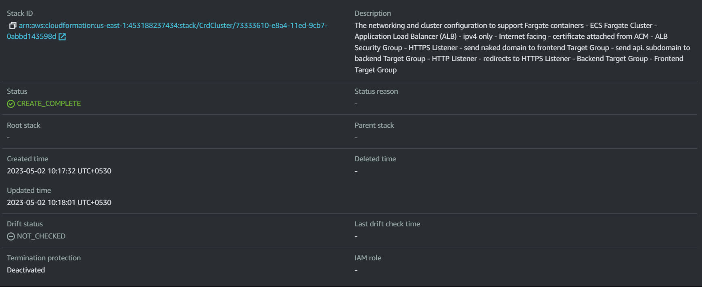
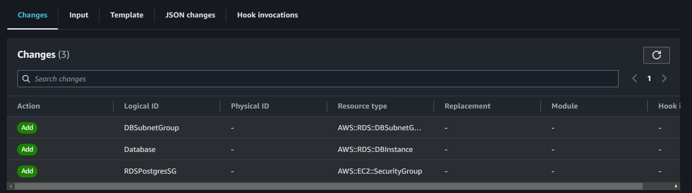
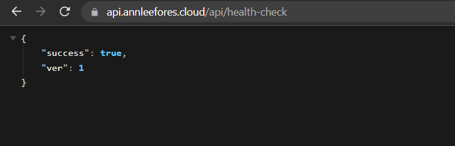
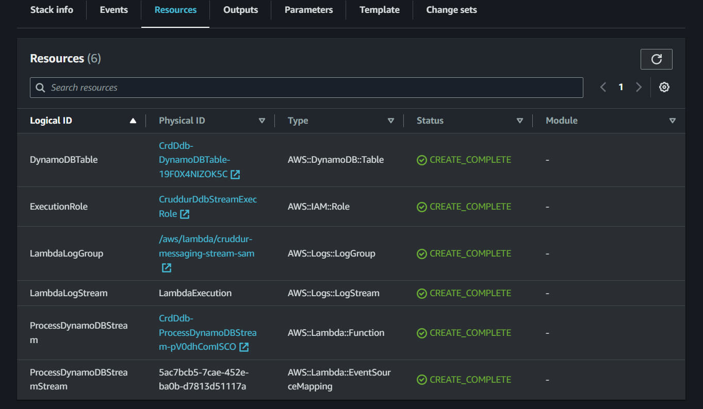
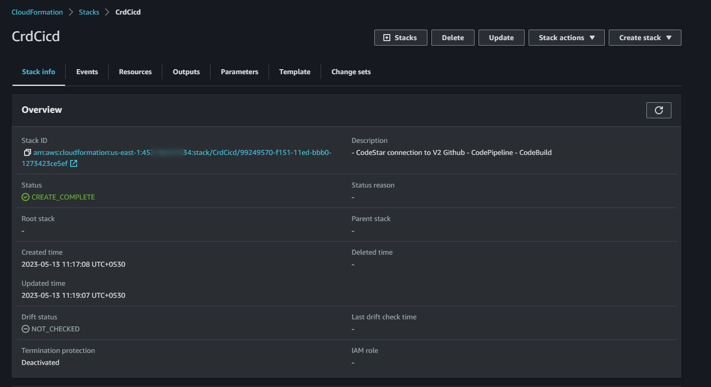

# Week 11 — CloudFormation Part 2

## Required Homework

### `cfn-toml`

`cfn-toml` is a tool utilized for retrieving environment variables from a config.toml file specifically designed for CloudFormation templates.

**Installation & Setup**

`gem install cfn-toml` (add to gitpod.yaml).

Create `aws/cfn/cluster/config.toml`

```toml
[deploy]
bucket = ''
region = ''
stack_name = 'CrdCluster'

[parameters]
CertificateArn = ''
NetworkingStack = 'CrdNet'
```

To create a template for the `config.toml` file, similar to how `.env.example` is used, you can create a file called `config.toml.example`.

Add this code above aws cfn deploy call in `bin/cfn/cluster-deploy` to fetch `config.toml` data.

```bash
abs_config_filepath="$ABS_PATH/aws/cfn/cluster/config.toml"
ConfigFilePath=$(realpath --relative-base="$PWD" "$abs_config_filepath")

BUCKET=$(cfn-toml key deploy.bucket -t $ConfigFilePath)
REGION=$(cfn-toml key deploy.region -t $ConfigFilePath)
STACK_NAME=$(cfn-toml key deploy.stack_name -t $ConfigFilePath)
PARAMETERS=$(cfn-toml params v2 -t $ConfigFilePath)
```

Update `aws cfn deploy` command.

```bash
aws cloudformation deploy \
  --stack-name "$STACK_NAME" \
  --s3-bucket "$BUCKET" \
  --region $REGION \
  --template-file $TemplateFilePath \
  --no-execute-changeset \
  --tags group=cruddur-cluster \
  --parameter-overrides $PARAMETERS \
  --capabilities CAPABILITY_NAMED_IAM
```

To configure `cfn-toml` for the network CFN (CloudFormation) template, follow the same steps as mentioned earlier.

```toml
[deploy]
bucket = ''
region = ''
stack_name = 'CrdNet'
```

```bash
abs_config_filepath="$ABS_PATH/aws/cfn/networking/config.toml"
ConfigFilePath=$(realpath --relative-base="$PWD" "$abs_config_filepath")

BUCKET=$(cfn-toml key deploy.bucket -t $ConfigFilePath)
REGION=$(cfn-toml key deploy.region -t $ConfigFilePath)
STACK_NAME=$(cfn-toml key deploy.stack_name -t $ConfigFilePath)

aws cloudformation deploy \
  --stack-name $STACK_NAME \
  --s3-bucket $BUCKET \
  --region $REGION \
  --template-file "$FilePath" \
  --no-execute-changeset \
  --tags group=cruddur-networking \
  --capabilities CAPABILITY_NAMED_IAM
```

### CFN Cluster Layer Continuation

In Network CFN split subnet id’s to public and private. Deploy changes.

```yaml
PublicSubnetIds:
    Value: !Join
      - ","
      - - !Ref SubnetPub1
        - !Ref SubnetPub2
        - !Ref SubnetPub3
    Export:
      Name: !Sub "${AWS::StackName}PublicSubnetIds"
  PrivateSubnetIds:
    Value: !Join
      - ","
      - - !Ref SubnetPriv1
        - !Ref SubnetPriv2
        - !Ref SubnetPriv3
    Export:
      Name: !Sub "${AWS::StackName}PrivateSubnetIds"
```

Update SG and Subnet in Cluster CFN ALB service. The public subnets are obtained from the output of the Network stack.

```yaml
SecurityGroups:
  - !GetAtt ALBSG.GroupId
Subnets:
  Fn::Split:
    - ","
    - Fn::ImportValue: !Sub "${NetworkingStack}PublicSubnetIds"
```

Add `VpcId:` to ALBSG service properties.

```yaml
VpcId:
    Fn::ImportValue:
    !Sub ${NetworkingStack}VpcId
```

Add TG ARN outputs to cluster CFN template.

```yaml
FrontendTGArn:
  Value: !Ref FrontendTG
  Export:
    Name: !Sub "${AWS::StackName}FrontendTGArn"
BackendTGArn:
  Value: !Ref BackendTG
  Export:
    Name: !Sub "${AWS::StackName}BackendTGArn"
```

Update the BackendTG and FrontendTG resources by setting `TargetType: ip`. Additionally, comment out the Name attribute for both resources to avoid replacement errors and instead add tags.

```yaml
Tags:
  - Key: target-group-name
    Value: backend
```

```yaml
Tags:
  - Key: target-group-name
    Value: frontend
```

Update Cluster ServiceSG, `SecurityGroupIngress` to use BackendPort instead of port 80

```yaml
SecurityGroupIngress:
  # https://docs.aws.amazon.com/AWSCloudFormation/latest/UserGuide/aws-properties-ec2-security-group-rule-1.html
  - IpProtocol: tcp
    SourceSecurityGroupId: !GetAtt ALBSG.GroupId
    FromPort: !Ref BackendPort
    ToPort: !Ref BackendPort
    Description: ALB HTTP
```

Deploy Cluster



### CFN Service Layer

To add variables, create a new `config.toml` file under `aws/cfn/service` directory.

```toml
[deploy]
bucket = ''
region = ''
stack_name = 'CrdSrvBackendFlask'
```

Create `template.yaml` file inside this folder.

```yaml
AWSTemplateFormatVersion: 2010-09-09

Description: |
  Task Definition
  Fargate Service
  Execution Role
  Task Role
```

Add parameters to CFN template.

```yaml
Parameters:
  NetworkingStack:
    Type: String
    Description: This is our base layer of networking components eg. VPC, Subnets
    Default: CrdNet

  ClusterStack:
    Type: String
    Description: This is our cluster layer eg ECS cluster
    Default: CrdCluster

  ContainerPort:
    Type: Number
    Default: 4567

  ContainerName:
    Type: String
    Default: backend-flask

  TaskFamily:
    Type: String
    Default: backend-flask

  ServiceName:
    Type: String
    Default: backend-flask

  ServiceCpu:
    Type: String
    Default: "256"

  ServiceMemory:
    Type: String
    Default: "512"

  EcrImage:
    Type: AWS::SSM::Parameter::Value<String>
    Default: /cfn/cruddur/backend-flask/ECRImage

  EnvOtelServiceName:
    Type: String
    Default: backend-flask

  EnvOtelExporterOtlpEndpoint:
    Type: String
    Default: https://api.honeycomb.io

  EnvAWSCognitoUserPoolId:
    Type: AWS::SSM::Parameter::Value<String>
    Default: /cfn/cruddur/backend-flask/EnvAWSCognitoUserPoolId

  EnvCognitoUserPoolClientId:
    Type: AWS::SSM::Parameter::Value<String>
    Default: "/cfn/cruddur/backend-flask/EnvCognitoUserPoolClientId"

  EnvFrontendUrl:
    Type: String
    Default: "*"

  EnvBackendUrl:
    Type: String
    Default: "*"

  SecretsAWSAccessKeyId:
    Type: AWS::SSM::Parameter::Value<String>
    Default: /cfn/cruddur/backend-flask/SecretsAWSAccessKeyId

  SecretsSecretAccessKey:
    Type: AWS::SSM::Parameter::Value<String>
    Default: /cfn/cruddur/backend-flask/SecretsSecretAccessKey

  SecretsConnectionUrl:
    Type: AWS::SSM::Parameter::Value<String>
    Default: /cfn/cruddur/backend-flask/SecretsConnectionUrl

  SecretsRollbarAccessToken:
    Type: AWS::SSM::Parameter::Value<String>
    Default: /cfn/cruddur/backend-flask/SecretsRollbarAccessToken

  SecretsOtelExporterOltpHeaders:
    Type: AWS::SSM::Parameter::Value<String>
    Default: /cfn/cruddur/backend-flask/SecretsOtelExporterOltpHeaders
```

Create a resource for Fargate Service

```yaml
FargateService:
  # https://docs.aws.amazon.com/AWSCloudFormation/latest/UserGuide/aws-resource-ecs-service.html
  Type: AWS::ECS::Service
  Properties:
    Cluster:
      Fn::ImportValue: !Sub "${ClusterStack}ClusterName"
    DeploymentController:
      Type: ECS
    DesiredCount: 1
    EnableECSManagedTags: true
    EnableExecuteCommand: true
    HealthCheckGracePeriodSeconds: 0
    LaunchType: FARGATE
    LoadBalancers:
      - TargetGroupArn:
          Fn::ImportValue: !Sub "${ClusterStack}BackendTGArn"
        ContainerName: !Ref ContainerName
        ContainerPort: !Ref ContainerPort
    NetworkConfiguration:
      AwsvpcConfiguration:
        AssignPublicIp: ENABLED
        SecurityGroups:
          - Fn::ImportValue: !Sub "${ClusterStack}ServiceSecurityGroupId"
        Subnets:
          Fn::Split:
            - ","
            - Fn::ImportValue: !Sub "${NetworkingStack}PublicSubnetIds"
    PlatformVersion: LATEST
    PropagateTags: SERVICE
    ServiceConnectConfiguration:
      Enabled: true

      Namespace: "cruddur"
      # log config
      Services:
        - DiscoveryName: backend-flask
          PortName: backend-flask
          ClientAliases:
            - Port: !Ref ContainerPort

    # ServiceRegistries:
    #   - RegistryArn: !Sub 'arn:aws:servicediscovery:${AWS::Region}:${AWS::AccountId}:service/srv-cruddur-backend-flask'
    #     Port: !Ref ContainerPort
    #     ContainerName: !Ref ContainerName
    #     ContainerPort: !Ref ContainerPort

    ServiceName: !Ref ServiceName
    TaskDefinition: !Ref TaskDefinition
```

Add Backend Task definition as a resource to this template.

```yaml
TaskDefinition:
  # https://docs.aws.amazon.com/AWSCloudFormation/latest/UserGuide/aws-resource-ecs-taskdefinition.html
  Type: "AWS::ECS::TaskDefinition"
  Properties:
    Family: !Ref TaskFamily
    ExecutionRoleArn: !GetAtt ExecutionRole.Arn
    TaskRoleArn: !GetAtt TaskRole.Arn
    NetworkMode: "awsvpc"
    Cpu: !Ref ServiceCpu
    Memory: !Ref ServiceMemory
    RequiresCompatibilities:
      - "FARGATE"
    ContainerDefinitions:
      - Name: "xray"
        Image: "public.ecr.aws/xray/aws-xray-daemon"
        Essential: true
        User: "1337"
        PortMappings:
          - Name: "xray"
            ContainerPort: 2000
            Protocol: "udp"
      - Name: "backend-flask"
        Image: !Ref EcrImage
        Essential: true
        HealthCheck:
          Command:
            - "CMD-SHELL"
            - "python /backend-flask/bin/health-check"
          Interval: 30
          Timeout: 5
          Retries: 3
          StartPeriod: 60
        PortMappings:
          - Name: !Ref ContainerName
            ContainerPort: !Ref ContainerPort
            Protocol: "tcp"
            AppProtocol: "http"
        LogConfiguration:
          LogDriver: "awslogs"
          Options:
            awslogs-group: "cruddur"
            awslogs-region: !Ref AWS::Region
            awslogs-stream-prefix: !Ref ServiceName
        Environment:
          - Name: "OTEL_SERVICE_NAME"
            Value: !Ref EnvOtelServiceName
          - Name: "OTEL_EXPORTER_OTLP_ENDPOINT"
            Value: !Ref EnvOtelExporterOtlpEndpoint
          - Name: "FRONTEND_URL"
            Value: !Ref EnvFrontendUrl
          - Name: "BACKEND_URL"
            Value: !Ref EnvBackendUrl
          - Name: "AWS_DEFAULT_REGION"
            Value: !Ref AWS::Region
        Secrets:
          - Name: "AWS_ACCESS_KEY_ID"
            ValueFrom: !Ref SecretsAWSAccessKeyId
          - Name: "AWS_SECRET_ACCESS_KEY"
            ValueFrom: !Ref SecretsSecretAccessKey
          - Name: "CONNECTION_URL"
            ValueFrom: !Ref SecretsConnectionUrl
          - Name: "ROLLBAR_ACCESS_TOKEN"
            ValueFrom: !Ref SecretsRollbarAccessToken
          - Name: "OTEL_EXPORTER_OTLP_HEADERS"
            ValueFrom: !Ref SecretsOtelExporterOltpHeaders
          - Name: "AWS_COGNITO_USER_POOL_ID"
            ValueFrom: !Ref EnvAWSCognitoUserPoolId
          - Name: "AWS_COGNITO_USER_POOL_CLIENT_ID"
            ValueFrom: !Ref EnvCognitoUserPoolClientId
```

Add Execution Role and Task Role for this service

```yaml
ExecutionRole:
    # https://docs.aws.amazon.com/AWSCloudFormation/latest/UserGuide/aws-resource-iam-role.html
    Type: AWS::IAM::Role
    Properties:
      RoleName: CruddurServiceExecutionRole
      AssumeRolePolicyDocument:
        Version: '2012-10-17'
        Statement:
          - Effect: 'Allow'
            Principal:
              Service: 'ecs-tasks.amazonaws.com'
            Action: 'sts:AssumeRole'
      Policies:
        - PolicyName: 'cruddur-execution-policy'
          PolicyDocument:
            Version: '2012-10-17'
            Statement:
              - Sid: 'VisualEditor0'
                Effect: 'Allow'
                Action:
                  - 'ecr:GetAuthorizationToken'
                  - 'ecr:BatchCheckLayerAvailability'
                  - 'ecr:GetDownloadUrlForLayer'
                  - 'ecr:BatchGetImage'
                  - 'logs:CreateLogStream'
                  - 'logs:PutLogEvents'
                Resource: '*'
              - Sid: 'VisualEditor1'
                Effect: 'Allow'
                Action:
                  - 'ssm:GetParameters'
                  - 'ssm:GetParameter'
                Resource: !Sub 'arn:aws:ssm:${AWS::Region}:${AWS::AccountId}:parameter/cruddur/${ServiceName}/*'
      ManagedPolicyArns:
        - arn:aws:iam::aws:policy/CloudWatchLogsFullAccess

  TaskRole:
      # https://docs.aws.amazon.com/AWSCloudFormation/latest/UserGuide/aws-resource-iam-role.html
      Type: AWS::IAM::Role
      Properties:
        RoleName: CruddurServiceTaskRole
        AssumeRolePolicyDocument:
          Version: '2012-10-17'
          Statement:
            - Effect: 'Allow'
              Principal:
                Service: 'ecs-tasks.amazonaws.com'
              Action: 'sts:AssumeRole'
        Policies:
          - PolicyName: 'cruddur-task-policy'
            PolicyDocument:
              Version: '2012-10-17'
              Statement:
                - Sid: 'VisualEditor0'
                  Effect: 'Allow'
                  Action:
                    - ssmmessages:CreateControlChannel
                    - ssmmessages:CreateDataChannel
                    - ssmmessages:OpenControlChannel
                    - ssmmessages:OpenDataChannel
                  Resource: '*'
        ManagedPolicyArns:
          - arn:aws:iam::aws:policy/CloudWatchLogsFullAccess
          - arn:aws:iam::aws:policy/AWSXRayDaemonWriteAccess
```

Add this outputs to template.

```yaml
Outputs:
  ServiceName:
    Value: !GetAtt FargateService.Name
    Export:
      Name: !Sub "${AWS::StackName}ServiceName"
```

Create deploy bash script for service layer.

```bash
#! /usr/bin/bash

set -e # stop execution if anything fails

abs_template_filepath="$ABS_PATH/aws/cfn/service/template.yaml"
TemplateFilePath=$(realpath --relative-base="$PWD" "$abs_template_filepath")

abs_config_filepath="$ABS_PATH/aws/cfn/service/config.toml"
ConfigFilePath=$(realpath --relative-base="$PWD" "$abs_config_filepath")

BUCKET=$(cfn-toml key deploy.bucket -t $ConfigFilePath)
REGION=$(cfn-toml key deploy.region -t $ConfigFilePath)
STACK_NAME=$(cfn-toml key deploy.stack_name -t $ConfigFilePath)

cfn-lint $TemplateFilePath

aws cloudformation deploy \
  --stack-name "$STACK_NAME" \
  --s3-bucket "$BUCKET" \
  --s3-prefix backend-service \
  --region $REGION \
  --template-file $TemplateFilePath \
  --no-execute-changeset \
  --tags group=cruddur-backend-flask \
  --capabilities CAPABILITY_NAMED_IAM
```

Deploy Service Layer and before approving the changeset delete existing policies/roles listed below.

- CruddurTaskRole
- CruddurServiceExecutionRole

### CFN RDS

Create a new folder `db` in `aws/cfn/` . Add `template.yaml` file.

```yaml
AWSTemplateFormatVersion: 2010-09-09
Description: |
  The primary PSQL RDS DB for the application
  - RDS Instance
  - DB SG
```

Add parameters.

```yaml
Parameters:
  NetworkingStack:
    Type: String
    Description: This is our base layer of networking components eg. VPC, Subnets
    Default: CrdNet
  ClusterStack:
    Type: String
    Description: This is our FargateCluster
    Default: CrdCluster
  BackupRetentionPeriod:
    Type: Number
    Default: 0
  DBInstanceClass:
    Type: String
    Default: db.t4g.micro
  DBInstanceIdentifier:
    Type: String
    Default: cruddur-instance
  DBName:
    Type: String
    Default: cruddur
  DeletionProtection:
    Type: String
    AllowedValues:
      - true
      - false
    Default: true
  EngineVersion:
    Type: String
    Default: "15.2"
  MasterUserPassword:
    Type: String
    NoEcho: true
  MasterUsername:
    Type: String
```

Database resource

```yaml
Database:
  # https://docs.aws.amazon.com/AWSCloudFormation/latest/UserGuide/aws-resource-rds-dbinstance.html
  Type: AWS::RDS::DBInstance
  # https://docs.aws.amazon.com/AWSCloudFormation/latest/UserGuide/aws-attribute-deletionpolicy.html
  DeletionPolicy: "Snapshot"
  # https://docs.aws.amazon.com/AWSCloudFormation/latest/UserGuide/aws-attribute-updatereplacepolicy.html
  UpdateReplacePolicy: "Snapshot"
  Properties:
    AllocatedStorage: "20"
    AllowMajorVersionUpgrade: true
    AutoMinorVersionUpgrade: true
    BackupRetentionPeriod: !Ref BackupRetentionPeriod
    DBInstanceClass: !Ref DBInstanceClass
    DBInstanceIdentifier: !Ref DBInstanceIdentifier
    DBName: !Ref DBName
    DBSubnetGroupName: !Ref DBSubnetGroup
    DeletionProtection: !Ref DeletionProtection
    EnablePerformanceInsights: true
    Engine: postgres
    EngineVersion: !Ref EngineVersion
    # Must be 1 to 63 letters or numbers.
    # First character must be a letter.
    # Can't be a reserved word for the chosen database engine.
    MasterUsername: !Ref MasterUsername
    # Constraints: Must contain from 8 to 128 characters.
    MasterUserPassword: !Ref MasterUserPassword
    PubliclyAccessible: true # don't enable for prod use cases
    VPCSecurityGroups:
      - !GetAtt RDSPostgresSG.GroupId
```

Database Secruity Group

```yaml
RDSPostgresSG:
  # https://docs.aws.amazon.com/AWSCloudFormation/latest/UserGuide/aws-properties-ec2-security-group.html
  Type: AWS::EC2::SecurityGroup
  Properties:
    GroupDescription: SG for RDS
    GroupName: !Sub "${AWS::StackName}RdsSG"
    VpcId:
      Fn::ImportValue: !Sub ${NetworkingStack}VpcId
    SecurityGroupIngress:
      # https://docs.aws.amazon.com/AWSCloudFormation/latest/UserGuide/aws-properties-ec2-security-group-rule-1.html
      - IpProtocol: tcp
        SourceSecurityGroupId:
          Fn::ImportValue: !Sub ${ClusterStack}ServiceSecurityGroupId
        FromPort: 5432
        ToPort: 5432
        Description: ALB HTTP
```

Database Subnet Group

```yaml
DBSubnetGroup:
  # https://docs.aws.amazon.com/AWSCloudFormation/latest/UserGuide/aws-resource-rds-dbsubnetgroup.html
  Type: AWS::RDS::DBSubnetGroup
  Properties:
    DBSubnetGroupDescription: !Sub "${AWS::StackName}DBSubnetGroup"
    DBSubnetGroupName: !Sub "${AWS::StackName}DBSubnetGroup"
    SubnetIds:
      Fn::Split:
        - ","
        - Fn::ImportValue: !Sub "${NetworkingStack}PublicSubnetIds"
```

`config.toml`

```toml
[deploy]
bucket = ''
region = ''
stack_name = 'CrdDb'

[parameters]
ClusterStack = 'CrdCluster'
NetworkingStack = 'CrdNet'
MasterUsername = ''
```

DB deploy script.

```bash
#! /usr/bin/bash

set -e # stop execution if anything fails

abs_template_filepath="$ABS_PATH/aws/cfn/db/template.yaml"
TemplateFilePath=$(realpath --relative-base="$PWD" "$abs_template_filepath")

abs_config_filepath="$ABS_PATH/aws/cfn/db/config.toml"
ConfigFilePath=$(realpath --relative-base="$PWD" "$abs_config_filepath")

BUCKET=$(cfn-toml key deploy.bucket -t $ConfigFilePath)
REGION=$(cfn-toml key deploy.region -t $ConfigFilePath)
STACK_NAME=$(cfn-toml key deploy.stack_name -t $ConfigFilePath)
PARAMETERS=$(cfn-toml params v2 -t $ConfigFilePath)

cfn-lint $TemplateFilePath

aws cloudformation deploy \
  --stack-name "$STACK_NAME" \
  --s3-bucket "$BUCKET" \
  --s3-prefix db \
  --region $REGION \
  --template-file $TemplateFilePath \
  --no-execute-changeset \
  --tags group=cruddur-db \
  --parameter-overrides $PARAMETERS MasterUserPassword=$DB_PASSWORD\
  --capabilities CAPABILITY_NAMED_IAM
```

Make sure to export `DB_PASSWORD` as env var.

Note that it may take some time to provision a new RDS DB instance.

After the deployment, ensure to update the connection URL in the parameter store to utilize the new RDS endpoint.



Delete old RDS instance.

Update Route53 main domain and `api.` subdomain to point to new load balancer (this can be automated using a bash script) and visit the api health check



### SAM CFN for Dynamodb & DynamoDB Streams Lambda

Reference: [DynamoDB & DynamoDB Streams](https://docs.aws.amazon.com/lambda/latest/dg/kinesis-tutorial-spec.html)

Include `-s3-prefix <prefix_name>` in all CFN deploy scripts to organize artifacts in a dedicated folder.

Add AWS SAM installation instructions to the `.gitpod.yml` file.

```yaml
tasks:
  - name: aws-sam
    init: |
      cd /workspace
       wget https://github.com/aws/aws-sam-cli/releases/latest/download/aws-sam-cli-linux-x86_64.zip
       unzip aws-sam-cli-linux-x86_64.zip -d sam-installation
       sudo ./sam-installation/install
       sudo rm -rf ./aws-sam-cli-linux-x86_64.zip
       sudo rm -rf ./aws-sam-cli-linux-x86_64
       cd $THEIA_WORKSPACE_ROOT
```

Create `ddb/template.yaml`

```yaml
AWSTemplateFormatVersion: "2010-09-09"
Transform: AWS::Serverless-2016-10-31
Description: |
  - DynamoDB Table
  - DynamoDB Stream
```

Parameters

```yaml
Parameters:
  PythonRuntime:
    Type: String
    Default: python3.9
  MemorySize:
    Type: String
    Default: 128
  Timeout:
    Type: Number
    Default: 3
  DeletionProtectionEnabled:
    Type: String
    Default: false
```

DynamoDB table resource

```yaml
DynamoDBTable:
  # https://docs.aws.amazon.com/AWSCloudFormation/latest/UserGuide/aws-resource-dynamodb-table.html
  Type: AWS::DynamoDB::Table
  Properties:
    AttributeDefinitions:
      - AttributeName: message_group_uuid
        AttributeType: S
      - AttributeName: pk
        AttributeType: S
      - AttributeName: sk
        AttributeType: S
    TableClass: STANDARD
    KeySchema:
      - AttributeName: pk
        KeyType: HASH
      - AttributeName: sk
        KeyType: RANGE
    ProvisionedThroughput:
      ReadCapacityUnits: 5
      WriteCapacityUnits: 5
    BillingMode: PROVISIONED
    DeletionProtectionEnabled: !Ref DeletionProtectionEnabled
    GlobalSecondaryIndexes:
      - IndexName: message-group-sk-index
        KeySchema:
          - AttributeName: message_group_uuid
            KeyType: HASH
          - AttributeName: sk
            KeyType: RANGE
        Projection:
          ProjectionType: ALL
        ProvisionedThroughput:
          ReadCapacityUnits: 5
          WriteCapacityUnits: 5
    StreamSpecification:
      StreamViewType: NEW_IMAGE
```

DynamoDB Stream - Lambda

```yaml
ProcessDynamoDBStream:
  # https://docs.aws.amazon.com/serverless-application-model/latest/developerguide/sam-resource-function.html
  Type: AWS::Serverless::Function
  Properties:
    CodeUri: .
    PackageType: Zip
    Handler: lambda_handler
    Runtime: !Ref PythonRuntime
    Role: !GetAtt ExecutionRole.Arn
    MemorySize: !Ref MemorySize
    Timeout: !Ref Timeout
    Environment:
      Variables:
        REGION: !Sub ${AWS::Region}

    Events:
      Stream:
        Type: DynamoDB
        Properties:
          Stream: !GetAtt DynamoDBTable.StreamArn
          # TODO - Does our Lambda handle more than one record
          BatchSize: 1
          # https://docs.aws.amazon.com/serverless-application-model/latest/developerguide/sam-property-function-dynamodb.html#sam-function-dynamodb-startingposition
          # TODO - Is this the right value?
          StartingPosition: LATEST
```

Lambda function log resources

```yaml
LambdaLogGroup:
    Type: "AWS::Logs::LogGroup"
    Properties:
      LogGroupName: "/aws/lambda/cruddur-messaging-stream-sam"
      RetentionInDays: 14

  LambdaLogStream:
    Type: AWS::Logs::LogStream
    Properties:
      LogGroupName: !Ref LambdaLogGroup
      LogStreamName: "LambdaExecution"
```

IAM Role for Lambda function

```yaml
ExecutionRole:
  # https://docs.aws.amazon.com/AWSCloudFormation/latest/UserGuide/aws-resource-iam-role.html
  Type: AWS::IAM::Role
  Properties:
    RoleName: CruddurDdbStreamExecRole
    AssumeRolePolicyDocument:
      Version: "2012-10-17"
      Statement:
        - Effect: "Allow"
          Principal:
            Service: "lambda.amazonaws.com"
          Action: "sts:AssumeRole"
    Policies:
      - PolicyName: "LambdaExecutionPolicy"
        PolicyDocument:
          Version: 2012-10-17
          Statement:
            - Effect: "Allow"
              Action: "logs:CreateLogGroup"
              Resource: !Sub "arn:aws:logs:${AWS::Region}:${AWS::AccountId}:*"

            - Effect: "Allow"
              Action:
                - logs:CreateLogStream
                - logs:PutLogEvents
              Resource: !Sub "arn:aws:logs:${AWS::Region}:${AWS::AccountId}:log-group:${LambdaLogGroup}:*"

            - Effect: Allow
              Action:
                - ec2:CreateNetworkInterface
                - ec2:DeleteNetworkInterface
                - ec2:DescribeNetworkInterfaces
              Resource: "*"

            - Effect: Allow
              Action:
                - "lambda:InvokeFunction"
              Resource: "*"

            - Effect: "Allow"
              Action:
                - "dynamodb:DescribeStream"
                - "dynamodb:GetRecords"
                - "dynamodb:GetShardIterator"
                - "dynamodb:ListStreams"
              Resource: "*"
```

Move the `cruddur-messaging-stream.py` file to `ddb/function/` and rename it as `lambda_function.py`.

Create a `ddb/config.toml` file. (this is different from config.toml used in `cfn-toml`)

```toml
version=0.1

[default.build.parameters]
region = ""

[default.package.parameters]
region = ""

[default.deploy.parameters]
region = ""
```

Create SAM Build, Package, and Deploy scripts within the `ddb/` folder.

- Build

```bash
#! /usr/bin/bash

set -e # stop execution if anything fails

ABS_FILEPATH="$ABS_PATH/ddb"
LAMBDA_FILEPATH="$ABS_PATH/ddb/function/"

echo ">>> Validate <<<"

sam validate -t $ABS_FILEPATH/template.yaml

echo ">>> Build <<<"
# use-container is for building the lambda in a container
# it's still using the runtimes and its not a custom
sam build \
    --use-container \
    --config-file $ABS_FILEPATH/config.toml \
    --template-file $ABS_FILEPATH/template.yaml \
    --base-dir $LAMBDA_FILEPATH
# --parameter-overrides
```

- Package

```bash
#! /usr/bin/bash

set -e # stop execution if anything fails

ABS_FILEPATH="$ABS_PATH/ddb"
ARTIFACT_BUCKET="cfn-artifacts-annlee"

echo ">>> Package <<<"

sam package \
    --s3-bucket $ARTIFACT_BUCKET \
    --config-file $ABS_FILEPATH/config.toml \
    --output-template-file $ABS_PATH/.aws-sam/build/package.yaml \
    --s3-prefix "ddb" \
    --template-file $ABS_PATH/.aws-sam/build/template.yaml
```

- Deploy

```bash
#! /usr/bin/bash

set -e # stop execution if anything fails

ABS_FILEPATH="$ABS_PATH/ddb"
ARTIFACT_BUCKET="cfn-artifacts-annlee"

echo ">>> Deploy <<<"

sam deploy \
    --template-file $ABS_PATH/.aws-sam/build/package.yaml \
    --config-file $ABS_FILEPATH/config.toml \
    --stack-name "CrdDdb" \
    --tags group=cruddur-ddb \
    --no-execute-changeset \
    --capabilities "CAPABILITY_NAMED_IAM"
```

Build, Package and Deploy



### CFN CICD

**Pipeline**

Create a CFN template for CICD in `/aws/cfn/cicd`

```yaml
AWSTemplateFormatVersion: "2010-09-09"
Description: |
  - CodeStar connection to V2 Github
  - CodePipeline
  - CodeBuild
```

Parameters

```yaml
Parameters:
  GitHubBranch:
    Type: String
    Default: prod
  GitHubRepo:
    Type: String
    Default: "annleefores/aws-bootcamp-cruddur-2023"
  ClusterStack:
    Type: String
  ServiceStack:
    Type: String
  ArtifactBucketName:
    Type: String
```

In order to reference the nested CodeBuild stack at a later stage, include the corresponding resource in the template.

```yaml
CodeBuildBakeImageStack:
  # https://docs.aws.amazon.com/AWSCloudFormation/latest/UserGuide/aws-properties-stack.html
  Type: AWS::CloudFormation::Stack
  Properties:
    TemplateURL: nested/codebuild.yaml
```

Add the specified CodeStar Connect resource to connect the pipeline with GitHub.

```yaml
CodeStarConnection:
  # https://docs.aws.amazon.com/AWSCloudFormation/latest/UserGuide/aws-resource-codestarconnections-connection.html
  Type: AWS::CodeStarConnections::Connection
  Properties:
    ConnectionName: !Sub ${AWS::StackName}-connection
    ProviderType: GitHub
```

Pipeline resource

```yaml
Pipeline:
  # https://docs.aws.amazon.com/AWSCloudFormation/latest/UserGuide/aws-resource-codepipeline-pipeline.html
  Type: AWS::CodePipeline::Pipeline
  Properties:
    ArtifactStore:
      Location: !Ref ArtifactBucketName
      Type: S3
    RoleArn: !GetAtt CodePipelineRole.Arn
    Stages:
      - Name: Source
        Actions:
          - Name: ApplicationSource
            RunOrder: 1
            ActionTypeId:
              Category: Source
              Provider: CodeStarSourceConnection
              Owner: AWS
              Version: "1"
            OutputArtifacts:
              - Name: Source
            Configuration:
              ConnectionArn: !Ref CodeStarConnection
              FullRepositoryId: !Ref GitHubRepo
              BranchName: !Ref GitHubBranch
              OutputArtifactFormat: "CODE_ZIP"
      - Name: Build
        Actions:
          - Name: BuildContainerImage
            RunOrder: 1
            ActionTypeId:
              Category: Build
              Owner: AWS
              Provider: CodeBuild
              Version: "1"
            InputArtifacts:
              - Name: Source
            OutputArtifacts:
              - Name: ImageDefinition
            Configuration:
              ProjectName: !GetAtt CodeBuildBakeImageStack.Outputs.CodeBuildProjectName
              BatchEnabled: false
      # https://docs.aws.amazon.com/codepipeline/latest/userguide/action-reference-ECS.html
      - Name: Deploy
        Actions:
          - Name: Deploy
            RunOrder: 1
            ActionTypeId:
              Category: Deploy
              Provider: ECS
              Owner: AWS
              Version: "1"
            InputArtifacts:
              - Name: ImageDefinition
            Configuration:
              # In Minutes
              DeploymentTimeout: "10"
              ClusterName:
                Fn::ImportValue: !Sub ${ClusterStack}ClusterName
              ServiceName:
                Fn::ImportValue: !Sub ${ServiceStack}ServiceName
```

CodePipeline IAM Role

```yaml
CodePipelineRole:
  Type: AWS::IAM::Role
  Properties:
    AssumeRolePolicyDocument:
      Statement:
        - Action: ["sts:AssumeRole"]
          Effect: Allow
          Principal:
            Service: [codepipeline.amazonaws.com]
      Version: "2012-10-17"
    Path: /
    Policies:
      - PolicyName: !Sub ${AWS::StackName}EcsDeployPolicy
        PolicyDocument:
          Version: "2012-10-17"
          Statement:
            - Action:
                - ecs:DescribeServices
                - ecs:DescribeTaskDefinition
                - ecs:DescribeTasks
                - ecs:ListTasks
                - ecs:RegisterTaskDefinition
                - ecs:UpdateService
              Effect: Allow
              Resource: "*"
      - PolicyName: !Sub ${AWS::StackName}CodeStarPolicy
        PolicyDocument:
          Version: "2012-10-17"
          Statement:
            - Action:
                - codestar-connections:UseConnection
              Effect: Allow
              Resource: !Ref CodeStarConnection
      - PolicyName: !Sub ${AWS::StackName}CodePipelinePolicy
        PolicyDocument:
          Version: "2012-10-17"
          Statement:
            - Action:
                - s3:*
                - logs:CreateLogGroup
                - logs:CreateLogStream
                - logs:PutLogEvents
                - cloudformation:*
                - iam:PassRole
                - iam:CreateRole
                - iam:DetachRolePolicy
                - iam:DeleteRolePolicy
                - iam:PutRolePolicy
                - iam:DeleteRole
                - iam:AttachRolePolicy
                - iam:GetRole
                - iam:PassRole
              Effect: Allow
              Resource: "*"
      - PolicyName: !Sub ${AWS::StackName}CodePipelineBuildPolicy
        PolicyDocument:
          Version: "2012-10-17"
          Statement:
            - Action:
                - codebuild:StartBuild
                - codebuild:StopBuild
                - codebuild:RetryBuild
                - codebuild:BatchGetBuilds
              Effect: Allow
              Resource: !Join
                - ""
                - - "arn:aws:codebuild:"
                  - !Ref AWS::Region
                  - ":"
                  - !Ref AWS::AccountId
                  - ":project/"
                  - !GetAtt CodeBuildBakeImageStack.Outputs.CodeBuildProjectName
```

**CodeBuild Stack**

To utilize a nested stack that can be referenced in the main template, create a new folder `nested` within the current directory and include a `codebuild.yaml` file.

```yaml
AWSTemplateFormatVersion: "2010-09-09"
Description: |
  Codebuild used for baking container image
   - Codebuild Project
   - Codebuild Project Role
```

Parameters

```yaml
Parameters:
  LogGroupPath:
    Type: String
    Description: "The log group path for codebuild"
    Default: "/cruddur/codebuild/bake-service"
  LogStreamName:
    Type: String
    Description: "The log group path for codebuild"
    Default: "backend-flask"
  CodeBuildImage:
    Type: String
    Default: aws/codebuild/amazonlinux2-x86_64-standard:4.0
  CodeBuildComputeType:
    Type: String
    Default: BUILD_GENERAL1_SMALL
  CodeBuildTimeoutMins:
    Type: Number
    Default: 15
  CodeBuildQueueTimeoutMins:
    Type: Number
    Default: 30
  BuildSpec:
    Type: String
    Default: backend-flask/buildspec.yml
  CodeBuildName:
    Type: String
    Default: CrdCodeBuild_CFN
```

CodeBuild Resource

```yaml
CodeBuild:
  # https://docs.aws.amazon.com/AWSCloudFormation/latest/UserGuide/aws-resource-codebuild-project.html
  Type: AWS::CodeBuild::Project
  Properties:
    Name: !Ref CodeBuildName
    QueuedTimeoutInMinutes: !Ref CodeBuildQueueTimeoutMins
    TimeoutInMinutes: !Ref CodeBuildTimeoutMins
    ServiceRole: !GetAtt CodeBuildRole.Arn
    # PrivilegedMode is needed to build Docker images
    # even though we have No Artifacts, CodePipeline Demands both to be set as CODEPIPLINE
    Artifacts:
      Type: CODEPIPELINE
    Environment:
      ComputeType: !Ref CodeBuildComputeType
      Image: !Ref CodeBuildImage
      Type: LINUX_CONTAINER
      PrivilegedMode: true
    LogsConfig:
      CloudWatchLogs:
        GroupName: !Ref LogGroupPath
        Status: ENABLED
        StreamName: !Ref LogStreamName
    Source:
      Type: CODEPIPELINE
      BuildSpec: !Ref BuildSpec
    # Triggers:
    #     BuildType: BUILD
    #     Webhook: True
    #     FilterGroups:
    #     - - Type: EVENT
    #         Pattern: PULL_REQUEST_MERGED
```

CodeBuild IAM Role

```yaml
CodeBuildRole:
  # https://docs.aws.amazon.com/AWSCloudFormation/latest/UserGuide/aws-resource-iam-role.html
  Type: AWS::IAM::Role
  Properties:
    AssumeRolePolicyDocument:
      Statement:
        - Action: ["sts:AssumeRole"]
          Effect: Allow
          Principal:
            Service: [codebuild.amazonaws.com]
      Version: "2012-10-17"
    Path: /
    Policies:
      - PolicyName: !Sub ${AWS::StackName}ECRPolicy
        PolicyDocument:
          Version: "2012-10-17"
          Statement:
            - Action:
                - ecr:BatchCheckLayerAvailability
                - ecr:CompleteLayerUpload
                - ecr:GetAuthorizationToken
                - ecr:InitiateLayerUpload
                - ecr:BatchGetImage
                - ecr:GetDownloadUrlForLayer
                - ecr:PutImage
                - ecr:UploadLayerPart
              Effect: Allow
              Resource: "*"
      - PolicyName: !Sub ${AWS::StackName}VPCPolicy
        PolicyDocument:
          Version: "2012-10-17"
          Statement:
            - Action:
                - ec2:CreateNetworkInterface
                - ec2:DescribeDhcpOptions
                - ec2:DescribeNetworkInterfaces
                - ec2:DeleteNetworkInterface
                - ec2:DescribeSubnets
                - ec2:DescribeSecurityGroups
                - ec2:DescribeVpcs
              Effect: Allow
              Resource: "*"
            - Action:
                - ec2:CreateNetworkInterfacePermission
              Effect: Allow
              Resource: "*"
      - PolicyName: !Sub ${AWS::StackName}Logs
        PolicyDocument:
          Version: "2012-10-17"
          Statement:
            - Action:
                - logs:CreateLogGroup
                - logs:CreateLogStream
                - logs:PutLogEvents
              Effect: Allow
              Resource:
                - !Sub arn:aws:logs:${AWS::Region}:${AWS::AccountId}:log-group:${LogGroupPath}*
                - !Sub arn:aws:logs:${AWS::Region}:${AWS::AccountId}:log-group:${LogGroupPath}:*
      - PolicyName: !Sub ${AWS::StackName}SSM
        PolicyDocument:
          Version: "2012-10-17"
          Statement:
            - Action:
                - ssm:GetParameters
              Effect: Allow
              Resource:
                - !Sub arn:aws:ssm:${AWS::Region}:${AWS::AccountId}:parameter/cruddur*
      - PolicyName: !Sub ${AWS::StackName}S3
        PolicyDocument:
          Version: "2012-10-17"
          Statement:
            - Action:
                - s3:PutObject
                - s3:GetObject
                - s3:GetObjectVersion
                - s3:GetBucketAcl
                - s3:GetBucketLocation
              Effect: Allow
              Resource:
                - arn:aws:s3:::codepipeline-crd-artifacts-annlee/*
```

CodeBuild Output that can be referenced by main stack.

```yaml
Outputs:
  CodeBuildProjectName:
    Description: "CodeBuildProjectName"
    Value: !Ref CodeBuildName
```

**Stack Config**

`config.toml`

Create a bucket manually for storing pipeline artifacts and reference that bucket in `config.toml`.

```toml
[deploy]
bucket = ''
region = ''
stack_name = 'CrdCicd'

[parameters]
ServiceStack = 'CrdSrvBackendFlask'
ClusterStack = 'CrdCluster'
GitHubBranch = 'prod'
GitHubRepo = ''
ArtifactBucketName = ''
```

Create a Package and Deploy script that includes the necessary packaging for nested stacks..

```bash
#! /usr/bin/bash

# set -e # stop execution if anything fails

abs_template_filepath="$ABS_PATH/aws/cfn/cicd/template.yaml"
TemplateFilePath=$(realpath --relative-base="$PWD" "$abs_template_filepath")

abs_config_filepath="$ABS_PATH/aws/cfn/cicd/config.toml"
ConfigFilePath=$(realpath --relative-base="$PWD" "$abs_config_filepath")

PackagedPath="$ABS_PATH/tmp/packages-template.yaml"

BUCKET=$(cfn-toml key deploy.bucket -t $ConfigFilePath)
REGION=$(cfn-toml key deploy.region -t $ConfigFilePath)
STACK_NAME=$(cfn-toml key deploy.stack_name -t $ConfigFilePath)
PARAMETERS=$(cfn-toml params v2 -t $ConfigFilePath)

cfn-lint $TemplateFilePath

echo ">>> packaging CFN to S3 <<<"

aws cloudformation package \
  --template-file $TemplateFilePath \
  --s3-bucket $BUCKET \
  --s3-prefix cicd-package \
  --region $REGION \
  --output-template-file $PackagedPath

echo ">>> Deploy CFN <<<"

aws cloudformation deploy \
  --stack-name "$STACK_NAME" \
  --s3-bucket "$BUCKET" \
  --s3-prefix cicd \
  --region $REGION \
  --template-file $PackagedPath \
  --no-execute-changeset \
  --tags group=cruddur-cicd \
  --parameter-overrides $PARAMETERS \
  --capabilities CAPABILITY_NAMED_IAM
```

Create a `/tmp` folder in root dir to store the packaged yaml file before deploying.

Deploy CICD Stack



Note: For new pipelines, the GitHub CodeStar connection needs to be manually enabled from the CodePipeline Console.

- Go to CodePipeline → Settings → Connections.
- Update the pending connection and establish the connection with GitHub.

### CFN Static Website Hosting - Frontend

Create a new template in `aws/cfn/frontend`

```yaml
AWSTemplateFormatVersion: "2010-09-09"
Description: |
  - Cloudfront Distribution
  - S3 bucket for www.
  - S3 bucket for Root domain
  - Bucket Policy
```

Parameters

```yaml
Parameters:
  RootBucketName:
    Type: String
    Default: www.annleefores.cloud
  WWWBucketName:
    Type: String
    Default: annleefores.cloud
  CertificateArn:
    Type: String
```

Create S3 Buckets for www.<domain> and <domain>

```yaml
WWWBucket:
  # https://docs.aws.amazon.com/AWSCloudFormation/latest/UserGuide/aws-properties-s3-bucket.html#aws-properties-s3-bucket--examples
    Type: 'AWS::S3::Bucket'
    # DeletionPolicy: Retain
    Properties:
      BucketName: !Ref WWWBucketName
      WebsiteConfiguration:
        RedirectAllRequestsTo:
          HostName: !Ref RootBucketName

  RootBucket:
  # https://docs.aws.amazon.com/AWSCloudFormation/latest/UserGuide/aws-properties-s3-bucket.html#aws-properties-s3-bucket--examples
    Type: 'AWS::S3::Bucket'
    # DeletionPolicy: Retain
    Properties:
      BucketName: !Ref RootBucketName
      PublicAccessBlockConfiguration:
        BlockPublicPolicy: false
      WebsiteConfiguration:
        IndexDocument: index.html
        ErrorDocument: error.html
```

Root bucket policy

```yaml
RootBucketPolicy:
  # https://docs.aws.amazon.com/AWSCloudFormation/latest/UserGuide/aws-properties-s3-bucket.html
  Type: AWS::S3::BucketPolicy
  Properties:
    Bucket: !Ref RootBucket
    PolicyDocument:
      Statement:
        - Action:
            - "s3:GetObject"
          Effect: Allow
          Resource: !Sub "arn:aws:s3:::${RootBucket}/*"
          Principal: "*"
```

Add root bucket domain and www bucket domain A record to Route53 Hosted Zone

```yaml
RootBucketDomain:
  # https://docs.aws.amazon.com/AWSCloudFormation/latest/UserGuide/aws-properties-route53-recordset.html
  Type: AWS::Route53::RecordSet
  Properties:
    HostedZoneName: !Sub ${RootBucketName}.
    Name: !Sub ${RootBucketName}.
    Type: A
    AliasTarget:
      # https://docs.aws.amazon.com/AWSCloudFormation/latest/UserGuide/aws-properties-route53-aliastarget.html#cfn-route53-aliastarget-hostedzoneid
      # Specify Z2FDTNDATAQYW2. This is always the hosted zone ID when you create an alias record that routes traffic to a CloudFront distribution.
      DNSName: !GetAtt Distribution.DomainName
      HostedZoneId: Z2FDTNDATAQYW2

WwwBucketDomain:
  # https://docs.aws.amazon.com/AWSCloudFormation/latest/UserGuide/aws-properties-route53-recordset.html
  Type: AWS::Route53::RecordSet
  Properties:
    HostedZoneName: !Sub ${RootBucketName}.
    Name: !Sub ${WWWBucketName}.
    Type: A
    AliasTarget:
      DNSName: !GetAtt Distribution.DomainName
      # https://docs.aws.amazon.com/AWSCloudFormation/latest/UserGuide/aws-properties-route53-aliastarget.html#cfn-route53-aliastarget-hostedzoneid
      # Specify Z2FDTNDATAQYW2. This is always the hosted zone ID when you create an alias record that routes traffic to a CloudFront distribution.
      HostedZoneId: Z2FDTNDATAQYW2
```

Configure Cloudfront distribution

```yaml
Distribution:
  Type: AWS::CloudFront::Distribution
  Properties:
    DistributionConfig:
      Aliases:
        - <root_domain>
        - www.<domain>
      Comment: Frontend React Js for Cruddur
      Enabled: true
      HttpVersion: http2and3
      DefaultRootObject: index.html
      Origins:
        - DomainName: !GetAtt RootBucket.DomainName
          Id: RootBucketOrigin
          S3OriginConfig: {}
      DefaultCacheBehavior:
        TargetOriginId: RootBucketOrigin
        ForwardedValues:
          QueryString: false
          Cookies:
            Forward: none
        ViewerProtocolPolicy: redirect-to-https
      ViewerCertificate:
        AcmCertificateArn: !Ref CertificateArn
        SslSupportMethod: sni-only
```

`config.toml`

```toml
[deploy]
bucket = ''
region = ''
stack_name = 'CrdFrontend'

[parameters]
RootBucketName = '<domain>'
WWWBucketName = 'www.<domain>'
CertificateArn = ''
```

Deploy Script

```bash
#! /usr/bin/bash

# set -e # stop execution if anything fails

abs_template_filepath="$ABS_PATH/aws/cfn/frontend/template.yaml"
TemplateFilePath=$(realpath --relative-base="$PWD" "$abs_template_filepath")

abs_config_filepath="$ABS_PATH/aws/cfn/frontend/config.toml"
ConfigFilePath=$(realpath --relative-base="$PWD" "$abs_config_filepath")

BUCKET=$(cfn-toml key deploy.bucket -t $ConfigFilePath)
REGION=$(cfn-toml key deploy.region -t $ConfigFilePath)
STACK_NAME=$(cfn-toml key deploy.stack_name -t $ConfigFilePath)
PARAMETERS=$(cfn-toml params v2 -t $ConfigFilePath)

cfn-lint $TemplateFilePath

echo ">>> Deploy CFN <<<"

aws cloudformation deploy \
  --stack-name "$STACK_NAME" \
  --s3-bucket "$BUCKET" \
  --s3-prefix frontend \
  --region $REGION \
  --template-file $TemplateFilePath \
  --no-execute-changeset \
  --tags group=cruddur-frontend \
  --parameter-overrides $PARAMETERS \
  --capabilities CAPABILITY_NAMED_IAM
```

Delete old root domain A record from Route53 before proceeding with deploy.

_Note: CloudFront is a global service, and using an SSL certificate from another region may result in an error. To work with CloudFront, the SSL certificate must be located in the `us-east-1` region._

### CFN Diagram


_Created in draw.io_

### AWS CloudFormation Security Best Practices

**AWS CFN Best Practices - AWS**

- Compliance standard is what your business requires from a
  Infrastructure as Code (laC) service and is available in the region you
  need to operate in.
- Amazon Organizations SCP - to restrict actions like creation, deletion,
  modification of production Cloudformation Templates/Resources etc
- AWS CloudTrail is enabled & monitored to trigger alerts for malicious
  activities e.g changes to Production Environment etc
- AWS Audit Manager, IAM Access Analyzer etc

**AWS CFN Best Practices - Application**

- Linting CFN
- Access Control - Roles or IAM Users for making changes in Amazon Cloudformation Template stacks or StackSets especially one for production.
- Security of the Cloudformation - Configuration access
- Security in the Cloudformation - Code Security Best Practices - SCA, SAST, Secret Scanner, DAST implemented in the CI/CD Pipeline
- Security of the CloudFormation entry points e.g - private access points
  using AWS Private Link etc
- Only use Trusted source control for sending changes to CFN
- Develop process for continuously verifying if there is a changes in compromise the known state of a CI/CD pipeline

## Homework Challenges

### Cruddur IaC using Terraform

I took on the challenge of creating most of the infrastructure as code (IaC) for Cruddur using Terraform. Since it was my first time using Terraform, I had to learn the basics and try it out with some simple projects.

Once I gained sufficient knowledge about Terraform's functionality, I developed the IaC for Cruddur in a similar manner to how we did it with CFN. This process provided me with valuable insights into how IaC tools work and the slight differences in how each tool handles various aspects.

Personally, I find Terraform's syntax much more familiar as I am accustomed to programming languages like Python. When comparing CFN and Terraform, both have their own advantages and disadvantages.

Here is the link to the Terraform configuration files: [Cruddur Terraform IaC](../terraform/)

### Removing exposed AWS Account ID in parameters

To avoid hardcoding the AWS account ID, I chose to store data as strings in parameter store values and retrieve them as parameters using the following method:

Unfortunately, there is a limitation in the CloudFormation (CFN) template that prevents us from directly using secure strings in the parameters section for certain resources, such as Fargate.

```yaml
Name:
  Type: AWS::SSM::Parameter::Value<String>
  Default: <parameter_name>
```
