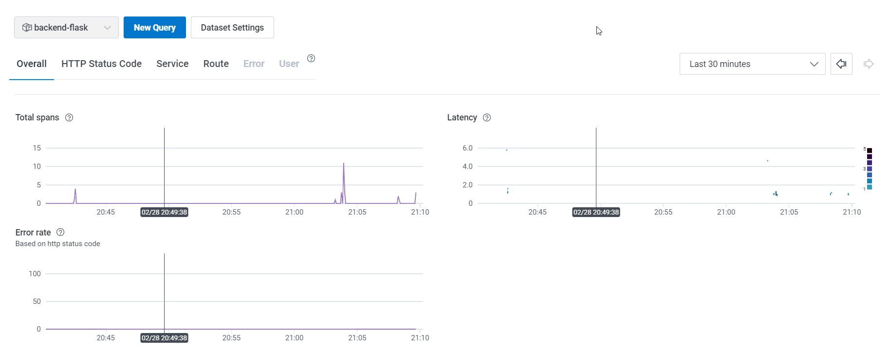
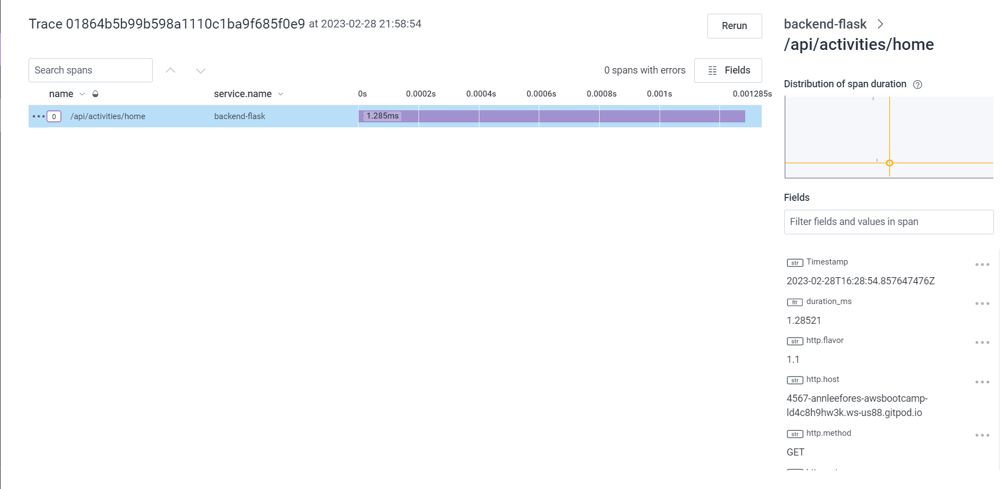
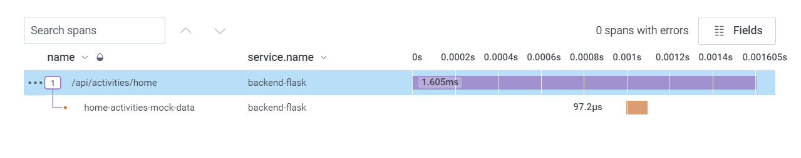
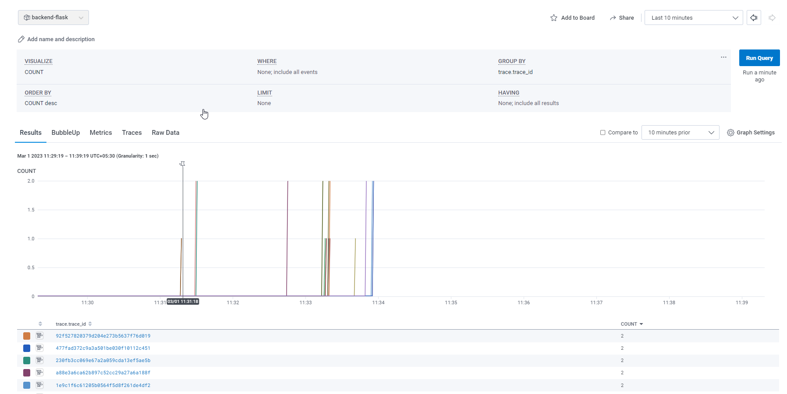
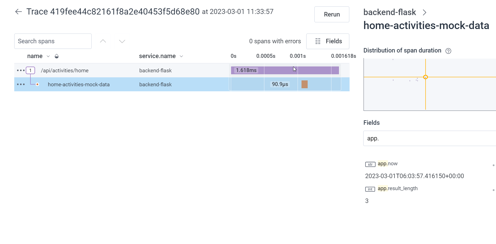
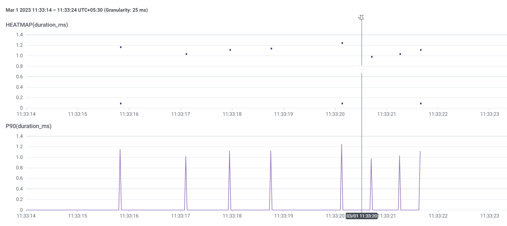

# Week 2 — Distributed Tracing

## Required Homework

- [Live Stream]()  
- [Instrument Honeycomb with OTEL]()
- [Instrument AWS X-Ray]()
- [Configure custom logger to send to CloudWatch Logs]()
- [Integrate Rollbar and capture and error]()
- [Observability Security Considerations]()
- [Observability Spending Considerations]()

## [Homework Challenges](#homework-challenges-1)

TODO

---

## Observability

- Observability - monitoring a complicated system.
- Distributed Tracing - method of tracking application requests as they flow from frontend devices to backend services and databases.

## Honeycomb.io

> Website: [https://www.honeycomb.io/](https://www.honeycomb.io/)  
> Honeycomb Python Docs: [https://docs.honeycomb.io/getting-data-in/opentelemetry/python/](https://docs.honeycomb.io/getting-data-in/opentelemetry/python/)

- Login to [Honeycomb.io](https://ui.honeycomb.io/) and create an **Environment**.
- Copy environment API key and export these env variable to gitpod.  Whole project needs to use the same API key.

```bash
gp env HONEYCOMB_API_KEY="<api-key>"
gp env HONEYCOMB_SERVICE_NAME="<service-name>"

or 

export HONEYCOMB_API_KEY="<api-key>"
export HONEYCOMB_SERVICE_NAME="<service-name>"
```

- Set these env in `docker-compose.yml` under backend.  `OTEL_SERVICE_NAME` should be different for different services so it’s easy to identify different service.

```bash
OTEL_SERVICE_NAME: "backend-flask"
OTEL_EXPORTER_OTLP_ENDPOINT: "https://api.honeycomb.io"
OTEL_EXPORTER_OTLP_HEADERS: "x-honeycomb-team=${HONEYCOMB_API_KEY}"
```

- `cd` into backend and add these packages to `requirements.txt` and run `pip install -r requirements.txt`

```
opentelemetry-api 
opentelemetry-sdk
opentelemetry-exporter-otlp-proto-http
opentelemetry-instrumentation-flask
opentelemetry-instrumentation-requests
```

- Add these import statements in `app.py`

```python
from opentelemetry import trace
from opentelemetry.instrumentation.flask import FlaskInstrumentor
from opentelemetry.instrumentation.requests import RequestsInstrumentor
from opentelemetry.exporter.otlp.proto.http.trace_exporter import OTLPSpanExporter
from opentelemetry.sdk.trace import TracerProvider
from opentelemetry.sdk.trace.export import BatchSpanProcessor
```

- Initialize tracing and an exporter that can send data to Honeycomb - set this just below all the import statements. `OTLPSpanExporter()` → reads the Honeycomb env vars

```python
# Initialize tracing and an exporter that can send data to Honeycomb
provider = TracerProvider()
processor = BatchSpanProcessor(OTLPSpanExporter())
provider.add_span_processor(processor)
trace.set_tracer_provider(provider)
tracer = trace.get_tracer(__name__)
```

- Initialize automatic instrumentation with Flask - add this below `app = Flask(__name__)`

```python
# Initialize automatic instrumentation with Flask
FlaskInstrumentor().instrument_app(app)
RequestsInstrumentor().instrument()
```

- Run `docker compose up`  and invoke some backend API usage to see if it is working.
- Data graph from Honeycomb.
    

    
- Click trace to view - trace with only one span
    


### What is OpenTelemetry?

- OTEL - [OpenTelemetry](https://opentelemetry.io/) → Open source, High-quality, ubiquitous, and portable telemetry to enable effective observability.
    - OTEL is configured to send data to honeycomb through standardized system.
    - Many Distributed Tracing service use `OpenTelemetry`.

### Creating a span

- Add this line above class in `home_activities` service and change tracer name

```python
from opentelemetry import trace
tracer = trace.get_tracer("tracer.name.here")
```

- Add this line below the `def run()` and indent everything to get inside the `with` statement. Give a unique name.  ⚠️ name here is important

```python
with tracer.start_as_current_span("http-handler"):
```

- In Honeycomb, select recent traces with more that one span to view
    


### Adding attribute to span

- Add these lines below in b/w `datetime.now` line like this and pass in the `now.isoformat()`to last line.

```python
span = trace.get_current_span()
now = datetime.now(timezone.utc).astimezone()
span.set_attribute("app.now", now.isoformat())
```

- Add this statement before return statement line.

```python
span.set_attribute("app.result_length", len(results))
```

- Select **Query** from Home in honeycomb.
- Set `COUNT` in **Visualize** and in **Group By**, select `trace.trace_id` and **RUN QUERY**.
- This Query language is not SQL, its a custom solution. Use the Query to filter out data.
- Set time to **Last 10 minutes.**



- Click any of the graph to go to span details. In this page select the span and search for `app.` to get `app.now` and `app.result_length`.



### Heatmap

- Select **New Query** from LHS
- set **Visualize** to **HEATMAP(duration_ms)** and **P90(duration_ms),** then run query.



## Homework Challenges


# Week 2 — Distributed Tracing

## Required Homework

- [Live Stream](#Observability)  
- [Instrument Honeycomb with OTEL](#Honeycomb.io)
- [Instrument AWS X-Ray]()
- [Configure custom logger to send to CloudWatch Logs]()
- [Integrate Rollbar and capture and error]()
- [Observability Security Considerations]()
- [Observability Spending Considerations]()

## [Homework Challenges](#homework-challenges-1)

TODO

---

## Observability

- Observability - monitoring a complicated system.
- Distributed Tracing - method of tracking application requests as they flow from frontend devices to backend services and databases.

## Honeycomb.io

> Website: [https://www.honeycomb.io/](https://www.honeycomb.io/)  
> Honeycomb Python Docs: [https://docs.honeycomb.io/getting-data-in/opentelemetry/python/](https://docs.honeycomb.io/getting-data-in/opentelemetry/python/)

- Login to [Honeycomb.io](https://ui.honeycomb.io/) and create an **Environment**.
- Copy environment API key and export these env variable to gitpod.  Whole project needs to use the same API key.
```bash
gp env HONEYCOMB_API_KEY="<api-key>"
gp env HONEYCOMB_SERVICE_NAME="<service-name>"

or

export HONEYCOMB_API_KEY="<api-key>"
export HONEYCOMB_SERVICE_NAME="<service-name>"
```

- Set these env in `docker-compose.yml` under backend.  `OTEL_SERVICE_NAME` should be different for different services so it’s easy to identify different service.

```bash
OTEL_SERVICE_NAME: "backend-flask"
OTEL_EXPORTER_OTLP_ENDPOINT: "https://api.honeycomb.io"
OTEL_EXPORTER_OTLP_HEADERS: "x-honeycomb-team=${HONEYCOMB_API_KEY}"
```

- `cd` into backend and add these packages to `requirements.txt` and run `pip install -r requirements.txt`

```
opentelemetry-api
opentelemetry-sdk
opentelemetry-exporter-otlp-proto-http
opentelemetry-instrumentation-flask
opentelemetry-instrumentation-requests
```

- Add these import statements in `app.py`

```python
from opentelemetry import trace
from opentelemetry.instrumentation.flask import FlaskInstrumentor
from opentelemetry.instrumentation.requests import RequestsInstrumentor
from opentelemetry.exporter.otlp.proto.http.trace_exporter import OTLPSpanExporter
from opentelemetry.sdk.trace import TracerProvider
from opentelemetry.sdk.trace.export import BatchSpanProcessor
```

- Initialize tracing and an exporter that can send data to Honeycomb - set this just below all the import statements. `OTLPSpanExporter()` → reads the Honeycomb env vars

```python
# Initialize tracing and an exporter that can send data to Honeycomb
provider = TracerProvider()
processor = BatchSpanProcessor(OTLPSpanExporter())
provider.add_span_processor(processor)
trace.set_tracer_provider(provider)
tracer = trace.get_tracer(__name__)
```

- Initialize automatic instrumentation with Flask - add this below `app = Flask(__name__)`

```python
# Initialize automatic instrumentation with Flask
FlaskInstrumentor().instrument_app(app)
RequestsInstrumentor().instrument()
```

- Run `docker compose up`  and invoke some backend API usage to see if it is working.
- Data graph from Honeycomb.  


- Click trace to view - trace with only one span


### What is OpenTelemetry?

- OTEL - [OpenTelemetry](https://opentelemetry.io/) → Open source, High-quality, ubiquitous, and portable telemetry to enable effective observability.
    - OTEL is configured to send data to honeycomb through standardized system.
    - Many Distributed Tracing service use `OpenTelemetry`.

### Creating a span

- Add this line above class in `home_activities` service and change tracer name
```python
from opentelemetry import trace
tracer = trace.get_tracer("tracer.name.here")
```

- Add this line below the `def run()` and indent everything to get inside the `with` statement. Give a unique name.  ⚠️ name here is important

```python
with tracer.start_as_current_span("http-handler"):
```

- In Honeycomb, select recent traces with more that one span to view


### Adding attribute to span

- Add these lines below in b/w `datetime.now` line like this and pass in the `now.isoformat()`to last line.

```python
span = trace.get_current_span()
now = datetime.now(timezone.utc).astimezone()
span.set_attribute("app.now", now.isoformat())
```

- Add this statement before return statement line.

```python
span.set_attribute("app.result_length", len(results))
```

- Select **Query** from Home in honeycomb.
- Set `COUNT` in **Visualize** and in **Group By**, select `trace.trace_id` and **RUN QUERY**.
- This Query language is not SQL, its a custom solution. Use the Query to filter out data.
- Set time to **Last 10 minutes.**


- Click any of the graph to go to span details. In this page select the span and search for `app.` to get `app.now` and `app.result_length`.


### Heatmap

- Select **New Query** from LHS
- set **Visualize** to **HEATMAP(duration_ms)** and **P90(duration_ms),** then run query.


## Homework Challenges

