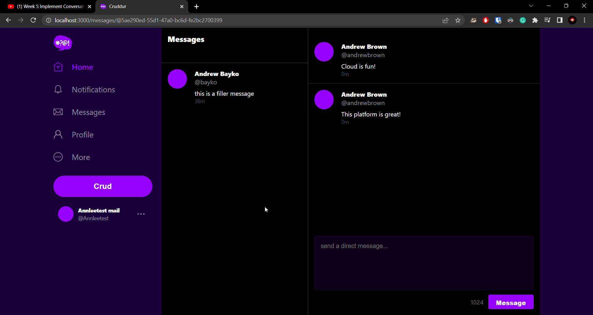
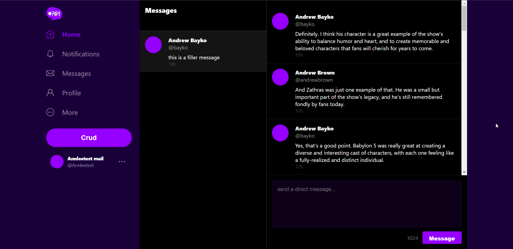
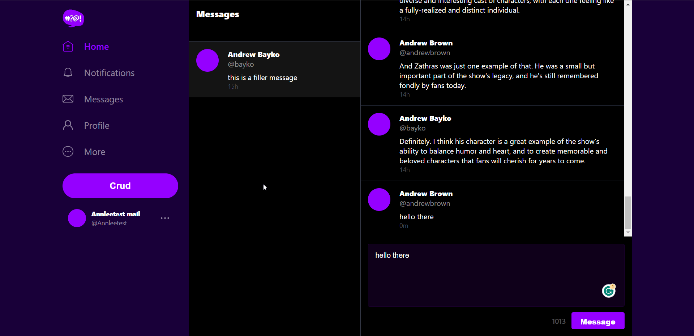
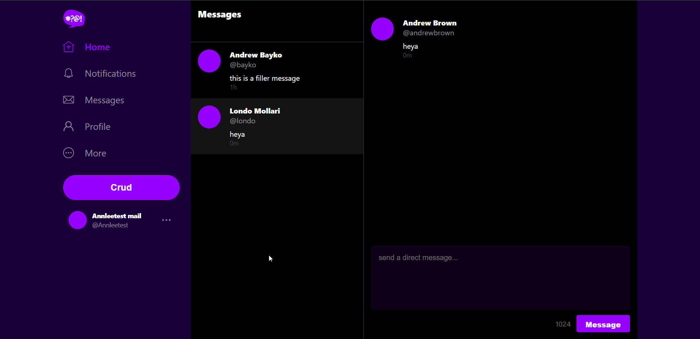
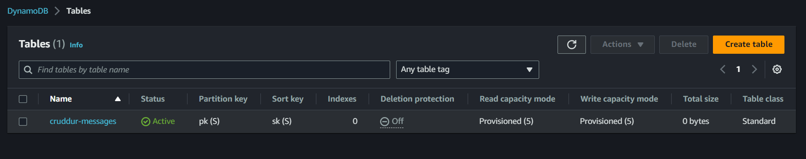
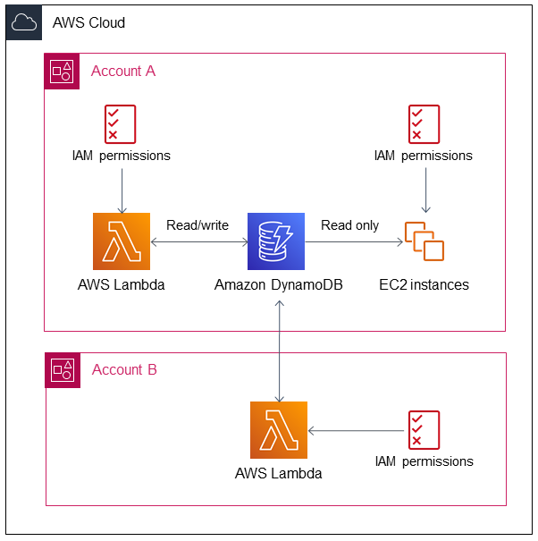

# Week 5 — DynamoDB and Serverless Caching

## [Required Homework](#required-homework-1)

- [Data Modelling](#data-modelling)
- [Implement Schema Load Script](#implement-schema-load-script)
- [Implement Seed Script](#implement-seed-script)
- [Implement Scan Script](#implement-scan-script)
- [Implement Pattern Scripts for Read and List Conversations](#implement-pattern-scripts-for-read-and-list-conversations)
- [Implement Update Cognito ID Script for Postgres Database](#implement-update-cognito-id-script-for-postgres-database)
- [Implement (Pattern A) Listing Messages in Message Group into Application](#implement-pattern-a-listing-messages-in-message-group-into-application)
- [Implement (Pattern B) Listing Messages Group into Application](#implement-pattern-b-listing-messages-group-into-application)
- [Implement (Pattern C) Creating a Message for an existing Message Group into Application](#implement-pattern-c-creating-a-message-for-an-existing-message-group-into-application)
- [Implement (Pattern D) Creating a Message for a new Message Group into Application](#implement-pattern-d-creating-a-message-for-a-new-message-group-into-application)
- [Implement (Pattern E) Updating a Message Group using DynamoDB Streams](#implement-pattern-e-updating-a-message-group-using-dynamodb-streams)
- [Security - How to use Amazon DynamoDB for security and speed](#security---how-to-use-amazon-dynamodb-for-security-and-speed)


## [Homework Challenges](#homework-challenges-1)


---

## Required Homework

### Data Modelling

- In DynamoDB, we don't have joins, so we need to plan for a flat table.
- DynamoDB offers the ability to use SQL, specifically [PartiQL](https://docs.aws.amazon.com/amazondynamodb/latest/developerguide/ql-gettingstarted.html)
- Structuring all data in a single table, as opposed to using related tables, improves scalability and accessibility.

[**DynamoDB Modelling SVG**](media/week5/images/DynamoDB%20Modelling.svg)

| pk | sk (created_at or last_reply_at) | data (data key) | uuid | display_name (aka other_user_display_name) | handle (aka other_user_handle) | message (aka last_message) | user_uuid | message_group_uuid |
| --- | --- | --- | --- | --- | --- | --- | --- | --- |
| MSG#{message_group_uuid} | MSG#{created_at} |  | 32423432-235325-3525-325235352-235235 | Andrew Brown | andrewbrown | Testing 123 | 90324830-2948230948-23424-30924 | 23523532-6433634643-234234234-23423525 |
| GRP#{my_user_uuid} | GRP#{last_reply_at} |  |  | Andrew Bayko | bayko | Great, I'll go take a look | 2342342-52353252-23523523-23424 | 23523532-6433634643-234234234-23423525 |
| GRP#{my_user_uuid} | GRP#{last_reply_at} |  |  | Andrew Brown | brown | Testing 123 | 90324830-2948230948-23424-30924 | 23523532-6433634643-234234234-23423525 |

- Every query must include a partition key (pk) and, if present in the table, a sort key (sk).
- When writing a query, you must provide a primary key (equality), such as pk = 'andrew'.
- Whenever you change a key (simple or composite), such as pk or sk, you must create a new item.
- It is better to solve problems without using GSI (global secondary indexes) and LSI (local secondary indexes) if possible.
- Data keys can act as a third key or a place to store JSON documents.
- Implement frequently used patterns in your app first and then optimize them.
- If you're not indexing data, store it as a JSON document in a string field.
- It's okay to repeat data if it improves indexing.
- Only create a UUID for an entity if you have an access pattern for it.

[**Patterns in SQL for reference**](https://github.com/omenking/aws-bootcamp-cruddur-2023/blob/week-5/journal/week5.md#pattern-a--showing-a-single-conversation)

### Implement Schema Load Script

- Add `boto3` to the requirements.txt file and run `pip install`.
- Create a new folder `ddb` inside `backend-flask/bin` .
- Add `schema-load` script to this folder and make it executable

```json
#! /usr/bin/env python3

import boto3
import sys

attrs = {"endpoint_url": "http://localhost:8000"}

if len(sys.argv) == 2:
    if "prod" in sys.argv[1]:
        attrs = {}

ddb = boto3.client("dynamodb", **attrs)
table_name = "cruddur-messages"

response = ddb.create_table(
    TableName=table_name,
    AttributeDefinitions=[
        {"AttributeName": "pk", "AttributeType": "S"},
        {"AttributeName": "sk", "AttributeType": "S"},
    ],
    KeySchema=[
        {"AttributeName": "pk", "KeyType": "HASH"},
        {"AttributeName": "sk", "KeyType": "RANGE"},
    ],
    # GlobalSecondaryIndexes=[
    # ],
    BillingMode="PROVISIONED",
    ProvisionedThroughput={"ReadCapacityUnits": 5, "WriteCapacityUnits": 5},
)

print(response)
```

- run script `./bin/ddb/schema-load`
- Ouput

```bash
❯ ./bin/ddb/schema-load
{'TableDescription': {'AttributeDefinitions': [{'AttributeName': 'pk', 'AttributeType': 'S'}, {'AttributeName': 'sk', 'AttributeType': 'S'}], 'TableName': 'cruddur-message', 'KeySchema': [{'AttributeName': 'pk', 'KeyType': 'HASH'}, {'AttributeName': 'sk', 'KeyType': 'RANGE'}], 'TableStatus': 'ACTIVE', 'CreationDateTime': datetime.datetime(2023, 3, 22, 10, 45, 31, 776000, tzinfo=tzlocal()), 'ProvisionedThroughput': {'LastIncreaseDateTime': datetime.datetime(1970, 1, 1, 5, 30, tzinfo=tzlocal()), 'LastDecreaseDateTime': datetime.datetime(1970, 1, 1, 5, 30, tzinfo=tzlocal()), 'NumberOfDecreasesToday': 0, 'ReadCapacityUnits': 5, 'WriteCapacityUnits': 5}, 'TableSizeBytes': 0, 'ItemCount': 0, 'TableArn': 'arn:aws:dynamodb:ddblocal:000000000000:table/cruddur-message'}, 'ResponseMetadata': {'RequestId': 'c92b6b70-b2b5-480c-974c-01525a3a7d7b', 'HTTPStatusCode': 200, 'HTTPHeaders': {'date': 'Wed, 22 Mar 2023 05:15:31 GMT', 'x-amzn-requestid': 'c92b6b70-b2b5-480c-974c-01525a3a7d7b', 'content-type': 'application/x-amz-json-1.0', 'x-amz-crc32': '2239767864', 'content-length': '578', 'server': 'Jetty(9.4.48.v20220622)'}, 'RetryAttempts': 0}}
```

- Script to list-tables → **list-tables**

```bash
#! /usr/bin/bash

set -e # stop if it fails at any point

if [ "$1" = "prod" ]; then
    ENDPOINT_URL=""
else
    ENDPOINT_URL="--endpoint-url=http://localhost:8000"
fi

aws dynamodb list-tables $ENDPOINT_URL \
--query TableNames \
--output table
```

- script to drop table → **drop**

```bash
#! /usr/bin/bash

set -e # stop if it fails at any point

if [ -z "$1" ]; then
    echo "No TABLE_NAME argument supplied eg ./bin/ddb/drop cruddur-messages prod"
    exit 1
fi

TABLE_NAME=$1

if [ "$2" = "prod" ]; then
    ENDPOINT_URL=""
else
    ENDPOINT_URL="--endpoint-url=http://localhost:8000"
fi

aws dynamodb delete-table $ENDPOINT_URL \
--table-name $TABLE_NAME
```

### Implement Seed Script

- Create [`backend-flask/bin/ddb/seed`](media/week5/code/ddb-seed) and make it executable.

- Update the PostgreSQL database schema and seed the data.
- Run `./bin/ddb/seed` to seed the DynamoDB database.
- This method might not be the most efficient way to do this. Sometimes, it's much more efficient to use `BatchWriteItem`.

### Implement Scan Script

- Used to list all data in ddb
- Create `backend-flask/bin/ddb/scan` and make it executable

```python
#! /usr/bin/env python3

import boto3
import sys

attrs = {"endpoint_url": "http://localhost:8000"}

ddb = boto3.resource("dynamodb", **attrs)

table_name = "cruddur-messages"

table = ddb.Table(table_name)
response = table.scan()

print("RESPONSE >>>>>>>>", response)

items = response["Items"]

for item in items:
    print(item)
```

- `./bin/ddb/scan`

```bash
................................
................................
{'user_uuid': '2f61ee44-0bf0-4f2f-8efc-587bc05bee32', 'user_handle': 'andrewbrown', 'sk': '2023-03-22T14:31:25.547845+05:30', 'pk': 'MSG#5ae290ed-55d1-47a0-bc6d-fe2bc2700399', 'message_uuid': 'bd6c7541-a960-4a0d-966f-103c0ccadb6c', 'message': "Yes, I agree. And it's impressive how they were able to accomplish all of this on a TV budget. The fact that the show was able to create such a rich and immersive sci-fi universe with limited resources is a testament to the talent and creativity of the production team.", 'user_display_name': 'Andrew Brown'}
{'user_uuid': '46f3e041-7154-4183-9e35-e6463fa4a987', 'user_handle': 'bayko', 'sk': '2023-03-22T14:32:25.547845+05:30', 'pk': 'MSG#5ae290ed-55d1-47a0-bc6d-fe2bc2700399', 'message_uuid': '66bd1761-f51c-409b-9367-34af75273ce6', 'message': "Definitely. And it's one of the reasons why the show has aged so well. Even today, the visual effects still hold up and look impressive, which is a rarity for a show that's almost 30 years old.", 'user_display_name': 'Andrew Bayko'}
{'user_uuid': '2f61ee44-0bf0-4f2f-8efc-587bc05bee32', 'user_handle': 'andrewbrown', 'sk': '2023-03-22T14:33:25.547845+05:30', 'pk': 'MSG#5ae290ed-55d1-47a0-bc6d-fe2bc2700399', 'message_uuid': 'a6132bb9-a450-4408-9059-6b9d0b245729', 'message': "Agreed. And it's also worth noting the way the show's use of visual effects influenced other sci-fi shows that came after it. Babylon 5 really set the bar for what was possible in terms of sci-fi visuals on TV.", 'user_display_name': 'Andrew Brown'}
{'user_uuid': '46f3e041-7154-4183-9e35-e6463fa4a987', 'user_handle': 'bayko', 'sk': '2023-03-22T14:34:25.547845+05:30', 'pk': 'MSG#5ae290ed-55d1-47a0-bc6d-fe2bc2700399', 'message_uuid': '585c3944-6c68-4b07-8a98-5025f9a0189e', 'message': "Yes, it definitely had a big impact on the genre as a whole. And it's a great example of how innovative and groundbreaking sci-fi can be when it's done right.", 'user_display_name': 'Andrew Bayko'}
{'user_uuid': '2f61ee44-0bf0-4f2f-8efc-587bc05bee32', 'user_handle': 'andrewbrown', 'sk': '2023-03-22T14:35:25.547845+05:30', 'pk': 'MSG#5ae290ed-55d1-47a0-bc6d-fe2bc2700399', 'message_uuid': '3f4d0694-2233-4be7-a622-47cc268ee647', 'message': 'Another character I wanted to discuss is Zathras. What did you think of his character?', 'user_display_name': 'Andrew Brown'}
{'user_uuid': '46f3e041-7154-4183-9e35-e6463fa4a987', 'user_handle': 'bayko', 'sk': '2023-03-22T14:36:25.547845+05:30', 'pk': 'MSG#5ae290ed-55d1-47a0-bc6d-fe2bc2700399', 'message_uuid': '2ae5c708-cbe3-404d-8089-2d860fd4d51a', 'message': 'Zathras was a really unique and memorable character. He was quirky and eccentric, but also had a lot of heart and sincerity.', 'user_display_name': 'Andrew Bayko'}
{'user_uuid': '2f61ee44-0bf0-4f2f-8efc-587bc05bee32', 'user_handle': 'andrewbrown', 'sk': '2023-03-22T14:37:25.547845+05:30', 'pk': 'MSG#5ae290ed-55d1-47a0-bc6d-fe2bc2700399', 'message_uuid': '19d08d52-a7cc-4ea2-b803-1450e778ae7c', 'message': 'Yes, I thought he was a great addition to the show. He added some much-needed comic relief, but also had some important moments of character development.', 'user_display_name': 'Andrew Brown'}
{'user_uuid': '46f3e041-7154-4183-9e35-e6463fa4a987', 'user_handle': 'bayko', 'sk': '2023-03-22T14:38:25.547845+05:30', 'pk': 'MSG#5ae290ed-55d1-47a0-bc6d-fe2bc2700399', 'message_uuid': '761171fa-c6c5-4097-8798-d5cf81a1c0d5', 'message': "And I appreciated the way the show used him as a sort of plot device, with his knowledge of time and space being instrumental in the resolution of some of the show's major storylines.", 'user_display_name': 'Andrew Bayko'}
................................
................................
```

### Implement Pattern Scripts for Read and List Conversations

#### get-conversation

- Used to list all conversation.
- Create `backend-flask/bin/ddb/patterns/get-conversation` and make it executable.

```python
#!/usr/bin/env python3

import boto3
import sys
import json
import datetime

attrs = {"endpoint_url": "http://localhost:8000"}

if len(sys.argv) == 2:
    if "prod" in sys.argv[1]:
        attrs = {}

dynamodb = boto3.client("dynamodb", **attrs)
table_name = "cruddur-messages"

message_group_uuid = "5ae290ed-55d1-47a0-bc6d-fe2bc2700399"

# define the query parameters
query_params = {
    "TableName": table_name,
    "ScanIndexForward": False,
    "Limit": 20,
    "KeyConditionExpression": "pk = :pk AND begins_with(sk, :year)",
    "ExpressionAttributeValues": {
        ":pk": {"S": f"MSG#{message_group_uuid}"},
        ":year": {"S": "2023"},
    },
    "ReturnConsumedCapacity": "TOTAL",
}

# query the table
response = dynamodb.query(**query_params)

# print the items returned by the query
print(json.dumps(response, sort_keys=True, indent=2))

# print the consumed capacity
print(json.dumps(response["ConsumedCapacity"], sort_keys=True, indent=2))

items = response["Items"]

for item in reversed(items):
    sender_handle = item["user_handle"]["S"]
    message = item["message"]["S"]
    timestamp = item["sk"]["S"]
    dt_object = datetime.datetime.strptime(timestamp, "%Y-%m-%dT%H:%M:%S.%f%z")
    formatted_datetime = dt_object.strftime("%Y-%m-%d %I:%M %p")
    print(f"{sender_handle: <16}{formatted_datetime: <22}{message[:40]}...")
```

- `./backend-flask/bin/ddb/patterns/get-conversation`

```bash
................................
................................
"ResponseMetadata": {
    "HTTPHeaders": {
      "content-type": "application/x-amz-json-1.0",
      "date": "Wed, 22 Mar 2023 08:35:09 GMT",
      "server": "Jetty(9.4.48.v20220622)",
      "transfer-encoding": "chunked",
      "x-amz-crc32": "4262478314",
      "x-amzn-requestid": "1cb5a89d-f693-4f5e-816f-d71b5c4c1a89"
    },
    "HTTPStatusCode": 200,
    "RequestId": "1cb5a89d-f693-4f5e-816f-d71b5c4c1a89",
    "RetryAttempts": 0
  },
  "ScannedCount": 20
}
{
  "CapacityUnits": 1.0,
  "TableName": "cruddur-messages"
}
bayko           2023-03-22 02:44 PM   Definitely. I think his character is a g...
andrewbrown     2023-03-22 02:43 PM   And Zathras was just one example of that...
bayko           2023-03-22 02:42 PM   Yes, that's a good point. Babylon 5 was ...
andrewbrown     2023-03-22 02:41 PM   I also thought that Zathras was a great ...
bayko           2023-03-22 02:40 PM   Yeah, that was a clever storytelling dev...
andrewbrown     2023-03-22 02:39 PM   Definitely. It was a great way to integr...
................................
................................
```

#### list-conversation

- Add this to function to `db.py`

```python
# when we want to return a a single value
  def query_value(self, sql, params={}):
      self.print_sql("value", sql, params)

      with self.pool.connection() as conn:
          with conn.cursor() as cur:
              cur.execute(sql, params)
              json = cur.fetchone()
              return json[0]
```

- Update `print_sql` function in `db.py` to this and update all function calls to pass params.

```python
def print_sql(self,title,sql,params={}):
    cyan = '\033[96m'
    no_color = '\033[0m'
    print(f'{cyan} SQL STATEMENT-[{title}]------{no_color}')
    print(sql,params)
```

- Create `backend-flask/bin/ddb/patterns/list-conversation` and make it executable.

```python
#!/usr/bin/env python3

import boto3
import sys
import json
import os
import sys

current_path = os.path.dirname(os.path.abspath(__file__))
parent_path = os.path.abspath(os.path.join(current_path, "..", "..", ".."))
sys.path.append(parent_path)
from lib.db import db

attrs = {"endpoint_url": "http://localhost:8000"}

if len(sys.argv) == 2:
    if "prod" in sys.argv[1]:
        attrs = {}

dynamodb = boto3.client("dynamodb", **attrs)
table_name = "cruddur-messages"

def get_my_user_uuids():
    sql = """
        SELECT 
            users.uuid
        FROM users
        WHERE
            users.handle = %(handle)s
    """

    uuid = db.query_value(sql, {"handle": "andrewbrown"})

    return uuid

my_user_uuid = get_my_user_uuids()
print("my user uuid >>>>", my_user_uuid)

# define the query parameters
query_params = {
    "TableName": table_name,
    "KeyConditionExpression": "pk = :pk",
    "ExpressionAttributeValues": {":pk": {"S": f"GRP#{my_user_uuid}"}},
    "ReturnConsumedCapacity": "TOTAL",
}

# query the table
response = dynamodb.query(**query_params)

# print the items returned by the query
print(json.dumps(response, sort_keys=True, indent=2))
```

- Run this command `./backend-flask/bin/ddb/patterns/list-conversation`

```python
❯ ./backend-flask/bin/ddb/patterns/list-conversation
.....................
.....................
  "Items": [
    {
      "message": {
        "S": "this is a filler message"
      },
      "message_group_uuid": {
        "S": "5ae290ed-55d1-47a0-bc6d-fe2bc2700399"
      },
      "pk": {
        "S": "GRP#2f61ee44-0bf0-4f2f-8efc-587bc05bee32"
      },
      "sk": {
        "S": "2023-03-22T13:01:25.547845+05:30"
      },
      "user_display_name": {
        "S": "Andrew Bayko"
      },
      "user_handle": {
        "S": "bayko"
      },
      "user_uuid": {
        "S": "46f3e041-7154-4183-9e35-e6463fa4a987"
      }
.....................
.....................
```

### Implement Update Cognito ID Script for Postgres Database

- Create a file `backend-flask/bin/cognito/list-users` and `chmod` it

```python
#!/usr/bin/env python3

import boto3
import os
import json

userpool_id = os.getenv("AWS_USER_POOLS_ID")
client = boto3.client("cognito-idp")
params = {"UserPoolId": userpool_id, "AttributesToGet": ["preferred_username", "sub"]}
response = client.list_users(**params)
users = response["Users"]

print(json.dumps(users, sort_keys=True, indent=2, default=str))

dict_users = {}
for user in users:
    attrs = user["Attributes"]
    sub = next((a for a in attrs if a["Name"] == "sub"), None)
    handle = next((a for a in attrs if a["Name"] == "preferred_username"), None)
    dict_users[handle["Value"]] = sub["Value"]

print(json.dumps(dict_users, sort_keys=True, indent=2, default=str))
```

- Run this to view user details `./backend-flask/bin/cognito/list-users`

```bash
............................
............................
{
  "Annlee": "c550a9**3be16",
  "Annleetest": "3c657**82876d6d90f",
}
```

- Create `backend-flask/bin/db/update_cognito_user_ids` and `chmod`

```python
#!/usr/bin/env python3

import boto3
import os
import sys

current_path = os.path.dirname(os.path.abspath(__file__))
parent_path = os.path.abspath(os.path.join(current_path, "..", ".."))
sys.path.append(parent_path)
from lib.db import db

def update_users_with_cognito_user_id(handle, sub):
    sql = """
    UPDATE public.users
    SET cognito_user_id = %(sub)s
    WHERE
      users.handle = %(handle)s;
  """
    db.query_commit(sql, {"handle": handle, "sub": sub})

def get_cognito_user_ids():
    userpool_id = os.getenv("AWS_USER_POOLS_ID")
    client = boto3.client("cognito-idp")
    params = {
        "UserPoolId": userpool_id,
        "AttributesToGet": ["preferred_username", "sub"],
    }
    response = client.list_users(**params)
    users = response["Users"]
    dict_users = {}
    for user in users:
        attrs = user["Attributes"]
        sub = next((a for a in attrs if a["Name"] == "sub"), None)
        handle = next((a for a in attrs if a["Name"] == "preferred_username"), None)
        dict_users[handle["Value"]] = sub["Value"]
    return dict_users

users = get_cognito_user_ids()

for handle, sub in users.items():
    print("----", handle, sub)
    update_users_with_cognito_user_id(handle=handle, sub=sub)
```

- Add this to `backend-flask/bin/db/setup`

```bash
python3 "$bin_path/db/update_cognito_user_ids"
```

- Create this file `backend-flask/db/sql/users/uuid_from_cognito_user_id.sql`

```sql
SELECT users.uuid
FROM public.users
WHERE
    users.cognito_user_id = %(cognito_user_id)s
LIMIT 1
```

### Implement (Pattern A) Listing Messages in Message Group into Application

- create a file [`backend-flask/lib/ddb.py`](media/week5/code/ddb.py)

- Add this environment variable under the backend service in Docker Compose. This is necessary for `ddb.py` to connect to the local DynamoDB.

```yaml
AWS_ENDPOINT_URL: "http://dynamodb-local:8000"
```

- in `app.py` update `data_message_group` function like this

```python
@app.route("/api/message_groups", methods=["GET"])
def data_message_groups():
    claims = request.environ["claims"]
    cognito_user_id = claims["sub"]
    model = MessageGroups.run(cognito_user_id=cognito_user_id)

    if model["errors"] is not None:
        return model["errors"], 422
    else:
        return model["data"], 200
```

- Remove @ sign from `data_messages` route in app.py.
- Update `backend-flask/services/message_groups.py`

```python
from datetime import datetime, timedelta, timezone

from lib.ddb import Ddb
from lib.db import db

class MessageGroups:
    def run(cognito_user_id):
        model = {"errors": None, "data": None}

        sql = db.template("users", "uuid_from_cognito_user_id")
        my_user_uuid = db.query_value(sql, {"cognito_user_id": cognito_user_id})

        print(f"UUID: {my_user_uuid}")

        ddb = Ddb.client()
        data = Ddb.list_message_groups(ddb, my_user_uuid)
        print("list_message_groups: ", data)

        model["data"] = data
        return model
```

- Update `backend-flask/bin/ddb/patterns/list-conversation`

```python
#!/usr/bin/env python3

import boto3
import sys
import json
import os
import sys
import datetime

current_path = os.path.dirname(os.path.abspath(__file__))
parent_path = os.path.abspath(os.path.join(current_path, "..", "..", ".."))
sys.path.append(parent_path)
from lib.db import db

attrs = {"endpoint_url": "http://localhost:8000"}

if len(sys.argv) == 2:
    if "prod" in sys.argv[1]:
        attrs = {}

dynamodb = boto3.client("dynamodb", **attrs)
table_name = "cruddur-messages"

def get_my_user_uuids():
    sql = """
        SELECT 
            users.uuid
        FROM users
        WHERE
            users.handle = %(handle)s
    """

    uuid = db.query_value(sql, {"handle": "andrewbrown"})

    return uuid

my_user_uuid = get_my_user_uuids()

year = str(datetime.datetime.now().year)

# define the query parameters
query_params = {
    "TableName": table_name,
    "KeyConditionExpression": "pk = :pk AND begins_with(sk, :year)",
    "ExpressionAttributeValues": {
        ":year": {"S": year},
        ":pk": {"S": f"GRP#{my_user_uuid}"},
    },
    "ReturnConsumedCapacity": "TOTAL",
}

# query the table
response = dynamodb.query(**query_params)

# print the items returned by the query
print(json.dumps(response, sort_keys=True, indent=2))
```

- Update `backend-flask/bin/ddb/patterns/get-conversation`

```python
#!/usr/bin/env python3

import boto3
import sys
import json
import datetime

attrs = {"endpoint_url": "http://localhost:8000"}

if len(sys.argv) == 2:
    if "prod" in sys.argv[1]:
        attrs = {}

dynamodb = boto3.client("dynamodb", **attrs)
table_name = "cruddur-messages"

message_group_uuid = "5ae290ed-55d1-47a0-bc6d-fe2bc2700399"

year = str(datetime.datetime.now().year)

# define the query parameters
query_params = {
    "TableName": table_name,
    "ScanIndexForward": False,
    "Limit": 20,
    "KeyConditionExpression": "pk = :pk AND begins_with(sk, :year)",
    #'KeyConditionExpression': 'pk = :pk AND sk BETWEEN :start_date AND :end_date',
    "ExpressionAttributeValues": {
        ":year": {"S": year},
        # ":start_date": { "S": "2023-03-01T00:00:00.000000+00:00" },
        # ":end_date": { "S": "2023-03-19T23:59:59.999999+00:00" },
        ":pk": {"S": f"MSG#{message_group_uuid}"},
    },
    "ReturnConsumedCapacity": "TOTAL",
}

# query the table
response = dynamodb.query(**query_params)

# print the items returned by the query
print(json.dumps(response, sort_keys=True, indent=2))

# print the consumed capacity
print(json.dumps(response["ConsumedCapacity"], sort_keys=True, indent=2))

items = response["Items"]

items.reverse()

for item in items:
    sender_handle = item["user_handle"]["S"]
    message = item["message"]["S"]
    timestamp = item["sk"]["S"]
    dt_object = datetime.datetime.strptime(timestamp, "%Y-%m-%dT%H:%M:%S.%f%z")
    formatted_datetime = dt_object.strftime("%Y-%m-%d %I:%M %p")
    print(f"{sender_handle: <16}{formatted_datetime: <22}{message[:40]}...")
```

#### Updating Auth

- Add Authorization header to these pages in frontend. Also delete cookie import statement.
    - frontend-react-js/src/pages/MessageGroupPage.js
    - frontend-react-js/src/pages/MessageGroupsPage.js
    - frontend-react-js/src/components/MessageForm.js

```jsx
headers: {
  'Authorization': `Bearer ${localStorage.getItem("access_token")}`,
},
```

- Create file `frontend-react-js/src/lib/CheckAuth.js`

```jsx
import { Auth } from "aws-amplify";

const checkAuth = async (setUser) => {
    Auth.currentAuthenticatedUser({
        // Optional, By default is false.
        // If set to true, this call will send a
        // request to Cognito to get the latest user data
        bypassCache: false,
    })
        .then((user) => {
            console.log("user", user);
            return Auth.currentAuthenticatedUser();
        })
        .then((cognito_user) => {

            setUser({
                display_name: cognito_user.attributes.name,
                handle: cognito_user.attributes.preferred_username,
            });

        })
        .catch((err) => console.log(err));
};
```

- Import this in `HomeFeedPage.js`

```jsx
import checkAuth from '../lib/CheckAuth'
```

- Update `checkAuth();` function call in `HomeFeedPage.js`.

```jsx
checkAuth(setUser);
```

- Repeat the same for:
    - frontend-react-js/src/pages/MessageGroupsPage.js
    - frontend-react-js/src/pages/MessageGroupPage.js
- update `App.js` route.

```jsx
{
  path: "/messages/:message_group_uuid",
  element: <MessageGroupPage />,
},
```

- Update `frontend-react-js/src/pages/MessageGroupPage.js`

```jsx
const loadMessageGroupData = async () => {
    try {
      const backend_url = `${process.env.REACT_APP_BACKEND_URL}/api/messages/${params.message_group_uuid}`
      const res = await fetch(backend_url, {
        method: "GET"
      });
      let resJson = await res.json();
      if (res.status === 200) {
        setMessages(resJson)
      } else {
        console.log(res)
      }
    } catch (err) {
      console.log(err);
    }
  };
```

- Update classes and Link in `frontend-react-js/src/components/MessageGroupItem.js`

```jsx
const classes = () => {
    let classes = ["message_group_item"];
    if (params.message_group_uuid == props.message_group.uuid) {
      classes.push("active");
    }
    return classes.join(" ");
  };

  return (
    <Link className={classes()} to={`/messages/` + props.message_group.uuid}>
```

- Message tab at this point.



### Implement (Pattern B) Listing Messages Group into Application

- Update `data_messages` in `app.py`

```python
@app.route("/api/messages/<string:message_group_uuid>", methods=["GET"])
def data_messages(message_group_uuid):
    claims = request.environ["claims"]
    cognito_user_id = claims["sub"]
    model = Messages.run(
        cognito_user_id=cognito_user_id, message_group_uuid=message_group_uuid
    )
    if model["errors"] is not None:
        return model["errors"], 422
    else:
        return model["data"], 200
    return
```

- Update `backend-flask/services/messages.py`

```python
from datetime import datetime, timedelta, timezone
from lib.ddb import Ddb
from lib.db import db

class Messages:
    def run(message_group_uuid, cognito_user_id):
        model = {"errors": None, "data": None}

        sql = db.template("users", "uuid_from_cognito_user_id")
        my_user_uuid = db.query_value(sql, {"cognito_user_id": cognito_user_id})

        ddb = Ddb.client()
        data = Ddb.list_messages(ddb, message_group_uuid)
        print("list_messages")
        print(data)

        model["data"] = data
        return model
```

- Update `backend-flask/services/create_message.py`

```python
from datetime import datetime, timedelta, timezone

from lib.db import db
from lib.ddb import Ddb

class CreateMessage:
    # mode indicates if we want to create a new message_group or using an existing one
    def run(
        mode,
        message,
        cognito_user_id,
        message_group_uuid=None,
        user_receiver_handle=None,
    ):
        model = {"errors": None, "data": None}

        if mode == "update":
            if message_group_uuid == None or len(message_group_uuid) < 1:
                model["errors"] = ["message_group_uuid_blank"]

        if cognito_user_id == None or len(cognito_user_id) < 1:
            model["errors"] = ["cognito_user_id_blank"]

        if mode == "create":
            if user_receiver_handle == None or len(user_receiver_handle) < 1:
                model["errors"] = ["user_reciever_handle_blank"]

        if message == None or len(message) < 1:
            model["errors"] = ["message_blank"]
        elif len(message) > 1024:
            model["errors"] = ["message_exceed_max_chars"]

        if model["errors"]:
            # return what we provided
            model["data"] = {
                "display_name": "Andrew Brown",
                "handle": user_sender_handle,
                "message": message,
            }
        else:
            sql = db.template("users", "create_message_users")

            if user_receiver_handle == None:
                rev_handle = ""
            else:
                rev_handle = user_receiver_handle
            users = db.query_array_json(
                sql,
                {
                    "cognito_user_id": cognito_user_id,
                    "user_receiver_handle": rev_handle,
                },
            )
            print("USERS =-=-=-=-==")
            print(users)

            my_user = next((item for item in users if item["kind"] == "sender"), None)
            other_user = next((item for item in users if item["kind"] == "recv"), None)

            print("USERS=[my-user]==")
            print(my_user)
            print("USERS=[other-user]==")
            print(other_user)

            ddb = Ddb.client()

            if mode == "update":
                data = Ddb.create_message(
                    client=ddb,
                    message_group_uuid=message_group_uuid,
                    message=message,
                    my_user_uuid=my_user["uuid"],
                    my_user_display_name=my_user["display_name"],
                    my_user_handle=my_user["handle"],
                )
            elif mode == "create":
                data = Ddb.create_message_group(
                    client=ddb,
                    message=message,
                    my_user_uuid=my_user["uuid"],
                    my_user_display_name=my_user["display_name"],
                    my_user_handle=my_user["handle"],
                    other_user_uuid=other_user["uuid"],
                    other_user_display_name=other_user["display_name"],
                    other_user_handle=other_user["handle"],
                )
            model["data"] = data
        return model
```



### Implement (Pattern C) Creating a Message for an existing Message Group into Application

Note: Remove @ before uuid if messages are not visible.

- Update `onsubmit` in `frontend-react-js/src/components/MessageForm.js`

```jsx
const onsubmit = async (event) => {
    event.preventDefault();
    try {
      const backend_url = `${process.env.REACT_APP_BACKEND_URL}/api/messages`
      console.log('onsubmit payload', message)

      let json = {
        "message": message
      }

      if (params.handle) {
        json.handle = params.handle
      } else {

        json.message_group_uuid = params.message_group_uuid
      }

      const res = await fetch(backend_url, {
        method: "POST",
        headers: {
          'Accept': 'application/json',
          'Content-Type': 'application/json',
          'Authorization': `Bearer ${localStorage.getItem("access_token")}`,
        },
        body: JSON.stringify(
          json
        ),
```

- Update `data_create_message()` in `app.py`

```python
@app.route("/api/messages", methods=["POST", "OPTIONS"])
@cross_origin()
def data_create_message():
    message_group_uuid = request.json.get("message_group_uuid", None)
    user_receiver_handle = request.json.get("handle", None)
    message = request.json["message"]

    claims = request.environ["claims"]
    cognito_user_id = claims["sub"]

    if message_group_uuid is None:
        # Create for the first time
        model = CreateMessage.run(
            mode="create",
            message=message,
            cognito_user_id=cognito_user_id,
            user_receiver_handle=user_receiver_handle,
        )
    else:
        # Push onto existing Message Group
        model = CreateMessage.run(
            mode="update",
            message=message,
            message_group_uuid=message_group_uuid,
            cognito_user_id=cognito_user_id,
        )

    if model["errors"] is not None:
        return model["errors"], 422
    else:
        return model["data"], 200
```

- Create `backend-flask/db/sql/users/create_message_users.sql`

```sql
SELECT 
  users.uuid,
  users.display_name,
  users.handle,
  CASE users.cognito_user_id = %(cognito_user_id)s
  WHEN TRUE THEN
    'sender'
  WHEN FALSE THEN
    'recv'
  ELSE
    'other'
  END as kind
FROM public.users
WHERE
  users.cognito_user_id = %(cognito_user_id)s
  OR 
  users.handle = %(user_receiver_handle)s
```

- Posting message is successful.



- Add this to routes in `App.js`

```python
import MessageGroupNewPage from "./pages/MessageGroupNewPage";

{
  path: "/messages/new/:handle",
  element: <MessageGroupNewPage />,
},
```

- Create a new file `/pages/MessageGroupNewPage.js`

```jsx
import './MessageGroupPage.css';
import React from "react";
import { useParams } from 'react-router-dom';

import DesktopNavigation from '../components/DesktopNavigation';
import MessageGroupFeed from '../components/MessageGroupFeed';
import MessagesFeed from '../components/MessageFeed';
import MessagesForm from '../components/MessageForm';
import checkAuth from '../lib/CheckAuth';

export default function MessageGroupPage() {
    const [otherUser, setOtherUser] = React.useState([]);
    const [messageGroups, setMessageGroups] = React.useState([]);
    const [messages, setMessages] = React.useState([]);
    const [popped, setPopped] = React.useState([]);
    const [user, setUser] = React.useState(null);
    const dataFetchedRef = React.useRef(false);
    const params = useParams();

    const loadUserShortData = async () => {
        try {
            const backend_url = `${process.env.REACT_APP_BACKEND_URL}/api/users/@${params.handle}/short`
            const res = await fetch(backend_url, {
                method: "GET"
            });
            let resJson = await res.json();
            if (res.status === 200) {
                console.log('other user:', resJson)
                setOtherUser(resJson)
            } else {
                console.log(res)
            }
        } catch (err) {
            console.log(err);
        }
    };

    const loadMessageGroupsData = async () => {
        try {
            const backend_url = `${process.env.REACT_APP_BACKEND_URL}/api/message_groups`
            const res = await fetch(backend_url, {
                headers: {
                    Authorization: `Bearer ${localStorage.getItem("access_token")}`
                },
                method: "GET"
            });
            let resJson = await res.json();
            if (res.status === 200) {
                setMessageGroups(resJson)
            } else {
                console.log(res)
            }
        } catch (err) {
            console.log(err);
        }
    };

    React.useEffect(() => {
        //prevents double call
        if (dataFetchedRef.current) return;
        dataFetchedRef.current = true;

        loadMessageGroupsData();
        loadUserShortData();
        checkAuth(setUser);
    }, [])
    return (
        <article>
            <DesktopNavigation user={user} active={'home'} setPopped={setPopped} />
            <section className='message_groups'>
                <MessageGroupFeed otherUser={otherUser} message_groups={messageGroups} />
            </section>
            <div className='content messages'>
                <MessagesFeed messages={messages} />
                <MessagesForm setMessages={setMessages} />
            </div>
        </article>
    );
}
```

- Update `backend-flask/db/seed.sql`

```sql
-- this file was manually created

INSERT INTO
    public.users (
        display_name,
        email,
        handle,
        cognito_user_id
    )
VALUES (
        'Annlee Test',
        'annleetestmail@gmail.com',
        'Annleetest',
        'MOCK'
    ), (
        'Andrew Brown',
        'andrewb@exampro.co',
        'andrewbrown',
        'MOCK'
    ), (
        'Andrew Bayko',
        'bayko@exampro.co',
        'bayko',
        'MOCK'
    ), (
        'Londo Mollari',
        'lmollari@centari.com',
        'londo',
        'MOCK'
    );

INSERT INTO
    public.activities (user_uuid, message, expires_at)
VALUES ( (
            SELECT uuid
            from public.users
            WHERE
                users.handle = 'andrewbrown'
            LIMIT
                1
        ), 'This was imported as seed data!', current_timestamp + interval '10 day'
    )
```

- Add this to `app.py`

```python
from services.users_short import *

@app.route("/api/users/@<string:handle>/short", methods=["GET"])
def data_users_short(handle):
    data = UsersShort.run(handle)
    return data, 200
```

- Create `backend-flask/services/users_short.py` and add

```python
from lib.db import db

class UsersShort:
    def run(handle):
        sql = db.template("users", "short")
        results = db.query_object_json(sql, {"handle": handle})
        return results
```

- Create `backend-flask/db/sql/users/short.sql` and add

```python
SELECT
    users.uuid,
    users.handle,
    users.display_name
FROM public.users
WHERE users.handle = %(handle)s
```

- Create `frontend-react-js/src/components/MessageGroupNewItem.js` and add

```jsx
import './MessageGroupItem.css';
import { Link } from "react-router-dom";

export default function MessageGroupNewItem(props) {
  return (

    <Link className='message_group_item active' to={`/messages/new/`+props.user.handle}>
      <div className='message_group_avatar'></div>
      <div className='message_content'>
        <div classsName='message_group_meta'>
          <div className='message_group_identity'>
            <div className='display_name'>{props.user.display_name}</div>
            <div className="handle">@{props.user.handle}</div>
          </div>{/* activity_identity */}
        </div>{/* message_meta */}
      </div>{/* message_content */}
    </Link>
  );
}
```

### Implement (Pattern D) Creating a Message for a new Message Group into Application

- Update `frontend-react-js/src/components/MessageGroupFeed.js`

```jsx
import './MessageGroupFeed.css';
import MessageGroupItem from './MessageGroupItem';
import MessageGroupNewItem from './MessageGroupNewItem';
export default function MessageGroupFeed(props) {

  let message_group_new_item;

  if (props.otherUser) {
    message_group_new_item = <MessageGroupNewItem user={props.otherUser} />
  }

  return (
    <div className='message_group_feed'>
      <div className='message_group_feed_heading'>
        <div className='title'>Messages</div>
      </div>
      <div className='message_group_feed_collection'>
        {message_group_new_item}
        {props.message_groups.map(message_group => {
          return <MessageGroupItem key={message_group.uuid} message_group={message_group} />
        })}
      </div>
    </div>
  );
}
```

- Go to this URL to start chat with a new user

```shell
http://localhost:3000/messages/new/londo
```


- Update the portion below `frontend-react-js/src/components/MessageForm.js` using this code

```jsx
let data = await res.json();
if (res.status === 200) {
  console.log('data:',data)
  if (data.message_group_uuid) {
    console.log('redirect to message group')
    window.location.href = `/messages/${data.message_group_uuid}`
  } else {
    props.setMessages(current => [...current,data]);
  }
} else {
  console.log(res)
}
} catch (err) {
console.log(err);
}
}
```

- Now when you submit a message to the new user, the message should submit and redirect the user to this page.



### Implement (Pattern E) Updating a Message Group using DynamoDB Streams

- Add this to `backend-flask/bin/ddb/schema-load` in **AttributeDefinitions** list.

```python
{"AttributeName": "message_group_uuid", "AttributeType": "S"},
```

- and update GSI

```python
GlobalSecondaryIndexes=[
        {
            "IndexName": "message-group-sk-index",
            "KeySchema": [
                {"AttributeName": "message_group_uuid", "KeyType": "HASH"},
                {"AttributeName": "sk", "KeyType": "RANGE"},
            ],
            "Projection": {
                "ProjectionType": "ALL",
            },
            "ProvisionedThroughput": {
                "ReadCapacityUnits": 5,
                "WriteCapacityUnits": 5,
            },
        },
    ],
```

- Create schema in ddb prod.

```bash
./backend-flask/bin/ddb/schema-load prod
```



- From **Exports and streams** tab turn on **DynamoDB stream details** with **New Image** attribute.

#### VPC endpoint

- Go to **VPC** console.
- Click on **Endpoints** tab in main window
- Click **Create Endpoint**
- Name the endpoint
- Select **DynamoDB** from **Services.**
- Select Default VPC
- Choose the available **Route tables**
- Select **Full Access**
- And **Create**


#### Lambda function for ddb message stream

- In DDB you cannot update something instead you have to delete and create it with updated data
- Create a new lambda function with python 3.9 runtime
- From **Change default execution role** choose **Create a new role with basic Lambda permissions**
- From **Advanced settings** select **Enable VPC** and choose the VPC
- Choose 3 subnets
- Choose **Default Security groups** and create
- Add this code to lambda function also create a copy in `aws/lambdas/cruddur-messaging-stream.py`

```python
import json
import boto3
from boto3.dynamodb.conditions import Key, Attr

dynamodb = boto3.resource(
 'dynamodb',
 region_name='<region>',
 endpoint_url="http://dynamodb.<region>.amazonaws.com"
)

def lambda_handler(event, context):
	print("event-data", event)

  eventName = event["Records"][0]["eventName"]
  if eventName == "REMOVE":
      print("skip REMOVE event")
      return

  pk = event['Records'][0]['dynamodb']['Keys']['pk']['S']
  sk = event['Records'][0]['dynamodb']['Keys']['sk']['S']
  if pk.startswith('MSG#'):
    group_uuid = pk.replace("MSG#","")
    message = event['Records'][0]['dynamodb']['NewImage']['message']['S']
    print("GRUP ===>",group_uuid,message)
    
    table_name = 'cruddur-messages'
    index_name = 'message-group-sk-index'
    table = dynamodb.Table(table_name)
    data = table.query(
      IndexName=index_name,
      KeyConditionExpression=Key('message_group_uuid').eq(group_uuid)
    )
    print("RESP ===>",data['Items'])
    
    # recreate the message group rows with new SK value
    for i in data['Items']:
      delete_item = table.delete_item(Key={'pk': i['pk'], 'sk': i['sk']})
      print("DELETE ===>",delete_item)
      
      response = table.put_item(
        Item={
          'pk': i['pk'],
          'sk': sk,
          'message_group_uuid':i['message_group_uuid'],
          'message':message,
          'user_display_name': i['user_display_name'],
          'user_handle': i['user_handle'],
          'user_uuid': i['user_uuid']
        }
      )
      print("CREATE ===>",response)
```

- From **Configuration → Permissions → Execution role** click **Role name.**
- From **Permissions policies → Add Permissions → Attach Policy.**
- Select this policy `AWSLambdaInvocation-DynamoDB` and add it.
- **Add Permissions → Create Inline Policy** and add this json to create policy

```json
{
    "Version": "2012-10-17",
    "Statement": [
        {
            "Sid": "VisualEditor0",
            "Effect": "Allow",
            "Action": [
                "dynamodb:PutItem",
                "dynamodb:DeleteItem",
                "dynamodb:Query"
            ],
            "Resource": [
                "arn:aws:dynamodb:<region>:<account_id>:table/cruddur-messages/index/message-group-sk-index",
                "arn:aws:dynamodb:<region>:<account_id>:table/cruddur-messages"
            ]
        }
    ]
}
```

#### Setting Trigger in DDB

- From **Exports and streams** tab create trigger.
- Select Lambda function
- Leave rest as default and create trigger

#### Configuring Application

- Comment local ddb endpoint in docker-compose.yaml and docker compose up
- Type in the URL to send a new message

```python
http://localhost:3000/messages/new/bayko
```


- This also runs the lambda trigger.  


---

### Security - How to use Amazon DynamoDB for security and speed

#### Types of access to DynamoDB

- Internet Gateway


- VPC/Gateway Endpoint


- DynamoDB Accelerator (DAX) - cache


- Cross Account




#### Create DynamoDB from console

- Make sure you’re in region you’re supposed to be
- Create tags
- Use default settings for now
- endpoint to access db - `https://dynamodb.<region>.amazonaws.com/<table_name>`

#### Create DAX cluster

- Create cluster, name it
- choose node types and cluster size (min of 3 nodes)
- Create a new subnet group, choose default vpc and subnets
- Create new IAM role (important) choose ddb table

#### Security Best Practices

##### AWS Side

- Use VPC Endpoints: Use Amazon Virtual private Cloud VPC to create a private network from your application or Lambda to a DynamoDB. This helps prevent unauthorized access to your instance from the public internet.
- Compliance standard is what your business requires
- Amazon DynamoDB should only be in the AWS region that you are legally allowed to be holding user data in.
- Amazon Organizations SCP - to manage DynamoDB Table deletion,
DynamoDB creation, region lock etc
- AWS CloudTrail is enabled & monitored to trigger alerts on malicious DynamoDB behaviour by an identity in AWS.
- AWS Config Rules (as no GuardDuty even in Mar'2023) is enabled in the account and region of DynamoDB

##### Application Side

- DynamoDB to use appropriate Authentication —Use IAM Roles/ AWS Cognito Identity Pool - Avoid IAM Users/Groups
- DynamoDB User Lifecycle Management - Create, Modify, Delete Users AWS IAM roles instead of individual users to access and manage DynamoDB
- DAX Service (IAM) Role to have Read Only Access to DynamoDB (if possible)
- Not have DynamoDB be accessed from the internet (use VPC Endpoints etc)
- Site to Site VPN or Direct Connect for Onpremise and DynamoDB Access
- Client side encryption is recommended by Amazon for DynamoDB.

---

## Homework Challenges