# Week 6 — Deploying Containers

## [Required Homework](#required-homework-1)

- [Provision ECS Cluster](#create-ecs-cluster)
- [Create ECR repo and push image for backend-flask](#create-ecr-repo-and-push-image)
- [Deploy Backend Flask app as a service to Fargate](#launch-backend-container)
- [Create ECR repo and push image for frontend-react-js](#ecs---frontend-react)
- [Deploy Frontend React JS app as a service to Fargate](#task-definition)
- [Provision and configure Application Load Balancer along with target groups](#load-balancer)
- [Manage your domain using Route53 via hosted zone](#custom-domain)
- [Create an SSL certificate via ACM](#create-ssl-certificate)
- [Setup a record set for naked domain to point to frontend-react-js](#update-alb)
- [Setup a record set for api subdomain to point to the backend-flask](#update-alb)
- [Configure CORS to only permit traffic from our domain](#cors-update)
- [Secure Flask by not running in debug mode](#securing-flask)
- [Implement Refresh Token for Amazon Cognito](#implement-refresh-token-cognito)
- [Refactor bin directory to be top level](#update-bin-structure)
- [Configure task definitions to contain x-ray and turn on Container Insights](#fargate---configuring-for-container-insights)
- [Change Docker Compose to explicitly use a user-defined network](#debugging-container-networks)
- [Using ruby generate out env dot files for docker using erb templates](#move-env-from-docker-compose-to-a-dot-env-file)
- [Fargate Technical Questions with Maish](#fargate-technical-questions)
- [AWS ECS Security Best Practices](#amazon-ecs-security-best-practices)
- [How to securely host a website on AWS with custom domain](#how-to-securely-host-a-website-on-aws-with-a-custom-domain)

## [Homework Challenges](#homework-challenges-1)

- [Updated `connect-to-service`](#updated-connect-to-service)
- [Script to launch & delete ECS services](#script-to-launch--delete-services)
- [Get Relative Path](#get-relative-path)
- [Host Frontend Application on CloudFront](#host-frontend-application-on-cloudfront)

---

## Required Homework

### Create ECS Cluster

To start a new ECS cluster, execute the following command:

```bash
aws ecs create-cluster \
--cluster-name cruddur \
--service-connect-defaults namespace=cruddur
```

- **service-connect** → creates a namespace → cloudmap → can be used instead of endpoint internally.

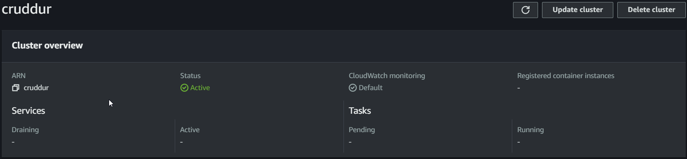

### ECS - Backend-Flask

#### Test RDS Connection

- Create `backend-flask/bin/db/test` and make it executable.

```python
#!/usr/bin/env python3

import psycopg
import os
import sys

connection_url = os.getenv("CONNECTION_URL")

conn = None

try:
    print("attempting connection")
    conn = psycopg.connect(connection_url)
    print("Connection successful!")
except psycopg.Error as e:
    print("Unable to connect to the database:", e)
finally:
    conn.close()
```

- Run script to test RDS connection.

```bash
❯ ./backend-flask/bin/db/test
attempting connection
Connection successful!
```

#### Backend Health Check

- Add health check endpoint in `app.py`

```python
@app.route("/api/health-check")
def health_check():
    return {"success": True}, 200
```

- Create file `backend-flask/bin/flask/health-check` and make it executable.

```python
#!/usr/bin/env python3

import urllib.request

try:
  response = urllib.request.urlopen('http://localhost:4567/api/health-check')
  if response.getcode() == 200:
    print("[OK] Flask server is running")
    exit(0) # success
  else:
    print("[BAD] Flask server is not running")
    exit(1) # false
# This for some reason is not capturing the error....
#except ConnectionRefusedError as e:
# so we'll just catch on all even though this is a bad practice
except Exception as e:
  print(e)
  exit(1) # false
```

- Run the python script to test backend.

```bash
❯ ./backend-flask/bin/flask/health-check
[OK] Flask server is running
```

⚠️ Avoid including network utility tools such as `curl` in Docker containers, as this could potentially make it easier for bad actors to carry out abusive actions.

#### Create CloudWatch Log Group

- To reduce cost set expiry to 1 day.

```bash
aws logs create-log-group --log-group-name cruddur
aws logs put-retention-policy --log-group-name cruddur --retention-in-days 1
```

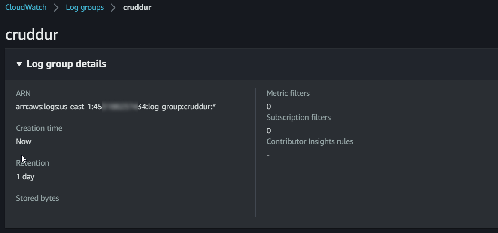

#### Create ECR repo and push image

While it's okay to reference images from Docker Hub, frequent deployments may lead to limitations imposed by Docker Hub. To avoid the need to repeatedly pull images from Docker Hub, you can create your own container registry and download the referenced images to your private repository. Then, you can use the images from your private repository instead.

**For Base-image python**

- This command creates a new repository named _cruddur-python_.

```bash
aws ecr create-repository \
  --repository-name cruddur-python \
  --image-tag-mutability MUTABLE
```

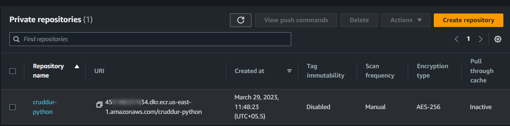

- Check the box and click on the **View Push Commands** button to see the commands for pushing images.
- Log in to ECR

```bash
aws ecr get-login-password --region $AWS_DEFAULT_REGION | docker login --username AWS --password-stdin "$AWS_ACCOUNT_ID.dkr.ecr.$AWS_DEFAULT_REGION.amazonaws.com"
```

- Export the repo URL.

```bash
export ECR_PYTHON_URL="$AWS_ACCOUNT_ID.dkr.ecr.$AWS_DEFAULT_REGION.amazonaws.com/cruddur-python"
echo $ECR_PYTHON_URL
```

- Pull Python image

```bash
docker pull python:3.10-slim-buster
```

- Tag Image

```bash
docker tag python:3.10-slim-buster $ECR_PYTHON_URL:3.10-slim-buster
```

- Push image

```bash
docker push $ECR_PYTHON_URL:3.10-slim-buster
```

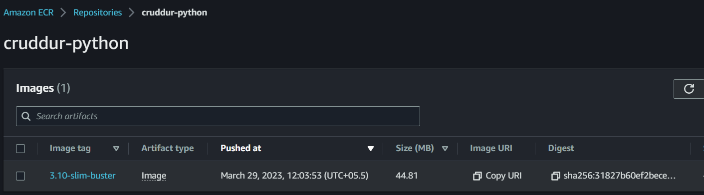

**For Flask**

- In your Flask Dockerfile, modify the `FROM` \*\*command to use the Python image from ECR.

```docker
FROM AWS_ACCOUNT_ID.dkr.ecr.AWS_REGION.amazonaws.com/cruddur-python:3.10-slim-buster
# Inside container
# make a new directory and move into it
WORKDIR /backend-flask
```

Note: To _docker compose up_ specific services `docker compose up backend-flask db`

- Create Repo

```bash
aws ecr create-repository \
  --repository-name backend-flask \
  --image-tag-mutability MUTABLE
```

- Set URL

```bash
export ECR_BACKEND_FLASK_URL="$AWS_ACCOUNT_ID.dkr.ecr.$AWS_DEFAULT_REGION.amazonaws.com/backend-flask"
echo $ECR_BACKEND_FLASK_URL
```

- From backend-flask folder - Build Image

```bash
docker build -t backend-flask .
```

- Tag Image

```bash
docker tag backend-flask:latest $ECR_BACKEND_FLASK_URL
```

- Push Image

```bash
docker push $ECR_BACKEND_FLASK_URL
```

#### Parameter Store

You can find more information about storing sensitive data in Amazon ECS in the following documentation:

- **[Specifying Sensitive Data](https://docs.aws.amazon.com/AmazonECS/latest/developerguide/specifying-sensitive-data.html)**
- **[Storing Secrets in Parameter Store](https://docs.aws.amazon.com/AmazonECS/latest/developerguide/secrets-envvar-ssm-paramstore.html)**

To store secrets, AWS offers two different services: Secrets Manager and Parameter Store. While Secrets Manager may be more user-friendly, it can be more expensive than Parameter Store.

To create a parameter in Parameter Store, use the Systems Manager service. When naming the parameter, use a naming convention that makes it easy to query later on.

```
/cruddur/app/frontend/AWS_ACCESS_KEY
```

- Use the **SecureString** option to encrypt the data.
- To create parameters and store environment variables, we will use the CLI. To do this, execute the following commands

```bash
aws ssm put-parameter --type "SecureString" --name "/cruddur/backend-flask/AWS_ACCESS_KEY_ID" --value $AWS_ACCESS_KEY_ID
aws ssm put-parameter --type "SecureString" --name "/cruddur/backend-flask/AWS_SECRET_ACCESS_KEY" --value $AWS_SECRET_ACCESS_KEY
aws ssm put-parameter --type "SecureString" --name "/cruddur/backend-flask/CONNECTION_URL" --value $PROD_CONNECTION_URL
aws ssm put-parameter --type "SecureString" --name "/cruddur/backend-flask/ROLLBAR_ACCESS_TOKEN" --value $ROLLBAR_ACCESS_TOKEN
aws ssm put-parameter --type "SecureString" --name "/cruddur/backend-flask/OTEL_EXPORTER_OTLP_HEADERS" --value "x-honeycomb-team=$HONEYCOMB_API_KEY"
```

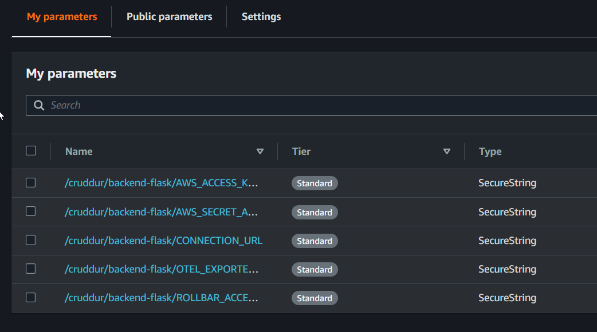

#### Create ExecutionRole

- Go to IAM and click on the **Create Role** button under the "Roles" section.
- From the **use case** section, select **Elastic Container Service**.
- Select the `Elastic Container Service Task` option from the radio button
- Click on **Next**
- In the new page, click on the **Create Policy** button.
- In the visual editor, select **Systems Manager** as the service.
- Select **GetParameter** and **GetParameters** for the **Actions**.
- Choose **Specific** in the **Resources** section and add the ARN.

```

arn:aws:ssm:<REGION>:<AWS_ACCOUNT_ID>:parameter/cruddur/backend-flask/*

```

- Click on **Add additional permissions**.
- In the visual editor, select **Elastic Container Registry** as the service.
- Select **GetAuthorizationToken**, **GetDownloadUrlForLayer**, and **BatchGetImage** for the **Actions**.
- Click on the **Review Policy** button.
- Also, attach the **CloudwatchFullAccess** policy.
- Click on **Next** and then click on **Next** again.
- On the review page, name the policy as `CruddurServiceExecutionPolicy`.
- Click on **Create Policy.**
- Go back to the Roles section and repeat the same steps until you reach the policy page.
- In the policy page, search for `CruddurServiceExecutionPolicy` and select it.
- Click on **Next**.
- Enter **Role name** as `CruddurServiceExecutionRole`.
- Click on **Create Role**.

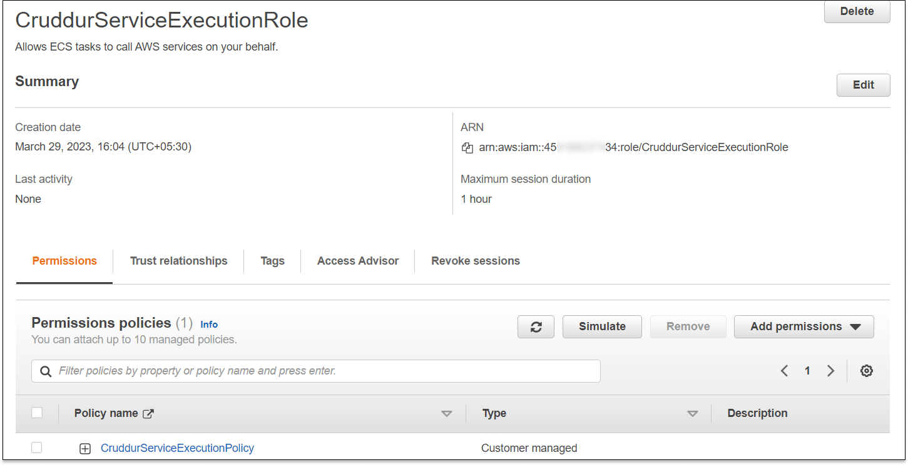

#### Create TaskRole

- Run this command to create _TaskRole_.

```bash
aws iam create-role \
    --role-name CruddurTaskRole \
    --assume-role-policy-document "{
  \"Version\":\"2012-10-17\",
  \"Statement\":[{
    \"Action\":[\"sts:AssumeRole\"],
    \"Effect\":\"Allow\",
    \"Principal\":{
      \"Service\":[\"ecs-tasks.amazonaws.com\"]
    }
  }]
}"
```

- Attach **SSMAccessPolicy**.

```bash
aws iam put-role-policy \
  --policy-name SSMAccessPolicy \
  --role-name CruddurTaskRole \
  --policy-document "{
  \"Version\":\"2012-10-17\",
  \"Statement\":[{
    \"Action\":[
      \"ssmmessages:CreateControlChannel\",
      \"ssmmessages:CreateDataChannel\",
      \"ssmmessages:OpenControlChannel\",
      \"ssmmessages:OpenDataChannel\"
    ],
    \"Effect\":\"Allow\",
    \"Resource\":\"*\"
  }]
}
"
```

- Attach **CloudWatchFullAccess** policy.

```bash
aws iam attach-role-policy --policy-arn arn:aws:iam::aws:policy/CloudWatchFullAccess --role-name CruddurTaskRole
```

- Attach **AWSXRayDaemonWriteAccess** policy.

```bash
aws iam attach-role-policy --policy-arn arn:aws:iam::aws:policy/AWSXRayDaemonWriteAccess --role-name CruddurTaskRole
```

#### Register Task Definitions - Backend

- Create `aws/task-definitions/backend-flask.json`

```json
{
  "family": "backend-flask",
  "executionRoleArn": "arn:aws:iam::<AWS_ACCOUNT_ID>:role/CruddurServiceExecutionRole",
  "taskRoleArn": "arn:aws:iam::<AWS_ACCOUNT_ID>:role/CruddurTaskRole",
  "networkMode": "awsvpc",
  "cpu": "256",
  "memory": "512",
  "requiresCompatibilities": ["FARGATE"],
  "containerDefinitions": [
    {
      "name": "backend-flask",
      "image": "<BACKEND_FLASK_IMAGE_URL>",
      "essential": true,
      "healthCheck": {
        "command": [
          "CMD-SHELL",
          "python /backend-flask/bin/flask/health-check"
        ],
        "interval": 30,
        "timeout": 5,
        "retries": 3,
        "startPeriod": 60
      },
      "portMappings": [
        {
          "name": "backend-flask",
          "containerPort": 4567,
          "protocol": "tcp",
          "appProtocol": "http"
        }
      ],
      "logConfiguration": {
        "logDriver": "awslogs",
        "options": {
          "awslogs-group": "cruddur",
          "awslogs-region": "<AWS_REGION>",
          "awslogs-stream-prefix": "backend-flask"
        }
      },
      "environment": [
        { "name": "OTEL_SERVICE_NAME", "value": "backend-flask" },
        {
          "name": "OTEL_EXPORTER_OTLP_ENDPOINT",
          "value": "https://api.honeycomb.io"
        },
        {
          "name": "AWS_COGNITO_USER_POOL_ID",
          "value": "<AWS_COGNITO_USER_POOL_ID>"
        },
        {
          "name": "AWS_COGNITO_USER_POOL_CLIENT_ID",
          "value": "<AWS_COGNITO_USER_POOL_CLIENT_ID>"
        },
        { "name": "FRONTEND_URL", "value": "*" },
        { "name": "BACKEND_URL", "value": "*" },
        { "name": "AWS_DEFAULT_REGION", "value": "<AWS_REGION>" }
      ],
      "secrets": [
        {
          "name": "AWS_ACCESS_KEY_ID",
          "valueFrom": "arn:aws:ssm:<AWS_REGION>:<AWS_ACCOUNT_ID>:parameter/cruddur/backend-flask/AWS_ACCESS_KEY_ID"
        },
        {
          "name": "AWS_SECRET_ACCESS_KEY",
          "valueFrom": "arn:aws:ssm:<AWS_REGION>:<AWS_ACCOUNT_ID>:parameter/cruddur/backend-flask/AWS_SECRET_ACCESS_KEY"
        },
        {
          "name": "CONNECTION_URL",
          "valueFrom": "arn:aws:ssm:<AWS_REGION>:<AWS_ACCOUNT_ID>:parameter/cruddur/backend-flask/CONNECTION_URL"
        },
        {
          "name": "ROLLBAR_ACCESS_TOKEN",
          "valueFrom": "arn:aws:ssm:<AWS_REGION>:<AWS_ACCOUNT_ID>:parameter/cruddur/backend-flask/ROLLBAR_ACCESS_TOKEN"
        },
        {
          "name": "OTEL_EXPORTER_OTLP_HEADERS",
          "valueFrom": "arn:aws:ssm:<AWS_REGION>:<AWS_ACCOUNT_ID>:parameter/cruddur/backend-flask/OTEL_EXPORTER_OTLP_HEADERS"
        }
      ]
    }
  ]
}
```

- Run this command to register Task Definition.

```bash
aws ecs register-task-definition --cli-input-json file://aws/task-definitions/backend-flask.json
```

Note:

- **awsvpc** - [Recommended] attaches ENI directly to the service
- For ECS Fargate, compute and memory should be set to predefined combination values - **[Reference](https://docs.aws.amazon.com/AmazonECS/latest/developerguide/AWS_Fargate.html)**
- ⚠️ Do not leave URL origins open using wildcard

- Navigate to ECS > Task Definitions and verify these changes.
- Each task definition has a revision value associated with its name.

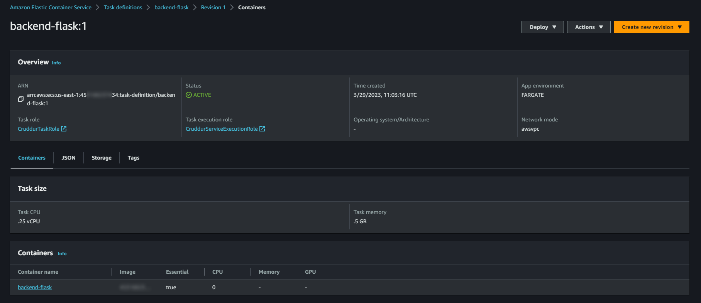

#### Create Security Group

- Run this commands to store VPC ID in env var.

```bash
export DEFAULT_VPC_ID=$(aws ec2 describe-vpcs \
--filters "Name=isDefault, Values=true" \
--query "Vpcs[0].VpcId" \
--output text)
echo $DEFAULT_VPC_ID
```

- Create Security Group.

```bash
export CRUD_SERVICE_SG=$(aws ec2 create-security-group \
  --group-name "crud-srv-sg" \
  --description "Security group for Cruddur services on ECS" \
  --vpc-id $DEFAULT_VPC_ID \
  --query "GroupId" --output text)
echo $CRUD_SERVICE_SG
```

- If we need to retrieve the security group ID again.

```bash
export CRUD_SERVICE_SG=$(aws ec2 describe-security-groups \
  --filters Name=group-name,Values=crud-srv-sg \
  --query 'SecurityGroups[*].GroupId' \
  --output text)
```

- Run this command to open up port 80 on this Security Group.

```bash
aws ec2 authorize-security-group-ingress \
  --group-id $CRUD_SERVICE_SG \
  --protocol tcp \
  --port 4567 \
  --cidr 0.0.0.0/0
```

#### Launch Backend Container

**Using CLI**

[Recommended method which enables execute command]

- Create `aws/json/service-backend-flask.json`

```json
{
  "cluster": "cruddur",
  "launchType": "FARGATE",
  "desiredCount": 1,
  "enableECSManagedTags": true,
  "enableExecuteCommand": true,
  "networkConfiguration": {
    "awsvpcConfiguration": {
      "assignPublicIp": "ENABLED",
      "securityGroups": ["<SECURITY_GROUP_ID>"],
      "subnets": ["<subnet-id>", "<subnet-id>", "<subnet-id>"]
    }
  },
  "propagateTags": "SERVICE",
  "serviceName": "backend-flask",
  "taskDefinition": "backend-flask"
}
```

- To get **SUBNET IDS**

```bash
export DEFAULT_SUBNET_IDS=$(aws ec2 describe-subnets  \
 --filters Name=vpc-id,Values=$DEFAULT_VPC_ID \
 --query 'Subnets[*].SubnetId' \
 --output json | jq -r 'join(",")')
echo $DEFAULT_SUBNET_IDS
```

- Run this command to create service

```bash
aws ecs create-service --cli-input-json file://aws/json/service-backend-flask.json
```

**OR**

**Using Console**

- Select the cluster **cruddur** from ECS.
- Click on the **Create** button from the Service tab.
- Set the **Family** to Backend-flask, **Revision** to Latest, and **Service name** to backend-flask.
- Choose the security group we created earlier using CLI commands for the **Security group** option.
- Click on **Create**.
- Refresh the Service tab and select the **backend-flask** service.
- If you encounter any issues during deployment, the logs will be displayed in the **Deployments and events** tab. You can also check the old deployments that failed.
- Deployment completion might take some time. If something is not working properly, use the **Update Service** option.
- Wait for the new task to appear in the Task tab.
- The Backend ECS cluster is now running successfully.

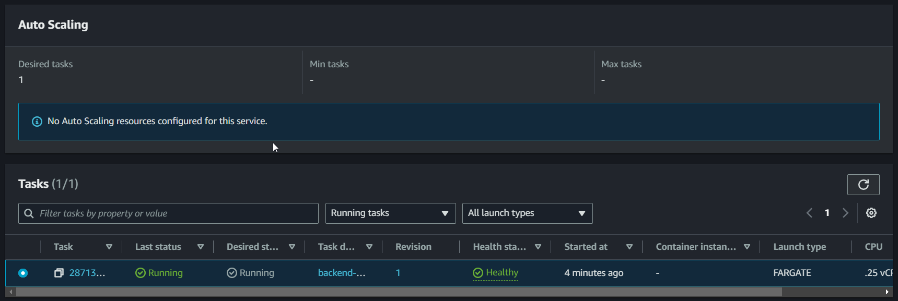

#### Connect to Backend-Flask via Session Manager

Install for Ubuntu.

```bash
curl "https://s3.amazonaws.com/session-manager-downloads/plugin/latest/ubuntu_64bit/session-manager-plugin.deb" -o "session-manager-plugin.deb"
sudo dpkg -i session-manager-plugin.deb
```

Verify working.

```bash
session-manager-plugin
```

- Copy Task ID/ARN of backend-flask from ECS console - Tasks
- Run this command after replacing task ARN

```bash
aws ecs execute-command  \
--region us-east-1 \
--cluster cruddur \
--task <TASK_ARN_ONLY_THE_VALUE> \
--container backend-flask \
--command "/bin/bash" \
--interactive
```

```bash
The Session Manager plugin was installed successfully. Use the AWS CLI to start a session.

Starting session with SessionId: ecs-execute-command-0165**139
root@ip-**-**-**-**:/backend-flask# ls
Dockerfile       README.md    app.py  db   openapi-3.0.yml   script.sh
Dockerfile.prod  __pycache__  bin     lib  requirements.txt  services
```

- Add this to `.gitpod.yml` to auto install session manager.

```bash
- name: fargate
    before: |
      curl "https://s3.amazonaws.com/session-manager-downloads/plugin/latest/ubuntu_64bit/session-manager-plugin.deb" -o "session-manager-plugin.deb"
      sudo dpkg -i session-manager-plugin.deb
      cd backend-flask
```

- Now to make this into a script create this file `backend-flask/bin/ecs/connect-to-service` and make it executable.

```bash
#! /usr/bin/bash

if [ -z "$1" ]; then
    echo "No TASK_ID argument supplied eg ./bin/ecs/connect-to-service <TASK_ID>"
    exit 1
fi

if [ -z "$2" ]; then
    echo "No CONTAINER_NAME argument supplied eg ./bin/ecs/connect-to-service <TASK_ID> <CONTAINER_NAME>"
    exit 1
fi

TASK_ID=$1

CONTAINER_NAME=$2

aws ecs execute-command  \
--region us-east-1 \
--cluster cruddur \
--task $TASK_ID \
--container $CONTAINER_NAME \
--command "/bin/bash" \
--interactive
```

#### Access running application

- Click into **backend-flask** task to view it’s **Public IP**.
- Use **Public IP:4567** to access the backend application.

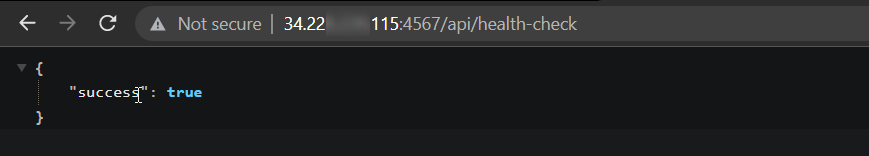

#### Check RDS connection from Backend Application

- Go to your RDS DB and click on its security group.
- Create a new rule with the "PostgreSQL" type and assign it the security group used for ECS service. Name it **CruddurServices**.
- Use this command to connect to the backend application shell:

```bash
./backend-flask/bin/ecs/connect-to-service backend-flask
```

- Run this command to check connection to RDS.

```bash
./bin/db/test
```

```bash
root@ip-**-**-**-**:/backend-flask# ./bin/db/test
attempting connection
Connection successful!
```

- Go to _/api/activities/home_ to view data.

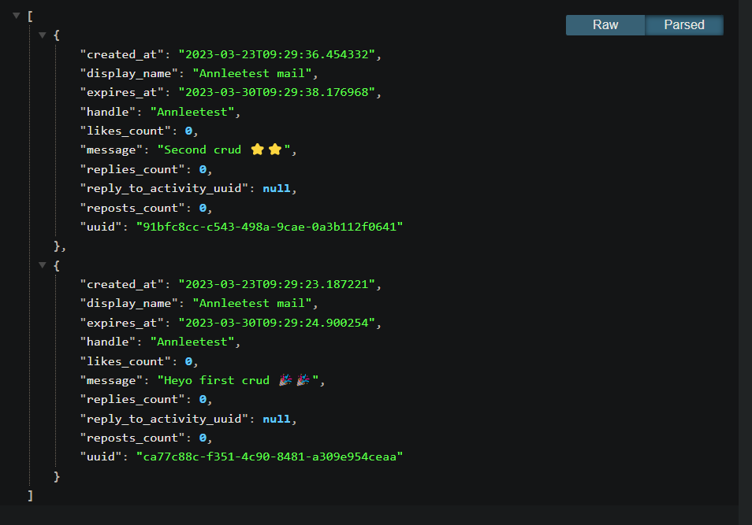

#### Service Connect

Learn more about **[Service Connect](https://docs.aws.amazon.com/AmazonECS/latest/developerguide/service-connect.html)**

**Console Method**

- Delete the existing service and stop any running tasks
- Create a new service
- Repeat the same steps as before, but make sure to **enable Service Connect**
- Choose the option **Client and server**
- Click on **Add more port mappings and applications**
- Add Port alias = **backend-flask** (from the drop-down)
- Discovery and DNS = **backend-flask**
- Port = **4567**
- Click **Create**

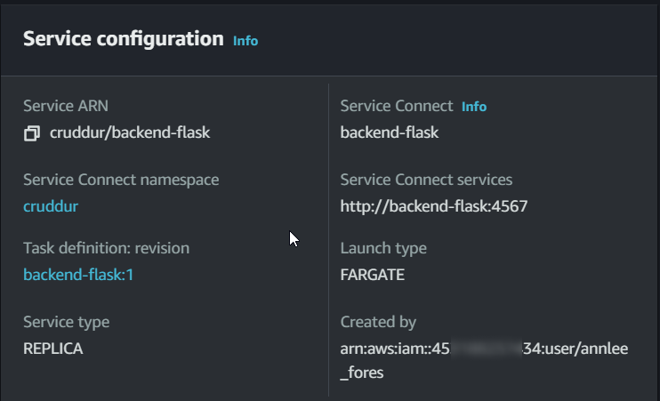

- This will also show up under Services in Namespaces for **cruddur**.

**CLI method [Recommended]**

- Add this below `"taskDefinition": "backend-flask"` in `aws/json/service-backend-flask.json`

```bash
,
"serviceConnectConfiguration": {
    "enabled": true,
    "namespace": "cruddur",
    "services": [
      {
        "portName": "backend-flask",
        "discoveryName": "backend-flask",
        "clientAliases": [{"port": 4567}]
      }
    ]
  }
```

- Run this command to create service.

```bash
aws ecs create-service --cli-input-json file://aws/json/service-backend-flask.json
```

- Check if you can still access the application using **Public IP:4567.**

### Load Balancer

- Navigate to the EC2 console and select **Load Balancers** from the left pane.
- Create a Load Balancer:
  - Choose the appropriate type:
    - **Application Load Balancer** for web application HTTP requests.
    - **Network Load Balancer** for lower level communication with UDP and TCP.
    - **Gateway Load Balancer** for deploying and managing a fleet of third-party virtual appliances that support GENEVE.
  - Choose **Application Load Balancer (ALB)**.
  - Name it **cruddur-alb**.
  - Select 3 subnets.
  - Create a new Security Group by clicking **Create new security group**.
- From the **Listeners and routing** section, click **Create target group** to create a target group for the backend.
- Click **Add listener** to create another listener for the frontend, and then click its **Create target group** to create a target group for the frontend.

#### Security Group

- Name it **cruddur-alb-sg**.
- Provide a description.
- Create 2 new inbound rules using **Add Rule**:
  - Set one rule to **HTTP** and the other to **HTTPS**.
  - Set the source for both to **0.0.0.0/0**.
  - You can set it to your specific IP address, but for now leave it at **0.0.0.0/0**.
- **Create Security Group**.
- Modify the **crud-srv-sg** security group inbound rule by creating a new rule and adding the **cruddur-alb-sg** to its source list.
- Set the port range for this new rule to **4567**.
- Give it a description - **CruddurALB**.
- Delete the old rule which was used to directly access the backend flask.
- Now, requests can only go through the load balancer.

#### Create target group

**Backend-flask**

- Select **IP addresses** under **Basic configuration** (used for Fargate, ECS, EC2)
- Set the target group name to **cruddur-backend-flask-tg**
- Set the port to **4567**
- Set `/api/health-check` as the **Health check path**
- In **Advanced health check settings**, set the healthy threshold to 3
- Click **Next**
- Click **Create Target Group**

**Frontend-react**

- Select **IP addresses** under **Basic configuration** (used for Fargate, ECS, EC2)
- Set the target group name to **cruddur-frontend-react-js**
- Set the port to **3000**
- In **Advanced health check settings**, set the healthy threshold to 3
- Click **Next**
- Click **Create Target Group**

#### ALB continuation

- Remove the default security group in ALB and set **cruddur-alb-sg** as the security group
- Set the **Default action** to the new target group **cruddur-backend-flask-tg** and set the port to 4567
- In the additional listener, set the port to 3000 and the **Default action** to **cruddur-frontend-react-js**
- Click **Create Load Balancer**

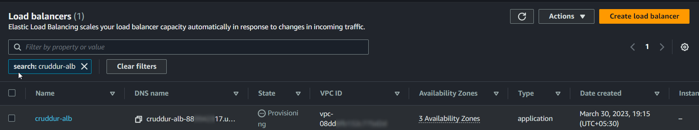

### Update ECS Backend to use ALB

We can use the `--generate-cli-skeleton` flag in `aws ecs create-service` to get a sample JSON input that the command needs.

- Copy the `loadBalancers` JSON from the sample JSON and add it to `service-backend-flask.json` above `networkConfiguration`.

```json
"loadBalancers": [
      {
          "targetGroupArn": "<cruddur-backend-flask-tg-ARN>",
          "containerName": "backend-flask",
          "containerPort": 4567
      }
  ],
```

- Go back to ECS delete currently running Backend application.
- Run this command to create new service.

```bash
aws ecs create-service --cli-input-json file://aws/json/service-backend-flask.json
```

- ⚠️ If it shows a draining error, wait for a bit until draining in ECS becomes 0.
- Click into tasks to view logs for the backend.
- Copy the ALB **`DNS Name`** and paste it into the browser search bar.
- Append this to the DNS Name.

```
:4567/api/health-check
```

- This should now show the health response.

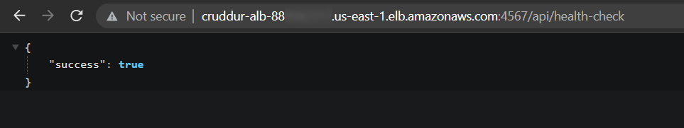

### ECS - Frontend-React

#### `Dockerfile.prod`

- Create `Dockerfile.prod` in `frontend-react-js` folder and add this instruction
- In my case, I had to add REACT_APP_FRONTEND_URL for Google IDP to work

```docker
# Base Image ~~~~~~~~~~~~~~~~~~~~~~~~~~~~~~~~~~
FROM node:16.18 AS build

ARG REACT_APP_BACKEND_URL
ARG REACT_APP_FRONTEND_URL
ARG REACT_APP_AWS_PROJECT_REGION
ARG REACT_APP_AWS_COGNITO_REGION
ARG REACT_APP_AWS_USER_POOLS_ID
ARG REACT_APP_CLIENT_ID

ENV REACT_APP_BACKEND_URL=$REACT_APP_BACKEND_URL
ENV REACT_APP_FRONTEND_URL=$REACT_APP_FRONTEND_URL
ENV REACT_APP_AWS_PROJECT_REGION=$REACT_APP_AWS_PROJECT_REGION
ENV REACT_APP_AWS_COGNITO_REGION=$REACT_APP_AWS_COGNITO_REGION
ENV REACT_APP_AWS_USER_POOLS_ID=$REACT_APP_AWS_USER_POOLS_ID
ENV REACT_APP_CLIENT_ID=$REACT_APP_CLIENT_ID

COPY . ./frontend-react-js
WORKDIR /frontend-react-js
RUN npm install
RUN npm run build

# New Base Image ~~~~~~~~~~~~~~~~~~~~~~~~~~~~~~
FROM nginx:1.23.3-alpine

# --from build is coming from the Base Image
COPY --from=build /frontend-react-js/build /usr/share/nginx/html
COPY --from=build /frontend-react-js/nginx.conf /etc/nginx/nginx.conf

EXPOSE 3000
```

- To serve the static assets of the React app, we need to use Nginx.
- The ENV VARs will be assigned during the build command.
- Add the following line to `.gitignore` file to prevent the build folder from being pushed to GitHub.

```docker
frontend-react-js/build
```

- Create `frontend-react-js/nginx.conf` and add this code to configure nginx.

```
# Set the worker processes
worker_processes 1;

# Set the events module
events {
  worker_connections 1024;
}

# Set the http module
http {
  # Set the MIME types
  include /etc/nginx/mime.types;
  default_type application/octet-stream;

  # Set the log format
  log_format  main  '$remote_addr - $remote_user [$time_local] "$request" '
                    '$status $body_bytes_sent "$http_referer" '
                    '"$http_user_agent" "$http_x_forwarded_for"';

  # Set the access log
  access_log  /var/log/nginx/access.log main;

  # Set the error log
  error_log /var/log/nginx/error.log;

  # Set the server section
  server {
    # Set the listen port
    listen 3000;

    # Set the root directory for the app
    root /usr/share/nginx/html;

    # Set the default file to serve
    index index.html;

    location / {
        # First attempt to serve request as file, then
        # as directory, then fall back to redirecting to index.html
        try_files $uri $uri/ $uri.html /index.html;
    }

    # Set the error page
    error_page  404 /404.html;
    location = /404.html {
      internal;
    }

    # Set the error page for 500 errors
    error_page  500 502 503 504  /50x.html;
    location = /50x.html {
      internal;
    }
  }
}
```

#### Build Frontend

- `cd` into frontend folder and run `npm run build` to build the frontend app.
- Run this command from frontend folder to build the docker image.

```bash
docker build \
--build-arg REACT_APP_BACKEND_URL="<ALB_DNS_NAME>:4567" \
--build-arg REACT_APP_BACKEND_URL="<ALB_DNS_NAME>:3000"
--build-arg REACT_APP_AWS_PROJECT_REGION="$AWS_DEFAULT_REGION" \
--build-arg REACT_APP_AWS_COGNITO_REGION="$AWS_DEFAULT_REGION" \
--build-arg REACT_APP_AWS_USER_POOLS_ID="" \
--build-arg REACT_APP_CLIENT_ID="" \
-t frontend-react-js \
-f Dockerfile.prod .
```

- Go to EC2 - ALB and copy the DNS name of cruddur ALB.
- Create ECR repo for frontend.

```bash
aws ecr create-repository \
  --repository-name frontend-react-js \
  --image-tag-mutability MUTABLE
```

- set URL.

```bash
export ECR_FRONTEND_REACT_URL="$AWS_ACCOUNT_ID.dkr.ecr.$AWS_DEFAULT_REGION.amazonaws.com/frontend-react-js"
echo $ECR_FRONTEND_REACT_URL
```

- Make sure to Login to ECR.

```bash
aws ecr get-login-password --region $AWS_DEFAULT_REGION | docker login --username AWS --password-stdin "$AWS_ACCOUNT_ID.dkr.ecr.$AWS_DEFAULT_REGION.amazonaws.com"
```

- Tag image.

```bash
docker tag frontend-react-js:latest $ECR_FRONTEND_REACT_URL
```

- Push Image.

```bash
docker push $ECR_FRONTEND_REACT_URL
```

- If you want to run and test it (make sure that backend and db containers are running).

```bash
docker run --rm -p 3000:3000 -it frontend-react-js
```

#### Task Definition

- Create `aws/task-definitions/frontend-react-js.json`

```json
{
  "family": "frontend-react-js",
  "executionRoleArn": "arn:aws:iam::<AWS_ACCOUNT_ID>:role/CruddurServiceExecutionRole",
  "taskRoleArn": "arn:aws:iam::<AWS_ACCOUNT_ID>:role/CruddurTaskRole",
  "networkMode": "awsvpc",
  "cpu": "256",
  "memory": "512",
  "requiresCompatibilities": ["FARGATE"],
  "containerDefinitions": [
    {
      "name": "frontend-react-js",
      "image": "<AWS_ACCOUNT_ID>.dkr.ecr.<AWS_REGION>.amazonaws.com/frontend-react-js",
      "essential": true,
      "healthCheck": {
        "command": ["CMD-SHELL", "curl -f http://localhost:3000 || exit"],
        "interval": 30,
        "timeout": 5,
        "retries": 3
      },
      "portMappings": [
        {
          "name": "frontend-react-js",
          "containerPort": 3000,
          "protocol": "tcp",
          "appProtocol": "http"
        }
      ],

      "logConfiguration": {
        "logDriver": "awslogs",
        "options": {
          "awslogs-group": "cruddur",
          "awslogs-region": "<AWS_REGION>",
          "awslogs-stream-prefix": "frontend-react-js"
        }
      }
    }
  ]
}
```

- Run this command to register task definition.

```
aws ecs register-task-definition --cli-input-json file://aws/task-definitions/frontend-react-js.json
```

- Create `aws/json/service-frontend-react-js.json` and make sure to update SG and Subnet.

```json
{
  "cluster": "cruddur",
  "launchType": "FARGATE",
  "desiredCount": 1,
  "enableECSManagedTags": true,
  "enableExecuteCommand": true,
  "loadBalancers": [
    {
      "targetGroupArn": "<cruddur-frontend-react-js-tg-ARN>",
      "containerName": "frontend-react-js",
      "containerPort": 3000
    }
  ],
  "networkConfiguration": {
    "awsvpcConfiguration": {
      "assignPublicIp": "ENABLED",
      "securityGroups": ["sg-04ca5ebd69e0aec6f"],
      "subnets": [
        "subnet-0462b87709683ccaa",
        "subnet-066a53dd88d557e05",
        "subnet-021a6adafb79249e3"
      ]
    }
  },
  "propagateTags": "SERVICE",
  "serviceName": "frontend-react-js",
  "taskDefinition": "frontend-react-js",
  "serviceConnectConfiguration": {
    "enabled": true,
    "namespace": "cruddur",
    "services": [
      {
        "portName": "frontend-react-js",
        "discoveryName": "frontend-react-js",
        "clientAliases": [{ "port": 3000 }]
      }
    ]
  }
}
```

- Go to EC2 - Target Groups and copy the Target Group ARN for frontend. Paste this in above file under load balancer.
- Run this command to create frontend-service.

```
aws ecs create-service --cli-input-json file://aws/json/service-frontend-react-js.json
```

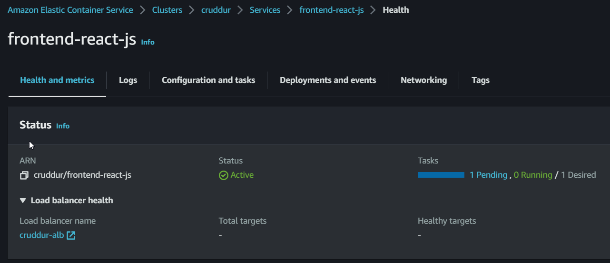

- Wait for target group to initialize (if it’s unhealthy, somethings wrong)

#### Fixing frontend ECS container error

- To launch without ALB, temporarily remove the LoadBalancer code from `service-backend-flask.json`.
- Create the service using the CLI command now.
- Since there's no bash shell in the frontend container, connecting via the connect script that uses bash is not possible.
- Instead of creating separate scripts for connecting to the frontend and backend containers, update `connect-to-service` to change `-command` based on `CONTAINER_NAME`.

```bash
#! /usr/bin/bash

if [ -z "$1" ]; then
    echo "No CONTAINER_NAME argument supplied eg ./bin/ecs/connect-to-service <CONTAINER_NAME>"
    exit 1
fi

CONTAINER_NAME=$1

TASK_ARN=$(aws ecs list-tasks --cluster cruddur --service-name $CONTAINER_NAME --output json | jq -r '.taskArns[0]')

if [ $CONTAINER_NAME == 'backend-flask' ]; then
    COMMAND="/bin/bash"
else
    COMMAND="/bin/sh"
fi

aws ecs execute-command  \
--region us-east-1 \
--cluster cruddur \
--task $TASK_ARN \
--container $CONTAINER_NAME \
--command $COMMAND \
--interactive
```

- Add LoadBalancer back to **`aws/json/service-frontend-react-js.json`**.
- Tear down the running frontend service and create a new frontend service.
- Go to the Security Group (SG) of the frontend from the Networking tab.
- Edit the Inbound Rule to add port 3000, and for the source, set the **`cruddur-alb-sg`**.

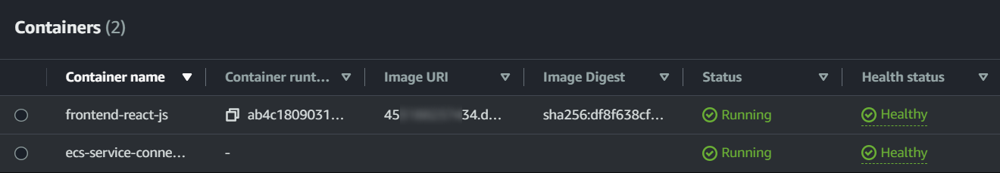

- Visit the frontend on port 3000 using the DNS NAME.

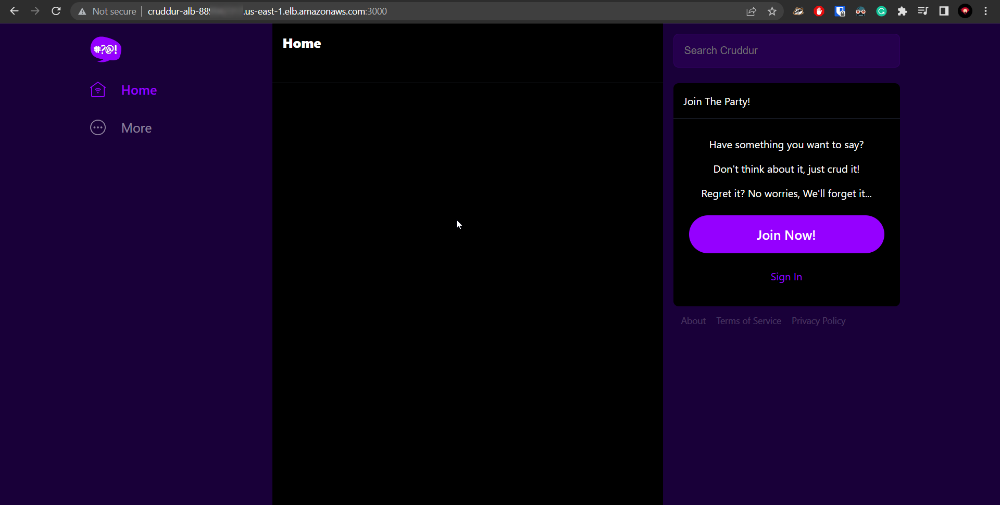

### Custom Domain

- Go to the **Route53** console
- Click **Create hosted zone**
- Enter your domain name
- Set the **Type** to **Public hosted zone**
- Click **Create**
- Copy the NS and SOA values and add them to your domain DNS
- I updated my domain DNS by following this guide: **[How to Change Nameservers](https://kb.porkbun.com/article/22-how-to-change-nameservers)**
- Wait for up-to 48 hours to see the changes.

#### Create SSL Certificate

- Go to the **Certificate Manager** console
- Click **Request a certificate**
- Make sure that the option **Request a public certificate** is selected, and click **Next**
- In the **Fully qualified domain name** field, enter `<domain_without_prefix>`
- Click **Add another name to this certificate**, and add `*.<domain_without_prefix>`
- Click **Request**
- Click the **Certificate ID**
- Click **Create records in Route 53**
- Click **Create records**
- Wait for the status to become **Success**
- Go back to the **Route53** console to see the new CNAME

#### Update ALB

- Go back to the EC2 → load balancer page
- Check the box for **cruddur-alb** and select the **Listeners** tab
- Click **Add Listener**
- Set the **Default actions** to **Redirect**
- Set the **Port** to **443**
- Click **Add**
- Add another Listener
- Set the **Protocol** to **HTTPS**
- Set the port to **443**
- In the **Default actions** field, select **Forward**
- From the **Target group** dropdown, select **frontend-react-js**
- In the **Default SSL/TLS certificate** dropdown, select the certificate we created earlier.
- Click **Add**
- Delete the **HTTP:3000** and **HTTP:4567** listeners
- Check the box for **HTTPS:443** and click the **Manage Rules** button from Action
- Click **Insert Rule**
- Click **Add Condition** → **Host Header**
- Set the **is** field to `api.<domain>`
- Click **add action** → **Forward to**
- In the target group dropdown, select **backend-flask**
- Click **Save**
- Now, the backend goes to the _api.<domain>_ domain

#### Point Domain to ALB

- Go to the Route53 console and click the domain
- In the domain management section, click **Create Record**
- Toggle **Alias**
- For the **Route traffic to** field, choose **Alias to Application and Classic Load Balancer**
- Choose the **us-east-1** region
- Select the cruddur-alb load balancer
- Click **Create Route**
- Click **Create Record** again
- This time, set the **Record name** to **api**, and follow the same alias setup as above
- Visit the custom domain to view the frontend
- It might take some time for the changes to take effect, or you can try a different browser.
- The frontend should now be working on the custom domain.

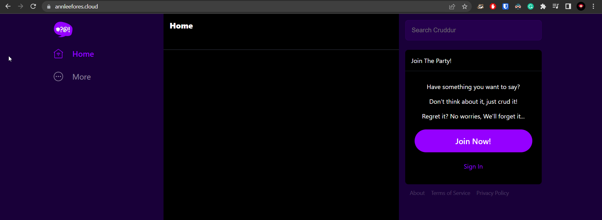

- Backend working on custom subdomain.

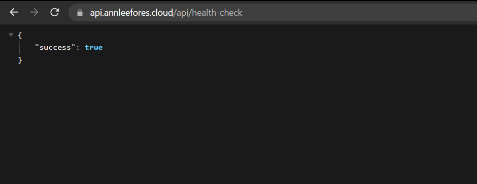

### CORS update

#### Backend task def

- In `aws/task-definitions/backend-flask.json` add domain to this section.

```bash
{"name": "FRONTEND_URL", "value": "https://<domain>"},
{"name": "BACKEND_URL", "value": "https://api.<domain>"},
```

- Run this command to update task-def.

```bash
aws ecs register-task-definition --cli-input-json file://aws/task-definitions/backend-flask.json
```

#### Frontend Docker Build

- Login to ECR.
- Run build command with updated URL from frontend folder.

```bash
docker build \
--build-arg REACT_APP_BACKEND_URL="https://api.annleefores.cloud" \
--build-arg REACT_APP_FRONTEND_URL="https://annleefores.cloud" \
--build-arg REACT_APP_AWS_PROJECT_REGION="$AWS_DEFAULT_REGION" \
--build-arg REACT_APP_AWS_COGNITO_REGION="$AWS_DEFAULT_REGION" \
--build-arg REACT_APP_AWS_USER_POOLS_ID="" \
--build-arg REACT_APP_CLIENT_ID="" \
-t frontend-react-js \
-f Dockerfile.prod .
```

- Tag and push container image.

#### ECS update

- Go to ECS console.
- Checkbox backend-flask and click **Update** to make changes.
- Check the **Force new deployment** checkbox.
- Select the latest **Revision**.
- Click **Update**.
- Repeat the same steps for the frontend service.
- Wait for the changes to complete.
- Check that both the frontend and backend URLs are running.

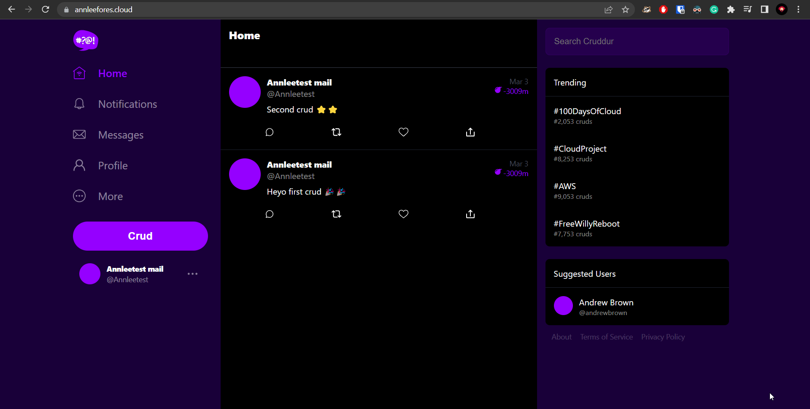

### Securing Flask

#### Limiting Access to your IP

- Navigate to the EC2 console and select **Security Groups**.
- Check the box next to **cruddur-alb-sg** and click on **Edit inbound rules**.
- Remove the rules for ports 4567 and 3000.
- For the remaining rules, change the Source Type to **My IP**.
- Save the changes to the security group.
- This will ensure that only your IP can access the website.

#### Script for ECR Login

- Create `backend-flask/bin/ecr/login` and make it executable.

```bash
#! /usr/bin/bash

aws ecr get-login-password --region $AWS_DEFAULT_REGION | docker login --username AWS --password-stdin "$AWS_ACCOUNT_ID.dkr.ecr.$AWS_DEFAULT_REGION.amazonaws.com"
```

#### Disable Debug Mode

- Navigate to backend-flask.
- Create a new **`Dockerfile.prod`** file and copy the content of **`Dockerfile`** to this new file.
- Update the CMD line in **`Dockerfile.prod`** with the following command.

```docker
CMD [ "python3", "-m" , "flask", "run", "--host=0.0.0.0", "--port=4567", "--no-debug","--no-debugger", "--no-reload" ]
```

- Delete `ENV FLASK_DEBUG=1`
- Do the same for Dockerfile and update the CMD line to include the `--debug` flag, as follows:

```docker
CMD [ "python3", "-m" , "flask", "run", "--host=0.0.0.0", "--port=4567", "--debug"]
```

- Build and run the docker container locally using the following command:

```docker
docker build -f Dockerfile.prod -t backend-flask-prod .
```

- Instead of creating `backend-flask/bin/docker/backend-flask-prod` I updated docker compose to use the `backend-flask-prod` image temporarily.

#### Scripts for working with docker images

**Build docker image**

- Create `backend-flask/bin/docker/build/backend-flask-prod` to build backend-flask-prod using script.

```bash
#! /usr/bin/bash

docker build -f backend-flask/Dockerfile.prod -t backend-flask-prod ./backend-flask
```

- Create `backend-flask/bin/docker/build/frontend-react-js-prod` to build frontend-react-js using script.

```bash
#! /usr/bin/bash

docker build \
    --build-arg REACT_APP_BACKEND_URL="https://api.annleefores.cloud" \
    --build-arg REACT_APP_FRONTEND_URL="https://annleefores.cloud" \
    --build-arg REACT_APP_AWS_PROJECT_REGION="$AWS_DEFAULT_REGION" \
    --build-arg REACT_APP_AWS_COGNITO_REGION="$AWS_DEFAULT_REGION" \
    --build-arg REACT_APP_AWS_USER_POOLS_ID="$AWS_USER_POOLS_ID" \
    --build-arg REACT_APP_CLIENT_ID="$CLIENT_ID" \
    -t frontend-react-js-prod \
    -f frontend-react-js/Dockerfile.prod ./frontend-react-js
```

**Tag and push image to ECR**

- Create `backend-flask/bin/docker/push/backend-flask-prod`

```bash
#! /usr/bin/bash

export ECR_BACKEND_FLASK_URL="$AWS_ACCOUNT_ID.dkr.ecr.$AWS_DEFAULT_REGION.amazonaws.com/backend-flask"

docker tag backend-flask-prod:latest $ECR_BACKEND_FLASK_URL

docker push $ECR_BACKEND_FLASK_URL
```

- Create `backend-flask/bin/docker/push/frontend-react-js-prod`

```bash
#! /usr/bin/bash

export ECR_FRONTEND_REACT_URL="$AWS_ACCOUNT_ID.dkr.ecr.$AWS_DEFAULT_REGION.amazonaws.com/frontend-react-js"

docker tag frontend-react-js-prod:latest $ECR_FRONTEND_REACT_URL

docker push $ECR_FRONTEND_REACT_URL
```

**Force Deploy**

- Create `backend-flask/bin/ecs/force-deploy-backend-flask`

```bash
#! /usr/bin/bash

CLUSTER_NAME="cruddur"
SERVICE_NAME="backend-flask"
TASK_DEFINTION_FAMILY="backend-flask"

LATEST_TASK_DEFINITION_ARN=$(aws ecs describe-task-definition \
--task-definition $TASK_DEFINTION_FAMILY \
--query 'taskDefinition.taskDefinitionArn' \
--output text)

echo "TASK DEF ARN:"
echo $LATEST_TASK_DEFINITION_ARN

aws ecs update-service \
--cluster $CLUSTER_NAME \
--service $SERVICE_NAME \
--task-definition $LATEST_TASK_DEFINITION_ARN \
--force-new-deployment

#aws ecs describe-services \
#--cluster $CLUSTER_NAME \
#--service $SERVICE_NAME \
#--query 'services[0].deployments' \
#--output table
```

- Create `bin/ecs/force-deploy-frontend-react-js`

```bash
#! /usr/bin/bash

CLUSTER_NAME="cruddur"
SERVICE_NAME="frontend-react-js"
TASK_DEFINTION_FAMILY="frontend-react-js"

LATEST_TASK_DEFINITION_ARN=$(aws ecs describe-task-definition \
--task-definition $TASK_DEFINTION_FAMILY \
--query 'taskDefinition.taskDefinitionArn' \
--output text)

echo "TASK DEF ARN:"
echo $LATEST_TASK_DEFINITION_ARN

aws ecs update-service \
--cluster $CLUSTER_NAME \
--service $SERVICE_NAME \
--task-definition $LATEST_TASK_DEFINITION_ARN \
--force-new-deployment

#aws ecs describe-services \
#--cluster $CLUSTER_NAME \
#--service $SERVICE_NAME \
#--query 'services[0].deployments' \
#--output table
```

- Run these scripts to update services with new changes.

### Update `bin` structure

- Reorganize the file structure and move the `bin` folder to the top-level directory.

```
./bin/
├── backend
│   ├── build
│   ├── deploy
│   └── push
├── cognito
│   └── list-users
├── db
│   ├── connect
│   ├── create
│   ├── drop
│   ├── schema-load
│   ├── seed
│   ├── sessions
│   ├── setup
│   ├── test
│   └── update_cognito_user_ids
├── ddb
│   ├── drop
│   ├── list-tables
│   ├── patterns
│   │   ├── get-conversation
│   │   └── list-conversation
│   ├── scan
│   ├── schema-load
│   └── seed
├── ecr
│   └── login
├── ecs
│   ├── connect-to-service
│   ├── delete-services
│   └── launch-services
├── frontend
│   ├── build
│   ├── deploy
│   └── push
└── rds
    └── update-sg-rule
```

- Instead of using `dirname` to navigate up from an absolute path, I used `realpath --relative-base=` to determine the relative path between the current PWD and the file's path.

```bash
# set the absolute path to the file
# In VS code right click on file/folder -> copy path to get abs path for the file/folder
abs_filepath="<absolute_path_to_file/folder>"

# get the relative path to the file from the current directory
FilePath=$(realpath --relative-base="$PWD" "$abs_filepath")

# get directory path of file
FilePathDir=$(dirname "$FilePath")
```

- I updated all scripts that rely on the relative path of files/folders.
- Don't forget to create a **`bin`** folder in **`backend-flask`** and move the **`flask/health-check`** script back into this folder.
- Build the updated **`backend-flask`** image and push it to ECR.

### PSQL Session Kill Command

- To destroy all sessions connected to PSQL create `backend-flask/db/kill-all-connections.sql`

```sql
SELECT pg_terminate_backend(pid)
FROM pg_stat_activity
WHERE
-- don't kill my own connection!
pid <> pg_backend_pid()
-- don't kill the connections to other databases
AND datname = 'cruddur';
```

- To make this into a script create `bin/db/kill-all`

```bash
#! /usr/bin/bash

CYAN='\033[1;36m'
NO_COLOR='\033[0m'
LABEL="db-kill-all"
printf "${CYAN}== ${LABEL}${NO_COLOR}\n"

# set the absolute path to the file
abs_filepath="$ABS_PATH/backend-flask/db/kill-all-connections.sql"

# get the relative path to the file from the current directory
kill_path=$(realpath --relative-base="$PWD" "$abs_filepath")

psql $CONNECTION_URL cruddur < $kill_path
```

- ⚠️ You may encounter a "server disconnected" error once you run this script, so make sure to run Docker Compose again to fix it.

### Fix Messaging in production

- When there is no user data in this route `http://localhost:4567/api/users/@baykoko/short`, it should return an empty response.
- Add a return statement to handle NULL JSON in **`db.py`**:

```python
with self.pool.connection() as conn:
  with conn.cursor() as cur:
      cur.execute(wrapped_sql, params)
      json = cur.fetchone()
      if json is None:
          return "{}"
      else:
          return json[0]
```

- Build and push the new backend image, then update the service.

### Implement Refresh Token Cognito

- Refer to [account recovery verification](https://docs.amplify.aws/lib/auth/manageusers/q/platform/js/#account-recovery-verification) for guidance on implementing Refresh Token Cognito.
- Update `frontend-react-js/src/lib/CheckAuth.js`.

```jsx
import { Auth } from "aws-amplify";

export async function getAccessToken() {
  Auth.currentSession()
    .then((cognito_user_session) => {
      const access_token = cognito_user_session.accessToken.jwtToken;
      localStorage.setItem("access_token", access_token);
    })
    .catch((err) => console.log(err));
}

export async function checkAuth(setUser) {
  Auth.currentAuthenticatedUser({
    // Optional, By default is false.
    // If set to true, this call will send a
    // request to Cognito to get the latest user data
    bypassCache: false,
  })
    .then((cognito_user) => {
      console.log("cognito_user", cognito_user);
      setUser({
        display_name: cognito_user.attributes.name,
        handle: cognito_user.attributes.preferred_username,
      });
      return Auth.currentSession();
    })
    .then((cognito_user_session) => {
      localStorage.setItem(
        "access_token",
        cognito_user_session.accessToken.jwtToken
      );
    })
    .catch((err) => console.log(err));
}
```

- Update `frontend-react-js/src/pages/HomeFeedPage.js` to use this new auth flow.

```jsx
import { checkAuth, getAccessToken } from '../lib/CheckAuth'

......
const backend_url = `${process.env.REACT_APP_BACKEND_URL}/api/activities/home`;
      await getAccessToken()
      const access_token = localStorage.getItem("access_token")
      const res = await fetch(backend_url, {
        headers: {
          'Content-Type': 'application/json',
          'Authorization': `Bearer ${access_token}`,
        },
......
```

- Update all files that use `checkAuth.`

### Fargate - Configuring for Container Insights

#### Add XRAY daemon

- Add xray daemon container definition in backend task definition and frontend task def file.

```json
{
      "name": "xray",
      "image": "public.ecr.aws/xray/aws-xray-daemon" ,
      "essential": true,
      "user": "1337",
      "portMappings": [
        {
          "name": "xray",
          "containerPort": 2000,
          "protocol": "udp"
        }
      ]
    },
```

- Register new task def using.

```bash
aws ecs register-task-definition --cli-input-json file://aws/task-definitions/frontend-react-js.json
aws ecs register-task-definition --cli-input-json file://aws/task-definitions/backend-flask.json
```

- Create scripts to run these commands.
- Now update backend service to include xray daemon.

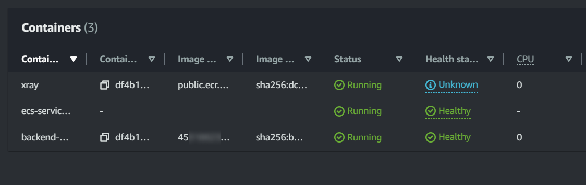

#### Turn on container insights

- From cruddur cluster click on **Update Cluster**
- Turn on **Use Container Insights** from monitoring (possible spend)
- Hit update
- To view the logs go to **Cloudwatch**
- Under insights select **Container Insights**
- Follow steps in image to view Nodes, click any of the nodes to view it’s logs.


### Debugging Container Networks

- Update docker network in `docker-compose.yml` for connecting external containers to main container network.

```yaml
networks:
  cruddur-net:
    driver: bridge
    name: cruddur-net
```

- Instruct every container to use this network by adding this instruction to every services in docker-compose

```yaml
networks:
  - cruddur-net
```

#### Busybox Debugging

> BusyBox is a software suite that provides several Unix utilities in a single executable file.

- Create `bin/busybox`

```bash
#! /usr/bin/bash

docker run --rm \
  --network cruddur-net \
  --publish 4568:4568 \
  -it busybox
```

- view docker network → `docker network list`
- inspect a docker network → `docker network inspect <network_name>`
- Ping xray daemon.

```bash
gitpod /workspace/aws-bootcamp-cruddur-2023 (main) $ ./bin/busybox
/ # ping xray-daemon
PING xray-daemon (172.18.0.5): 56 data bytes
64 bytes from 172.18.0.5: seq=0 ttl=64 time=0.120 ms
64 bytes from 172.18.0.5: seq=1 ttl=64 time=0.069 ms
64 bytes from 172.18.0.5: seq=2 ttl=64 time=0.070 ms
64 bytes from 172.18.0.5: seq=3 ttl=64 time=0.073 ms
```

- Telnet xray daemon.

```bash
/ # telnet xray-daemon 2000
Connected to xray-daemon
```

- Add this to Backend `Dockerfile.prod` to install iputils-ping for debugging from backend container.

```docker
# [TODO] For debugging, don't leave these in
RUN apt update && apt install -y iputils-ping
# -----
```

### Move env from docker-compose to a dot env file

#### Create template files using ruby

- Create `bin/backend/generate-env`

```ruby
#!/usr/bin/env ruby

require 'erb'

template = File.read 'erb/backend-flask.env.erb'
content = ERB.new(template).result(binding)
filename = "backend-flask.env"
File.write(filename, content)
```

- Do the same for frontend.

```ruby
#!/usr/bin/env ruby

require 'erb'

template = File.read 'erb/frontend-react-js.env.erb'
content = ERB.new(template).result(binding)
filename = "frontend-react-js.env"
File.write(filename, content)
```

- Create 2 files `erb/backend-flask.env.erb` & `erb/frontend-react-js.env.erb`
- Add this updated environment variable to the following files accordingly.

  - Backend

  ```ruby
  FRONTEND_URL=https://3000-<%= ENV['GITPOD_WORKSPACE_ID'] %>.<%= ENV['GITPOD_WORKSPACE_CLUSTER_HOST'] %>
  BACKEND_URL=https://4567-<%= ENV['GITPOD_WORKSPACE_ID'] %>.<%= ENV['GITPOD_WORKSPACE_CLUSTER_HOST'] %>
  AWS_DEFAULT_REGION=<%= ENV['AWS_DEFAULT_REGION'] %>
  AWS_ACCESS_KEY_ID=<%= ENV['AWS_ACCESS_KEY_ID'] %>
  AWS_SECRET_ACCESS_KEY=<%= ENV['AWS_SECRET_ACCESS_KEY'] %>
  AWS_COGNITO_USER_POOL_ID=<%= ENV['AWS_USER_POOLS_ID'] %>
  AWS_COGNITO_USER_POOL_CLIENT_ID=<%= ENV['CLIENT_ID'] %>
  PYTHONUNBUFFERED=1
  CONNECTION_URL=<%= ENV['LOCAL_CONNECTION_URL'] %>
  AWS_ENDPOINT_URL=http://dynamodb-local:8000
  OTEL_SERVICE_NAME=backend-flask
  OTEL_EXPORTER_OTLP_ENDPOINT=https://api.honeycomb.io
  OTEL_EXPORTER_OTLP_HEADERS=x-honeycomb-team=<%= ENV['HONEYCOMB_API_KEY'] %>
  AWS_XRAY_URL=*4567-<%= ENV['GITPOD_WORKSPACE_ID'] %>.<%= ENV['GITPOD_WORKSPACE_CLUSTER_HOST'] %>*
  AWS_XRAY_DAEMON_ADDRESS=xray-daemon:2000
  ROLLBAR_ACCESS_TOKEN=<%= ENV['ROLLBAR_ACCESS_TOKEN'] %>
  ```

  - Frontend

  ```ruby
  REACT_APP_BACKEND_URL=https://4567-<%= ENV['GITPOD_WORKSPACE_ID'] %>.<%= ENV['GITPOD_WORKSPACE_CLUSTER_HOST'] %>
  REACT_APP_FRONTEND_URL=https://3000-<%= ENV['GITPOD_WORKSPACE_ID'] %>.<%= ENV['GITPOD_WORKSPACE_CLUSTER_HOST'] %>

  REACT_APP_AWS_PROJECT_REGION=<%= ENV['AWS_DEFAULT_REGION'] %>
  REACT_APP_AWS_COGNITO_REGION=<%= ENV['AWS_DEFAULT_REGION'] %>
  REACT_APP_AWS_USER_POOLS_ID=<%= ENV['AWS_USER_POOLS_ID'] %>
  REACT_APP_CLIENT_ID=<%= ENV['CLIENT_ID'] %>
  ```

- Run the script to create the environment files.
- Update `.gitpod.yml` to execute this script, making sure to use `ruby <filename>`.
- To use these environment files, update `docker-compose.yml` with the following instructions in both the backend and frontend services, after removing the entire `ENV VARS` section:

```yaml
env_file:
  - backend-flask.env

env_file:
   - frontend-react-js.env
```

### Fargate Technical Questions

**How many processes are recommended per container for better scalability in microservice architecture?**

- Recommendation is one process per container.

**How many threads or hyper-threads do you get per vCPU in Fargate?**

- It is better to think about how many CPU cycles you are using instead of threads.

**Is there any use case for bridge networking mode in Fargate?**

- No, on Fargate you can only use AWS VPC mode.
- On EC2, you can use Host mode, Bridge mode & AWS VPC mode:
  - Host mode maps to the same port on the physical host (1:1). However, you cannot run multiple containers on the same port.
  - Bridge mode is used to run multiple containers on the same port using an internal network.
  - AWS VPC mode uses ENI, providing more security benefits. One container per ENI.

**What is Service Connect in Fargate?**

- Service Connect is the evolution of Appmesh, using cloudmap under the hood.
- It provides a more simple envoy service.
- It launches an additional proxy container and adds 256 CPU units and 64MB of memory to the task CPU for the Service Connect proxy container.
- On Fargate, you have to add a minimum of 512 MB of memory.

**When does it make sense to use a Service Mesh?**

- When you have an evolved architecture with hundreds of microservices.

**What is AWS Copilot?**

- AWS Copilot is a command line interface that makes it easy to develop, deploy, and operate containerized applications on AWS.
- More information can be found at **[https://aws.amazon.com/containers/copilot/](https://aws.amazon.com/containers/copilot/)**.

### Amazon ECS Security Best Practices

#### How does ECS work

- When an AWS user calls ECS to run containers, it uses the Amazon ECS container agent to call to run the container fetched from ECR.
- This all happens in EC2 or Fargate.

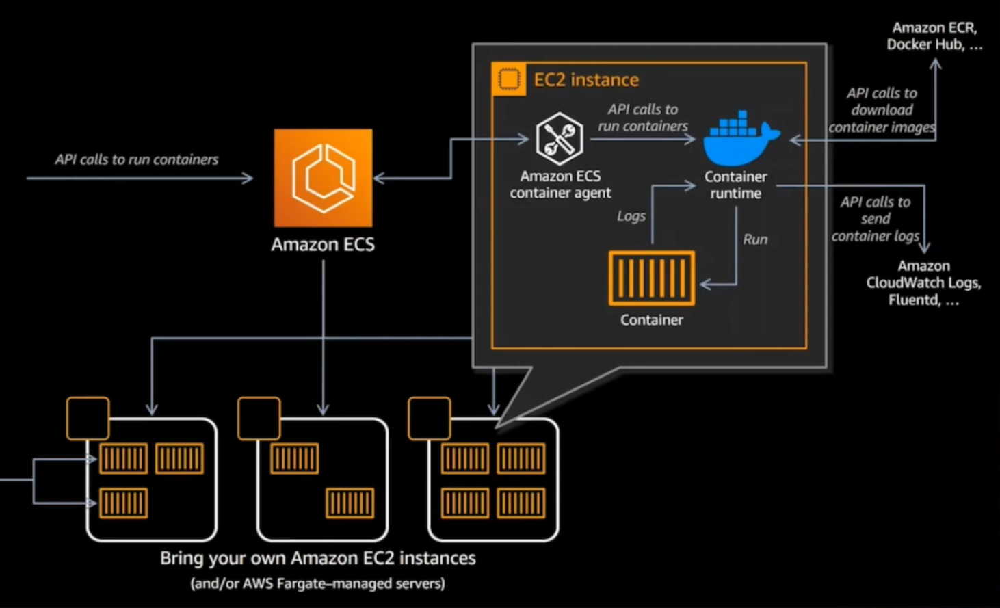

- The ECS cluster manages all the EC2 instances in an ECS architecture.
- In ECS Fargate, instead of EC2 instances, Fargate tasks are managed (serverless containers).

#### Security Challenges with AWS Fargate

- No visibility of infrastructure.
- Ephemeral resources make it hard to do triage or forensics for detected threats.
- No file/network monitoring.
- Cannot run traditional security agents in Fargate.
- Users can run unverified container images.
- Containers can run as root and even with elevated privileges.

#### Amazon ECR image security

- Turn on scan for ECR images; it uses Snyk in the background to scan Docker images.
- You can see the results under AWS Inspector also.

#### Amazon ECS security best practices - AWS

- Cloud Control Plane Configuration - Access Control, Container Images, etc.
- Choosing the right public or private ECR for images.
- Amazon ECR Scan Images to "Scan on Push" using Basic or Enhanced (Inspector + Snyk).
- Use VPC Endpoints or Security Groups with known sources only.
- Compliance standard is what your business requires.
- Amazon Organizations SCP - to manage ECS task deletion, ECS creation, region lock, etc.
- AWS CloudTrail is enabled and monitored to trigger alerts on malicious ECS behavior by an identity in AWS.
- AWS Config Rules (as no GuardDuty (ECS) even in Mar'2023) are enabled in the account and region of ECS.

#### Amazon ECS security best practices - Application

- Access Control - Roles or IAM Users for ECS Clusters/Services/Tasks.
- Most recent version of ECR Agent daemon on EC2.
- Container Control Plane Configuration - Root privileges, resource limitations, etc.
- No secrets/passwords in ECS Task Definitions (e.g., db password, etc.) - Consider AWS Secret Manager.
- No secrets/passwords in Containers - Consider AWS Secret Manager.
- Only use Trusted Containers from ECR with no HIGH/CRITICAL vulnerabilities.
- Limit the ability to ssh into the EC2 container to read-only file systems - use APIs or GitOps to pull information for troubleshooting.
- Use Amazon CloudWatch to monitor malicious ECS Configuration Changes.
- Only use authorized Container Images (hopefully some image signing).

### How To Securely Host a Website on AWS with a Custom Domain

#### Protecting web applications in AWS

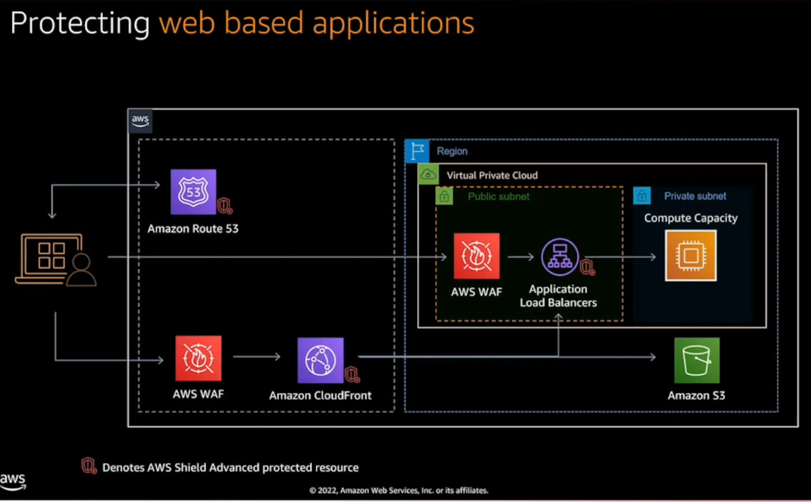

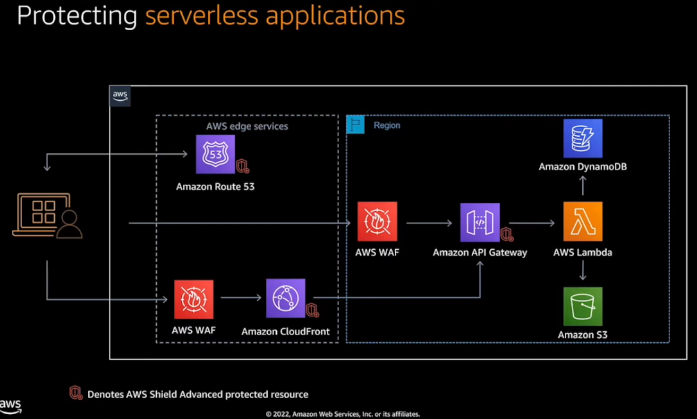

- Route53 is a DNS service provided by Amazon.
- Route53 can be used to create both Public and Private hosted zones.

#### Route 53 Security Best Practices - AWS

- Integrate with ACM (Amazon Certificate Manager) to enable TLS.
- Choose a compliance standard that meets your business requirements for a DNS provider.
- Use Amazon Organizations SCP to manage Route53 actions such as creation, deletion, and modification of production URIs.
- Enable AWS CloudTrail and monitor it for alerts on malicious activities like associating VPC with Hosted Zone, changing Resource Record Sets, and registering Domain.
- Enable GuardDuty to monitor suspicious DNS communications (e.g. Crypto-mining) and for automated auto-remediation.
- Enable AWS Config Rules in the account and region of Route53.
- Use Roles or IAM Users for making DNS changes in Amazon Route53.
- Understand the difference between Public and Private Hosted Zones.
- All Route53 records should point to an existing DNS, ELB, ALB, or AWS S3. Beware of Dangling DNS domains.
- Limit Hosted Zone Configuration Changes to a small set of authorized people.
- Enable Encryption in Transit using TLS/SSL certification (e.g. HTTPS URLs).
- Only use Trusted Domain Providers for requesting new DNSs.
- Set TTLs appropriately to afford waiting for a change to take effect.
- Ensure Root Domain Alias Record Points to ELB.
- Develop a process to continuously verify if DNS and Hosted Zone are current and valid.

---

## Homework Challenges

### Updated `connect-to-service`

- Instead of entering the TASK_ID with the script call, we can pass the TASK ARN fully to the task to get the same result.
- Update `connect-to-service` script like this to retrieve task id for specific CONTAINER_NAME

```bash
#! /usr/bin/bash

if [ -z "$1" ]; then
    echo "No CONTAINER_NAME argument supplied eg ./bin/ecs/connect-to-service <CONTAINER_NAME>"
    exit 1
fi

CONTAINER_NAME=$1

TASK_ARN=$(aws ecs list-tasks --cluster cruddur --service-name $CONTAINER_NAME --output json | jq -r '.taskArns[0]')

aws ecs execute-command  \
--region us-east-1 \
--cluster cruddur \
--task $TASK_ARN\
--container $CONTAINER_NAME \
--command "/bin/bash" \
--interactive
```

- Instead of creating 2 scripts for connecting to frontend and backend container. I updated `connect-to-service` to change `--command` based on CONTAINER_NAME

```bash
#! /usr/bin/bash

if [ -z "$1" ]; then
    echo "No CONTAINER_NAME argument supplied eg ./bin/ecs/connect-to-service <CONTAINER_NAME>"
    exit 1
fi

CONTAINER_NAME=$1

TASK_ARN=$(aws ecs list-tasks --cluster cruddur --service-name $CONTAINER_NAME --output json | jq -r '.taskArns[0]')

if [ $CONTAINER_NAME == 'backend-flask' ]; then
    COMMAND="/bin/bash"
else
    COMMAND="/bin/sh"
fi

aws ecs execute-command  \
--region us-east-1 \
--cluster cruddur \
--task $TASK_ARN \
--container $CONTAINER_NAME \
--command $COMMAND \
--interactive
```

### Script to Launch & Delete Services

- I created these scripts to launch services when I'm working on CRUD operations and delete them when I'm done working.
- Launch Services Script - `backend-flask/bin/ecs/launch-services`

```bash
#! /usr/bin/bash

aws ecs create-service --cli-input-json file://aws/json/service-backend-flask.json
aws ecs create-service --cli-input-json file://aws/json/service-frontend-react-js.json
```

- Delete Services Script - `backend-flask/bin/ecs/delete-services`

```bash
#! /usr/bin/bash

aws ecs delete-service --cluster cruddur --service backend-flask --force
aws ecs delete-service --cluster cruddur --service frontend-react-js --force
```

### Get Relative Path

Rather than using `dirname` to traverse back directories from an absolute path, you can use the following command:

```bash
realpath --relative-base=PATH1 PATH2
```

This command will provide you with the correct relative path based on the full path of the current directory (`$PWD`) and the full path of the file or folder referenced in the Bash script.

**Code Template:**

```bash
# set the absolute path to the file
abs_filepath="<absolute_path_to_file_or_folder>"

# get the relative path to the file from the current directory
FilePath=$(realpath --relative-base="$PWD" "$abs_filepath")
```

- Replace `<absolute_path_to_file_or_folder>` with the full path to the file or folder referenced inside the Bash script.
- To obtain the full path in VS Code, right-click on the file or folder and select "Copy Path" to retrieve the full path.

  **Usage example:**

Example 1: frontend-react-js build script

```bash
#! /usr/bin/bash

abs_filepath="/workspace/aws-bootcamp-cruddur-2023/frontend-react-js/Dockerfile.prod"

FilePath=$(realpath --relative-base="$PWD" "$abs_filepath")

# get directory path of file
FilePathDir=$(dirname "$FilePath")

echo filepath: $FilePath

docker build \
    --build-arg REACT_APP_BACKEND_URL="https://4567-${GITPOD_WORKSPACE_ID}.${GITPOD_WORKSPACE_CLUSTER_HOST}" \
    --build-arg REACT_APP_AWS_PROJECT_REGION="$AWS_DEFAULT_REGION" \
    --build-arg REACT_APP_AWS_COGNITO_REGION="$AWS_DEFAULT_REGION" \
    --build-arg REACT_APP_AWS_USER_POOLS_ID="$AWS_USER_POOLS_ID" \
    --build-arg REACT_APP_CLIENT_ID="$CLIENT_ID" \
    -t frontend-react-js-prod \
    -f $FilePath $FilePathDir
```

- Sample output

```bash
gitpod /workspace/aws-bootcamp-cruddur-2023 (main) $ ./backend-flask/bin/docker/build/frontend-react-js-prod

filepath: frontend-react-js/Dockerfile.prod
```

Example 2: SQL Setup script

```bash

abs_filepath="/workspace/aws-bootcamp-cruddur-2023/backend-flask/bin/db"

FilePath=$(realpath --relative-base="$PWD" "$abs_filepath")

source "$FilePath/drop"
source "$FilePath/create"
source "$FilePath/schema-load"
source "$FilePath/seed"
python3 "$FilePath/update_cognito_user_ids"
```

**For more details:** [https://www.gnu.org/software/coreutils/manual/html_node/Realpath-usage-examples.html](https://www.gnu.org/software/coreutils/manual/html_node/Realpath-usage-examples.html)

### Host Frontend Application on CloudFront

- Create a new S3 bucket and leave all settings to default.
- Go to the **CloudFront console** and **create a distribution**.
- Select the S3 bucket as the origin domain.
- Choose **Origin access control settings (recommended)** from Origin access, and select **Create Control Settings** for Origin access control.
- Provide a description in the opening tab, select the recommended settings, and click **Create**.
- In Viewer set, **redirect HTTP to HTTPS** and set Allowed HTTP methods to **GET, HEAD, OPTIONS**.
- In **Default root object - optional**, set it to **`index.html`**.
- Click **Create distribution**.
- Copy the S3 bucket policy from the top notification.
- Click **Go to S3 bucket permissions to update policy** to navigate to the S3 bucket permission page.
- Click **Bucket policy edit** and add the Policy JSON you copied from CloudFront.
- Click **Save changes**.
- Wait for CloudFront deployment to complete.

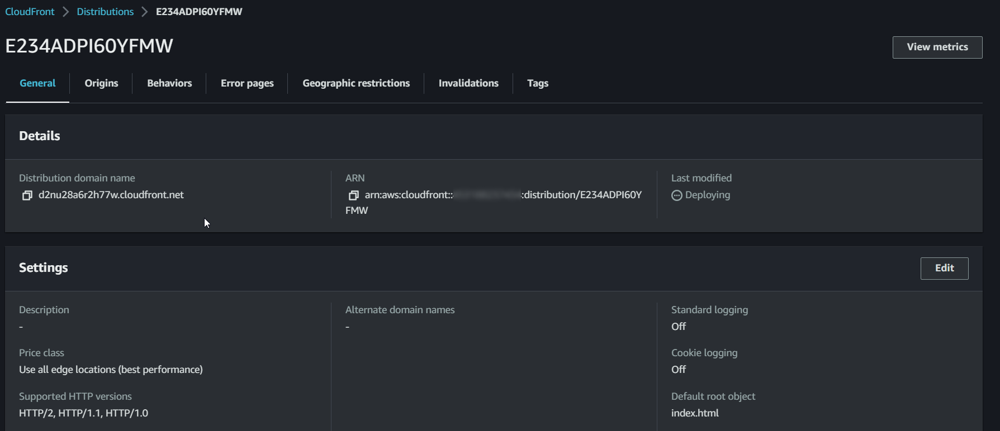

- From the frontend folder, run `npm run build` to create the build file for the frontend.
- Run the following command to sync the build folder with the S3 bucket:

```bash
aws s3 sync build s3://<bucket_name>
```

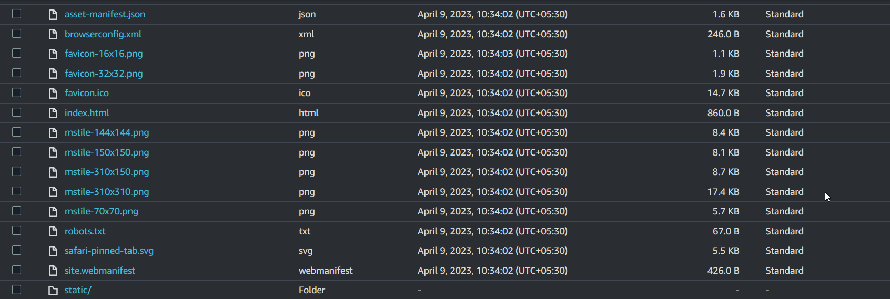

- In CloudFront Error pages, choose **Create custom error response**.
- Select **403** error code.
- In Customize error response, choose **Yes** and set Response page path to `/index.html`, HTTP Response code to `200`.
- Do the same for 404 and wait for CloudFront deployment to complete.
- Copy **Distribution domain name** from CloudFront and try visiting that page.

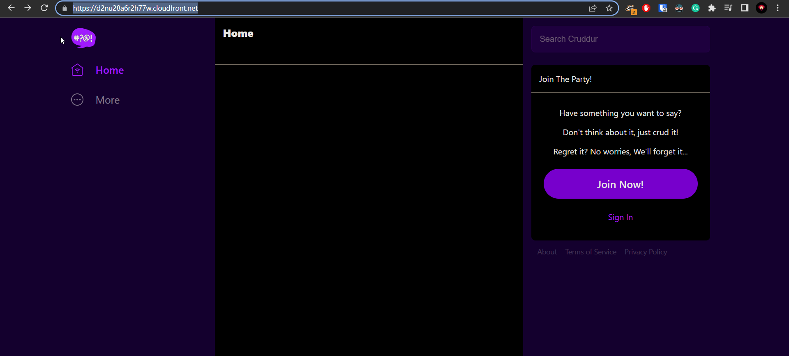

I encountered a `client pool not found` error due to missing env vars in the build file. I resolved this by creating a `.env.production` file with env vars in the frontend folder and then building it with `NODE_ENV=production npm run build`. Although this is a less secure way of doing it, I went with this solution for demonstration purposes.

I then synced this new file and invalidated CloudFront cache using this command:

```bash
aws cloudfront create-invalidation --distribution-id
<dist_id> --paths '/*'
```

To fix the CORS issue, go to backend `app.py`and add the **Distribution domain name** to origins:

```python
origins = [frontend, backend, '<distribution_domain_name>']
```

Build, push, and update the backend service, then sign into Cruddur through the Distribution domain name to view posts and messages.

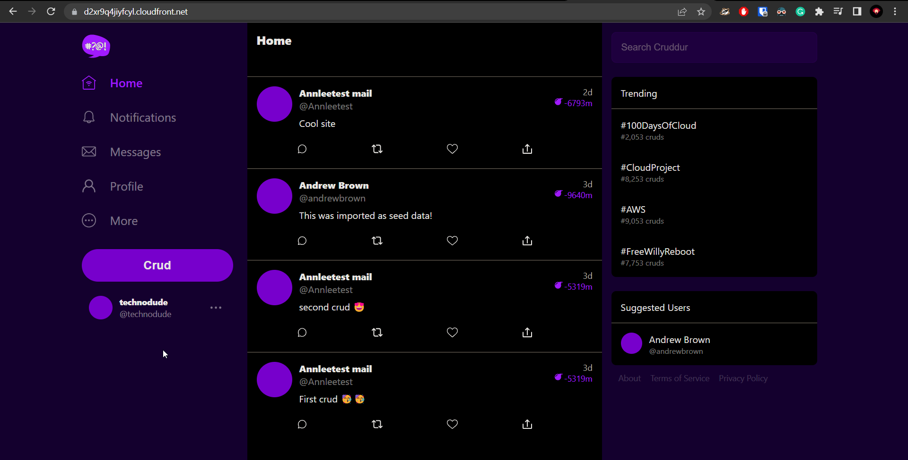

References:

- [Creating response headers policies in CloudFront](https://docs.aws.amazon.com/AmazonCloudFront/latest/DeveloperGuide/creating-response-headers-policies.html)
- [How to Deploy React App on AWS S3 and CloudFront](https://youtu.be/CQ8vzm1kYkM)
- [How to set up a CloudFront distribution for Amazon EC2](https://aws.amazon.com/cloudfront/getting-started/EC2/)
- [Dynamic whole site delivery with Amazon CloudFront](https://aws.amazon.com/blogs/networking-and-content-delivery/dynamic-whole-site-delivery-with-amazon-cloudfront/)
- [Deploying your Angular app in CloudFront with SSL](https://medium.com/cloud-base/deploying-your-angularapp-in-cloudfront-with-ssl-80af7b045193)
- [How do I resolve the CloudFront error "No Access-Control-Allow-Origin header?](https://youtu.be/8P9JvEURHO4)
