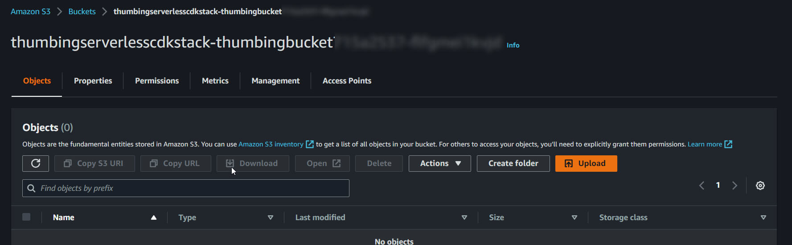
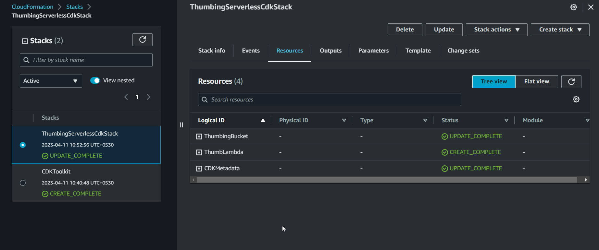
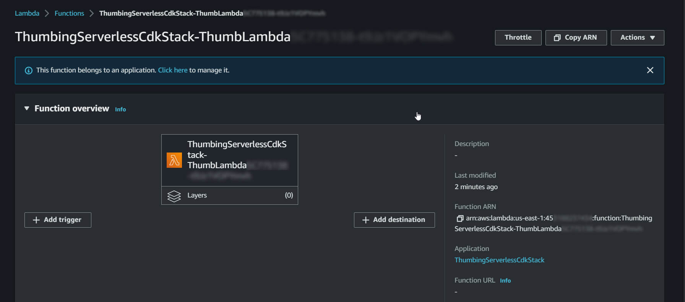
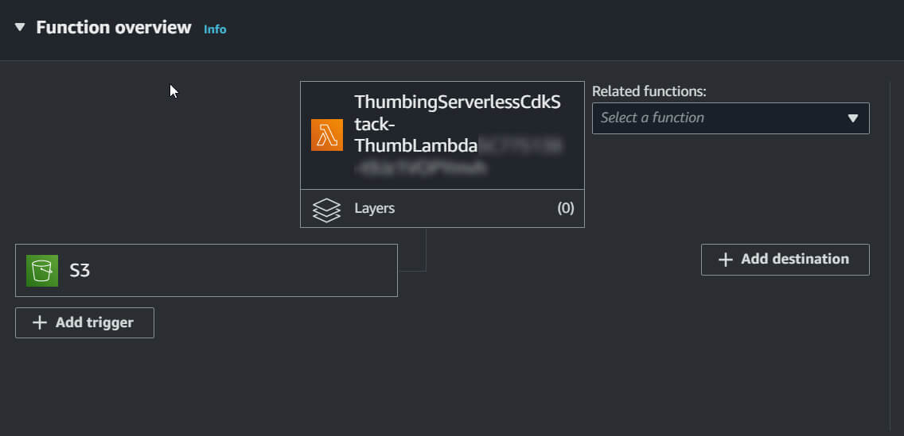
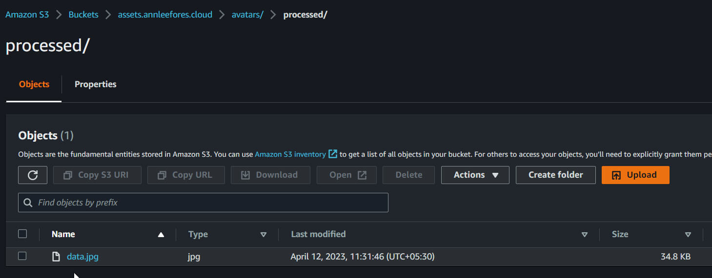
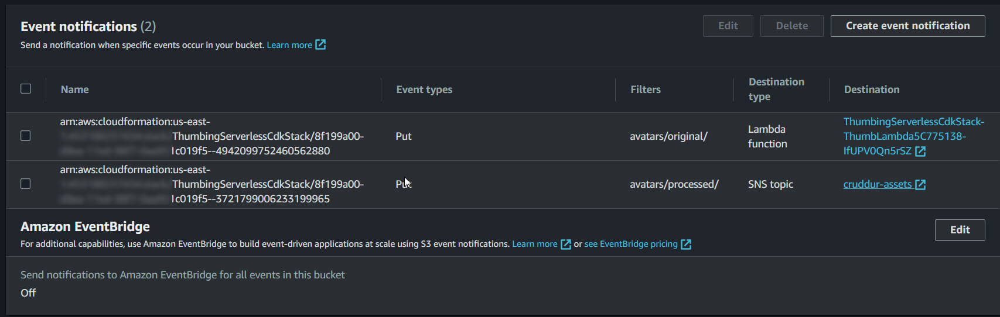
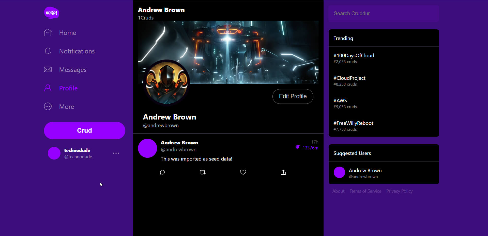
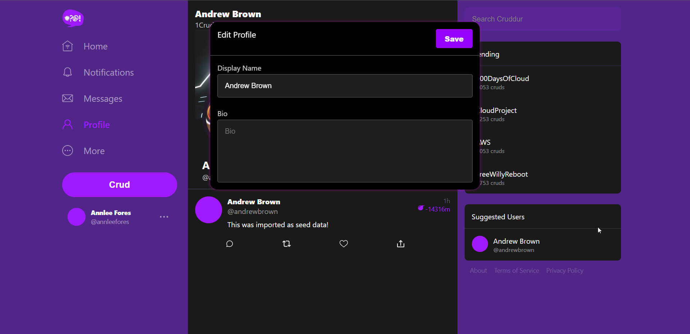
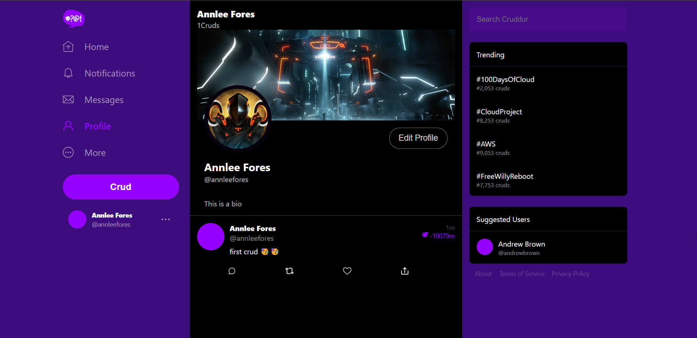
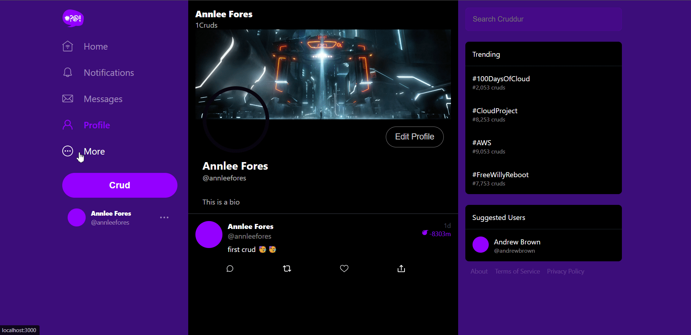

# Week 8 — Serverless Image Processing

## [Required Homework](#required-homework-1)

- [Implement CDK Stack](#what-is-cdk)
- [Serve Avatars via CloudFront](#serving-avatars-via-cloudfront)
- [Implement Users Profile Page](#implement-users-profile-page)
- [Implement Users Profile Form](#implement-users-profile-page)
- [Implement Backend Migrations](#implement-migrations-backend-endpoint-and-profile-form)
- [Presigned URL generation via Ruby Lambda](#implement-avatar-uploading)
- [HTTP API Gateway with Lambda Authorizer](#implement-avatar-uploading)
- [Create JWT Lambda Layer](#fix-cors-aws-lambda)
- [Render Avatars in App via CloudFront](#render-avatar-from-cloudfront)

## [Homework Challenges](#homework-challenges-1)

- [Passing the JWT sub from Authorizer Lambda to CruddurAvatarUpload Lambda](#passing-the-jwt-sub-from-authorizer-lambda-to-crudduravatarupload-lambda)

## Required Homework

### What is CDK?

CDK (Cloud Development Kit) is an Infrastructure as Code (IaC) tool owned by AWS that allows users to define infrastructure or cloud resources in their programming language of choice. CDK synth converts CDK to CloudFormation templates, and it is built on top of CFN. It supports TypeScript, Python, Java, .NET, and Go. CDK constructs are the basic building blocks of AWS CDK apps, and they encapsulate everything AWS CloudFormation needs to create the component. There are L1, L2, and L3 constructs, with L3 being the most complex. CFN knowledge is helpful but not necessary. CDK can be used with other IaC tools like AWS SAM, Terraform, and Kubernetes. CDK is good for minimizing CFN code. The CDK base library is written in TypeScript and uses jsii to convert the library for other languages. There are resources available to get started with CDK, such as the [official getting started guide](https://docs.aws.amazon.com/cdk/v2/guide/getting_started.html), CDK book, [constructs.dev](https://constructs.dev/), and [cdkpatterns.com](http://cdkpatterns.com/)

### Bootstrap

The Bootstrap process is necessary to provision AWS resources before deploying CDK apps. Each region needs to be bootstrapped to your account. To do this, run

```bash
cdk bootstrap aws://ACCOUNT-NUMBER-1/REGION-1
```

```bash
Trusted accounts for deployment: (none)
Trusted accounts for lookup: (none)
Using default execution policy of 'arn:aws:iam::aws:policy/AdministratorAccess'. Pass '--cloudformation-execution-policies' to customize.
CDKToolkit: creating CloudFormation changeset...
[··························································] (0/12)

10:40:58 AM | CREATE_IN_PROGRESS   | AWS::CloudFormation::Stack | CDKToolkit
..............................
..............................
..............................
```

It's essential not to delete the CDKToolkit from the CloudFormation stack, which also creates a bucket and an ECR repository.

Official documentation: [Bootstrapping](https://docs.aws.amazon.com/cdk/v2/guide/bootstrapping.html)

### Implementing S3 for Serverless Avatar Image Processing

To create an S3 bucket using CDK, first, create and navigate to the `thumbing-serverless-cdk` directory, and install AWS CDK using

```bash
npm install aws-cdk -g
```

Then, initialize a CDK application using

```bash
cdk init app --language typescript
```

In `thumbing-serverless-cdk/lib/thumbing-serverless-cdk-stack.ts,` remove the commented-out code and define the S3 bucket creation.

```tsx
import * as cdk from "aws-cdk-lib";
import { Construct } from "constructs";
import * as s3 from "aws-cdk-lib/aws-s3";

export class ThumbingServerlessCdkStack extends cdk.Stack {
  constructor(scope: Construct, id: string, props?: cdk.StackProps) {
    super(scope, id, props);

    // The code that defines your stack goes here
    const bucketName: string = process.env.THUMBING_BUCKET_NAME as string;
    const bucket = this.createBucket(bucketName);
  }

  createBucket(bucketName: string): s3.IBucket {
    const bucket = new s3.Bucket(this, "ThumbingBucket", {
      bucketName: bucketName,
      removalPolicy: cdk.RemovalPolicy.DESTROY,
    });
    return bucket;
  }
}
```

Note that the API references starting with cfn are L1 constructs. Running `cdk synth` creates a CloudFormation template, which returns YAML output in the shell. A grayed-out `thumbing-serverless-cdk/cdk.out` folder will appear in the directory containing JSON file for the CloudFormation stack.

```bash
./cdk.out
├── ThumbingServerlessCdkStack.assets.json
├── ThumbingServerlessCdkStack.template.json
├── cdk.out
├── manifest.json
└── tree.json
```

Run `cdk deploy` to deploy infra



### Implementing Lambda for Serverless Avatar Image Processing

Updated `thumbing-serverless-cdk-stack.ts` to define Lambda function creation.

```tsx
import * as lambda from 'aws-cdk-lib/aws-lambda';

{
    // The code that defines your stack goes here
	  const bucketName: string = process.env.THUMBING_BUCKET_NAME as string;
    const folderInput: string = process.env.THUMBING_S3_FOLDER_INPUT as string;
    const folderOutput: string = process.env.THUMBING_S3_FOLDER_OUTPUT as string;
    const webhookUrl: string = process.env.THUMBING_WEBHOOK_URL as string;
    const topicName: string = process.env.THUMBING_TOPIC_NAME as string;
    const functionPath: string = process.env.THUMBING_FUNCTION_PATH as string;

    const bucket = this.createBucket(bucketName);
    const lambda = this.createLambda(functionPath, bucketName, folderInput, folderOutput);
  }

  createLambda(functionPath:string, bucketName:string, folderInput:string, folderOutput:string): lambda.IFunction {

    const lambdaFunction = new lambda.Function(this, 'ThumbLambda', {
      runtime: lambda.Runtime.NODEJS_18_X,
      handler: 'index.handler',
      code: lambda.Code.fromAsset(functionPath),
      environment: {
        DEST_BUCKET_NAME: bucketName,
        FOLDER_INPUT: folderInput,
        FOLDER_OUTPUT: folderOutput,
        PROCESS_WIDTH: '512',
        PROCESS_HEIGHT: '512'
      }
    })
    return lambdaFunction;
  }

```

Next, an `.env` file is created in the `thumbing-serverless-cdk` folder with environment variables. The `dotenv` package is installed, and an import statement is added to the `thumbing-serverless-cdk-stack.ts` file.

```
THUMBING_BUCKET_NAME="assets.annleefores.cloud"
THUMBING_S3_FOLDER_INPUT="avatars/original/"
THUMBING_S3_FOLDER_OUTPUT="avatars/processed/"
THUMBING_WEBHOOK_URL="https://api.annleefores.cloud/webhooks/avatar"
THUMBING_TOPIC_NAME="cruddur-assets"
THUMBING_FUNCTION_PATH="/home/annlee/aws-bootcamp-cruddur-2023/aws/lambdas/process-images"
```

Then, `cdk synth` is run to create the CloudFormation template.

**Lambda Function Code**

Create `aws/lambdas/process-images/index.js` , the main lambda function code used to process the image

```jsx
const process = require("process");

const {
  getClient,
  getOriginalImage,
  processImage,
  uploadProcessedImage,
} = require("./s3-image-processing.js");

const path = require("path");

const bucketName = process.env.DEST_BUCKET_NAME;
const folderInput = process.env.FOLDER_INPUT;
const folderOutput = process.env.FOLDER_OUTPUT;
const width = parseInt(process.env.PROCESS_WIDTH);
const height = parseInt(process.env.PROCESS_HEIGHT);

client = getClient();

exports.handler = async (event) => {
  const srcBucket = event.Records[0].s3.bucket.name;
  const srcKey = decodeURIComponent(
    event.Records[0].s3.object.key.replace(/\+/g, " ")
  );
  console.log("srcBucket", srcBucket);
  console.log("srcKey", srcKey);

  const dstBucket = bucketName;

  const filename = path.parse(srcKey).name;

  const dstKey = `${folderOutput}${filename}.jpg`;

  console.log("dstBucket", dstBucket);
  console.log("dstKey", dstKey);

  const originalImage = await getOriginalImage(client, srcBucket, srcKey);
  const processedImage = await processImage(originalImage, width, height);
  await uploadProcessedImage(client, dstBucket, dstKey, processedImage);
};
```

Create `aws/lambdas/process-images/test.js` to test the lambda function when needed.

```jsx
const {
  getClient,
  getOriginalImage,
  processImage,
  uploadProcessedImage,
} = require("./s3-image-processing.js");

async function main() {
  client = getClient();
  const srcBucket = "cruddur-thumbs";
  const srcKey = "avatar/original/data.jpg";
  const dstBucket = "cruddur-thumbs";
  const dstKey = "avatar/processed/data.png";
  const width = 256;
  const height = 256;

  const originalImage = await getOriginalImage(client, srcBucket, srcKey);
  console.log(originalImage);
  const processedImage = await processImage(originalImage, width, height);
  await uploadProcessedImage(client, dstBucket, dstKey, processedImage);
}

main();
```

Create `aws/lambdas/process-images/s3-image-processing.js` for handling the image processing using sharp module

```jsx
const sharp = require("sharp");
const {
  S3Client,
  PutObjectCommand,
  GetObjectCommand,
} = require("@aws-sdk/client-s3");

function getClient() {
  const client = new S3Client();
  return client;
}

async function getOriginalImage(client, srcBucket, srcKey) {
  console.log("get==");
  const params = {
    Bucket: srcBucket,
    Key: srcKey,
  };
  console.log("params", params);
  const command = new GetObjectCommand(params);
  const response = await client.send(command);

  const chunks = [];
  for await (const chunk of response.Body) {
    chunks.push(chunk);
  }
  const buffer = Buffer.concat(chunks);
  return buffer;
}

async function processImage(image, width, height) {
  const processedImage = await sharp(image)
    .resize(width, height)
    .jpeg()
    .toBuffer();
  return processedImage;
}

async function uploadProcessedImage(client, dstBucket, dstKey, image) {
  console.log("upload==");
  const params = {
    Bucket: dstBucket,
    Key: dstKey,
    Body: image,
    ContentType: "image/jpeg",
  };
  console.log("params", params);
  const command = new PutObjectCommand(params);
  const response = await client.send(command);
  console.log("repsonse", response);
  return response;
}

module.exports = {
  getClient: getClient,
  getOriginalImage: getOriginalImage,
  processImage: processImage,
  uploadProcessedImage: uploadProcessedImage,
};
```

Create `aws/lambdas/process-images/example.json` to test the lambda function when needed

```json
{
  "Records": [
    {
      "eventVersion": "2.1",
      "eventSource": "aws:s3",
      "awsRegion": "us-east-1",
      "eventTime": "2023-04-04T12:34:56.000Z",
      "eventName": "ObjectCreated:Put",
      "userIdentity": {
        "principalId": "EXAMPLE"
      },
      "requestParameters": {
        "sourceIPAddress": "127.0.0.1"
      },
      "responseElements": {
        "x-amz-request-id": "EXAMPLE123456789",
        "x-amz-id-2": "EXAMPLE123/abcdefghijklmno/123456789"
      },
      "s3": {
        "s3SchemaVersion": "1.0",
        "configurationId": "EXAMPLEConfig",
        "bucket": {
          "name": "example-bucket",
          "ownerIdentity": {
            "principalId": "EXAMPLE"
          },
          "arn": "arn:aws:s3:::example-bucket"
        },
        "object": {
          "key": "example-object.txt",
          "size": 1024,
          "eTag": "EXAMPLEETAG",
          "sequencer": "EXAMPLESEQUENCER"
        }
      }
    }
  ]
}
```

Navigate to the `/aws/lambdas/process-images` directory and execute the command `npm init -y`. After that, install the Sharp package.

```bash
npm i sharp @aws-sdk/client-s3
```

- Then run `cdk deploy` to update the infrastructure





**Sharp package Installation**

Create `bin/serverless/build`

```bash
#! /usr/bin/bash

# set the absolute path to the file
abs_filepath="$ABS_PATH/thumbing-serverless-cdk"

# get the relative path to the file from the current directory
FilePath=$(realpath --relative-base="$PWD" "$abs_filepath")

cd $FilePath

npm install
rm -rf node_modules/sharp
SHARP_IGNORE_GLOBAL_LIBVIPS=1 npm install --arch=x64 --platform=linux --libc=glibc sharp
```

Run it to install sharp in `thumbing-serverless-cdk` folder

### Create S3 event notification to Lambda

To create an S3 notify Lambda, add the provided code to `thumbing-serverless-cdk/lib/thumbing-serverless-cdk-stack.ts` file. After that, run `cdk deploy` to update the infrastructure, which will create an additional Lambda function to handle event notifications.

```tsx
import * as s3n from 'aws-cdk-lib/aws-s3-notifications';

this.createS3NotifyToLambda(folderInput,lambda,bucket)

createS3NotifyToLambda(prefix: string, lambda: lambda.IFunction, bucket: s3.IBucket): void {
    const destination = new s3n.LambdaDestination(lambda);
      bucket.addEventNotification(s3.EventType.OBJECT_CREATED_PUT,
      destination,
      {prefix: prefix} //folder to container te original image
    )
  }
```

A new s3 trigger gets added to the lambda function



- To delete the whole stack, use the command `cdk destroy`
- You can view the changes made to the stack using the changeset feature in CloudFormation.
- It is recommended to create a separate stack for the database or storage, so that deleting the main stack won't affect it.
- If you need to apply this change, you should first delete the current stack.

### Import existing S3 bucket into CDK

Add this function to `thumbing-serverless-cdk/lib/thumbing-serverless-cdk-stack.ts`

```tsx
importBucket(bucketName:string): s3.IBucket {
    const bucket = s3.Bucket.fromBucketName(this, "AssetsBucket", bucketName);
    return bucket
  }
```

For now, we will manually create a bucket instead of using another stack.

To create the bucket, go to S3 and name it `assets.<domain>`. Then run `cdk deploy`.

Creating the bucket this way ensures it will remain even after the stack is destroyed. Create two folders named `avatar/original` and `avatar/processed` inside the S3 bucket.

### Script for uploading and clearing S3 bucket data

Create `bin/serverless/upload` and make it executable. This script is used to upload image to S3 bucket

```bash
#! /usr/bin/bash

# set the absolute path to the file
abs_filepath="$ABS_PATH/bin/serverless/files/rinzler.jpg"

# get the relative path to the file from the current directory
FilePath=$(realpath --relative-base="$PWD" "$abs_filepath")

aws s3 cp "$FilePath" "s3://assets.$DOMAIN_NAME/avatars/original/data.jpg"
```

Create a new folder called `files` inside `serverless/` and upload a JPEG image that is larger than `512x512`.

Create a script named `clear` inside `bin/serverless/` and set its permissions to executable. This script is used to clear the S3 bucket.

```bash
#! /usr/bin/bash

aws s3 rm "s3://assets.$DOMAIN_NAME/avatars/original/data.jpg"
aws s3 rm "s3://assets.$DOMAIN_NAME/avatars/processed/data.jpg"
```

### Adding S3 Policies

Add the provided code to `thumbing-serverless-cdk/lib/thumbing-serverless-cdk-stack.ts`.

```tsx
import * as iam from 'aws-cdk-lib/aws-iam';

const s3ReadWritePolicy = this.createPolicyBucketAccess(bucket.bucketArn)
lambda.addToRolePolicy(s3ReadWritePolicy);

createPolicyBucketAccess(bucketArn: string){
    const s3ReadWritePolicy = new iam.PolicyStatement({
      actions: [
        's3:GetObject',
        's3:PutObject',
      ],
      resources: [
        `${bucketArn}/*`,
      ]
    });
    return s3ReadWritePolicy;
  }
```

After executing the command `cdk deploy`, use the upload script to upload an image. The processed image will be saved in the `processed/` directory.



### Create SNS topic and subscription

To improve visibility, reorganize the function call structure and update the `thumbing-serverless-cdk/lib/thumbing-serverless-cdk-stack.ts` code.

```tsx
import * as sns from 'aws-cdk-lib/aws-sns';
import * as subscriptions from 'aws-cdk-lib/aws-sns-subscriptions';

const topicName: string = process.env.THUMBING_TOPIC_NAME as string;
const functionPath: string = process.env.THUMBING_FUNCTION_PATH as string;

// const bucket = this.createBucket(bucketName);
// import existing bucket
const bucket = this.importBucket(bucketName)

// create lambda
const lambda = this.createLambda(functionPath, bucketName, folderInput, folderOutput);

// create sns topic and subscription
const snsTopic = this.createSnsTopic(topicName)
this.createSnsSubscription(snsTopic,webhookUrl)

//Add S3 event notifications
this.createS3NotifyToLambda(folderInput,lambda,bucket)
this.createS3NotifyToSns(folderOutput,snsTopic,bucket)

//Create policies
const s3ReadWritePolicy = this.createPolicyBucketAccess(bucket.bucketArn)
// const snsPublishPolicy = this.createPolicySnSPublish(snsTopic.topicArn)

//Attach policies for permission
lambda.addToRolePolicy(s3ReadWritePolicy);
// lambda.addToRolePolicy(snsPublishPolicy);
}

createSnsTopic(topicName: string): sns.ITopic{
const logicalName = "ThumbingTopic";
const snsTopic = new sns.Topic(this, logicalName, {
  topicName: topicName
});
return snsTopic;
}

createSnsSubscription(snsTopic: sns.ITopic, webhookUrl: string): sns.Subscription {
const snsSubscription = snsTopic.addSubscription(
  new subscriptions.UrlSubscription(webhookUrl)
)
return snsSubscription;
}

createS3NotifyToSns(prefix: string, snsTopic: sns.ITopic, bucket: s3.IBucket): void {
const destination = new s3n.SnsDestination(snsTopic)
bucket.addEventNotification(
  s3.EventType.OBJECT_CREATED_PUT,
  destination,
  {prefix: prefix}
);
}

```



### Serving Avatars via CloudFront

- Go to the CloudFront console and create a new distribution.
- Set the **Origin domain** to point to the `assets.<domain>`S3 bucket.
- Choose **Origin access control settings (recommended)** and create a control setting.
- Select **Redirect HTTP to HTTPS** for the **viewer protocol policy**.
- Choose **CORS-CustomOrigin** for the optional **Origin request policy**.
- Choose **SimpleCORS** for the optional **Response headers policy**.
- Set the **Alternate domain name (CNAME)** to `assets.<domain>`.
- Choose the previously created ACM for the **Custom SSL certificate**.
- Give a description and click **Create**.
- Copy the S3 policy and use the given link to access the S3 bucket, then paste the policy.
- To view the processed image, go to `https://<Distribution domain name>/avatars/processed/data.jpg`.
- To get the image on the `assets.<domain>` domain, go to Route53 and select the Hosted Zone.
- Create a new record with the record name set to `assets`.
- Toggle **Alias** and select **Alias to CloudFront distribution** from the dropdown, then choose the distribution we created.
- Click **Create record**.
- To view the image, go to `https://assets.<domain_name>/avatars/processed/data.jpg`.


A recommended approach for addressing security concerns is to create a separate bucket for uploading images and serving processed images. The `/original` folder should not be made accessible to the public.

### Using Separate Buckets for Uploading and Serving Images

Update thumbing `.env` to this:

```
UPLOADS_BUCKET_NAME="cruddur-uploaded-avatars-annlee"
ASSETS_BUCKET_NAME="assets.annleefores.cloud"
THUMBING_S3_FOLDER_INPUT=""
THUMBING_S3_FOLDER_OUTPUT="avatars/"
THUMBING_WEBHOOK_URL="https://api.annleefores.cloud/webhooks/avatar"
THUMBING_TOPIC_NAME="cruddur-assets"
THUMBING_FUNCTION_PATH="/home/annlee/aws-bootcamp-cruddur-2023/aws/lambdas/process-images"
```

Update `thumbing-serverless-cdk/lib/thumbing-serverless-cdk-stack.ts`

```tsx

// The code that defines your stack goes here
const uploadsBucketName: string = process.env.UPLOADS_BUCKET_NAME as string;
const assetsBucketName: string = process.env.ASSETS_BUCKET_NAME as string;

const uploadsBucket = this.createBucket(uploadsBucketName);
const assetsBucket = this.importBucket(assetsBucketName) // import existing bucket

createBucket(bucketName: string): s3.IBucket {
  const bucket = new s3.Bucket(this, 'UploadsBucket', {
    bucketName: bucketName,
    removalPolicy: cdk.RemovalPolicy.DESTROY
  });
  return bucket;
}

importBucket(bucketName:string): s3.IBucket {
  const bucket = s3.Bucket.fromBucketName(this, "AssetsBucket", bucketName);
  return bucket
}

```

Rename `bin/serverless` to `bin/avatar` and update `bin/avatar/clear`

```tsx
#! /usr/bin/bash

aws s3 rm "s3://cruddur-uploaded-avatars-annlee/data.jpg"
aws s3 rm "s3://assets.$DOMAIN_NAME/avatars/data.jpg"
```

Update `bin/avatar/upload`

```tsx
#! /usr/bin/bash

# set the absolute path to the file
abs_filepath="$ABS_PATH/bin/avatar/files/rinzler.jpg"

# get the relative path to the file from the current directory
FilePath=$(realpath --relative-base="$PWD" "$abs_filepath")

aws s3 cp "$FilePath" "s3://cruddur-uploaded-avatars-annlee/data.jpg"
```

### Implement Users Profile Page

Create `backend-flask/db/sql/users/show.sql` to get info about user

```sql
SELECT
  (SELECT COALESCE(row_to_json(object_row),'{}'::json) FROM (
    SELECT
      users.uuid,
      users.handle,
      users.display_name,
      users.bio,
      (
       SELECT
        count(true)
       FROM public.activities
       WHERE
        activities.user_uuid = users.uuid
       ) as cruds_count
  ) object_row) as profile,
  (SELECT COALESCE(array_to_json(array_agg(row_to_json(array_row))),'[]'::json) FROM (
    SELECT
      activities.uuid,
      users.display_name,
      users.handle,
      activities.message,
      activities.created_at,
      activities.expires_at
    FROM public.activities
    WHERE
      activities.user_uuid = users.uuid
    ORDER BY activities.created_at DESC
    LIMIT 40
  ) array_row) as activities
FROM public.users
WHERE
  users.handle = %(handle)s
```

Update `backend-flask/services/user_activities.py`

```python
from lib.db import db

class UserActivities:
    def run(user_handle):
        model = {"errors": None, "data": None}

        if user_handle == None or len(user_handle) < 1:
            model["errors"] = ["blank_user_handle"]
        else:
            sql = db.template("users", "show")
            results = db.query_object_json(sql, {"handle": user_handle})
            model["data"] = results

        return model
```

Update `frontend-react-js/src/pages/UserFeedPage.js` to fetch data

```jsx

  const loadData = async () => {
    try {
      const backend_url = `${process.env.REACT_APP_BACKEND_URL}/api/activities/${params.handle}`;
      await getAccessToken();
      const access_token = localStorage.getItem("access_token");
      const res = await fetch(backend_url, {
        headers: {
          Authorization: `Bearer ${access_token}`,
        },
        method: "GET",
      });
      let resJson = await res.json();
      if (res.status === 200) {
        setProfile(resJson.profile);
        setActivities(resJson.activities);
      } else {
        console.log(res);
      }
    } catch (err) {
      console.log(err);
    }
  };

  return (
    <article>
      <DesktopNavigation user={user} active={"profile"} setPopped={setPopped} />
      <div className="content">
        <ActivityForm popped={popped} setActivities={setActivities} />
        <div className="activity_feed">
          <ProfileHeading setPopped={setPoppedProfile} profile={profile} />
          <ActivityFeed activities={activities} />
        </div>
      </div>
      <DesktopSidebar user={user} />
    </article>
  );
}
```

Create `frontend-react-js/src/components/EditProfileButton.js` for profile edit button

```jsx
import "./EditProfileButton.css";

export default function EditProfileButton(props) {
  const pop_profile_form = (event) => {
    event.preventDefault();
    props.setPopped(true);
    return false;
  };

  return (
    <button onClick={pop_profile_form} className="profile-edit-button" href="#">
      Edit Profile
    </button>
  );
}
```

Update `frontend-react-js/src/components/ActivityFeed.js`

```jsx
import "./ActivityFeed.css";
import ActivityItem from "./ActivityItem";

export default function ActivityFeed(props) {
  return (
    <div className="activity_feed_collection">
      {props.activities.map((activity) => {
        return (
          <ActivityItem
            setReplyActivity={props.setReplyActivity}
            setPopped={props.setPopped}
            key={activity.uuid}
            activity={activity}
          />
        );
      })}
    </div>
  );
}
```

Update all pages that use `ActivityFeed` Component

Create `frontend-react-js/src/components/ProfileHeading.css`

```css
.profile_heading {
  padding-bottom: 0px;
}
.profile_heading .avatar {
  position: absolute;
  bottom: -74px;
  left: 16px;
}
.profile_heading .avatar img {
  width: 148px;
  height: 148px;
  border-radius: 999px;
  border: solid 8px var(--fg);
}

.profile_heading .banner {
  position: relative;
  height: 200px;
}

.profile_heading .info {
  display: flex;
  flex-direction: row;
  align-items: start;
  padding: 16px;
}

.profile_heading .info .id {
  padding-top: 70px;
  flex-grow: 1;
}

.profile_heading .info .id .display_name {
  font-size: 24px;
  font-weight: bold;
  color: rgb(255, 255, 255);
}
.profile_heading .info .id .handle {
  font-size: 16px;
  color: rgba(255, 255, 255, 0.7);
}

.profile_heading .cruds_count {
  color: rgba(255, 255, 255, 0.7);
}
```

Create `frontend-react-js/src/components/ProfileHeading.jsx` to display profile details

```jsx
import "./ProfileHeading.css";
import EditProfileButton from "../components/EditProfileButton";

export default function ProfileHeading(props) {
  const backgroundImage =
    'url("https://assets.annleefores.cloud/banners/banner.jpg")';
  const styles = {
    backgroundImage: backgroundImage,
    backgroundSize: "cover",
    backgroundPosition: "center",
  };

  return (
    <div className="activity_feed_heading profile_heading">
      <div className="title">{props.profile.display_name}</div>
      <div className="cruds_count">{props.profile.cruds_count}Cruds</div>
      <div className="banner" style={styles}>
        <div className="avatar">
          
        </div>
      </div>

      <div className="info">
        <div className="id">
          <div className="display_name">{props.profile.display_name}</div>
          <div className="handle">@{props.profile.handle}</div>
        </div>
        <EditProfileButton setPopped={props.setPopped} />
      </div>
    </div>
  );
}
```

Create a new folder `banners/` in `assets.annleefores.cloud` and upload a banner image to this folder.

Update `frontend-react-js/src/components/EditProfileButton.css`

```css
.profile-edit-button {
  border: solid 1px rgba(255, 255, 255, 0.5);
  padding: 12px 20px;
  font-size: 18px;
  background: none;
  border-radius: 999px;
  color: rgba(255, 255, 255, 0.8);
  cursor: pointer;
}

.profile-edit-button:hover {
  background: rgba(255, 255, 255, 0.3);
}
```



### Implement Migrations Backend Endpoint and Profile Form

**Absolute Path frontend**

Create `jsconfig.json` for `frontend-react-js` to set `/src` as the base path and restart the application for changes to take effect.

```json
{
  "compilerOptions": {
    "baseUrl": "src"
  },
  "include": ["src"]
}
```

**Profile Form**

Create `frontend-react-js/src/components/ProfileForm.js` to allow user input for editing their profile page.

```jsx
import "./ProfileForm.css";
import React from "react";
import process from "process";
import { getAccessToken } from "lib/CheckAuth";

export default function ProfileForm(props) {
  const [bio, setBio] = React.useState(0);
  const [displayName, setDisplayName] = React.useState(0);

  React.useEffect(() => {
    console.log("useEffects", props);
    setBio(props.profile.bio);
    setDisplayName(props.profile.display_name);
  }, [props.profile]);

  const onsubmit = async (event) => {
    event.preventDefault();
    try {
      const backend_url = `${process.env.REACT_APP_BACKEND_URL}/api/profile/update`;
      await getAccessToken();
      const access_token = localStorage.getItem("access_token");
      const res = await fetch(backend_url, {
        method: "POST",
        headers: {
          Authorization: `Bearer ${access_token}`,
          Accept: "application/json",
          "Content-Type": "application/json",
        },
        body: JSON.stringify({
          bio: bio,
          display_name: displayName,
        }),
      });
      let data = await res.json();
      if (res.status === 200) {
        setBio(null);
        setDisplayName(null);
        props.setPopped(false);
      } else {
        console.log(res);
      }
    } catch (err) {
      console.log(err);
    }
  };

  const bio_onchange = (event) => {
    setBio(event.target.value);
  };

  const display_name_onchange = (event) => {
    setDisplayName(event.target.value);
  };

  const close = (event) => {
    console.log("close", event.target);
    if (event.target.classList.contains("profile_popup")) {
      props.setPopped(false);
    }
  };

  if (props.popped === true) {
    return (
      <div className="popup_form_wrap profile_popup" onClick={close}>
        <form className="profile_form popup_form" onSubmit={onsubmit}>
          <div class="popup_heading">
            <div class="popup_title">Edit Profile</div>
            <div className="submit">
              <button type="submit">Save</button>
            </div>
          </div>
          <div className="popup_content">
            <div className="field display_name">
              <label>Display Name</label>
              <input
                type="text"
                placeholder="Display Name"
                value={displayName}
                onChange={display_name_onchange}
              />
            </div>
            <div className="field bio">
              <label>Bio</label>
              <textarea placeholder="Bio" value={bio} onChange={bio_onchange} />
            </div>
          </div>
        </form>
      </div>
    );
  }
}
```

Create `frontend-react-js/src/components/ProfileForm.css` to style the profileform component

```css
form.profile_form input[type="text"],
form.profile_form textarea {
  font-family: Arial, Helvetica, sans-serif;
  font-size: 16px;
  border-radius: 4px;
  border: none;
  outline: none;
  display: block;
  outline: none;
  resize: none;
  width: 100%;
  padding: 16px;
  border: solid 1px var(--field-border);
  background: var(--field-bg);
  color: #fff;
}

.profile_popup .popup_content {
  padding: 16px;
}

form.profile_form .field.display_name {
  margin-bottom: 24px;
}

form.profile_form label {
  color: rgba(255, 255, 255, 0.8);
  padding-bottom: 4px;
  display: block;
}

form.profile_form textarea {
  height: 140px;
}

form.profile_form input[type="text"]:hover,
form.profile_form textarea:focus {
  border: solid 1px var(--field-border-focus);
}

.profile_popup button[type="submit"] {
  font-weight: 800;
  outline: none;
  border: none;
  border-radius: 4px;
  padding: 10px 20px;
  font-size: 16px;
  background: rgba(149, 0, 255, 1);
  color: #fff;
}
```

Update `frontend-react-js/src/pages/UserFeedPage.js` import statements and add this component below ActivityForm component

```jsx
import DesktopNavigation from "components/DesktopNavigation";
import DesktopSidebar from "components/DesktopSidebar";
import ActivityFeed from "components/ActivityFeed";
import ActivityForm from "components/ActivityForm";
import ProfileHeading from "components/ProfileHeading";
import ProfileForm from "components/ProfileForm";

<ProfileForm
  profile={profile}
  popped={poppedProfile}
  setPopped={setPoppedProfile}
/>;
```

**Popup ProfileForm**

Create `frontend-react-js/src/components/Popup.css`

```css
.popup_form_wrap {
  z-index: 100;
  position: fixed;
  height: 100%;
  width: 100%;
  top: 0;
  left: 0;
  display: flex;
  flex-direction: column;
  justify-content: flex-start;
  align-items: center;
  padding-top: 48px;
  background: rgba(255, 255, 255, 0.1);
}

.popup_form {
  background: #000;
  box-shadow: 0px 0px 6px rgba(190, 9, 190, 0.6);
  border-radius: 16px;
  width: 600px;
}

.popup_form .popup_heading {
  display: flex;
  flex-direction: row;
  border-bottom: solid 1px rgba(255, 255, 255, 0.4);
  padding: 16px;
}

.popup_form .popup_heading .popup_title {
  flex-grow: 1;
  color: rgb(255, 255, 255);
  font-size: 18px;
}
```

Import this CSS file in `app.js`

```jsx
import "./components/Popup.css";
```



**Endpoint for Profile Update**

Add this endpoint to `app.py`

```python
from services.update_profile import *

@app.route("/api/profile/update", methods=["POST", "OPTIONS"])
@cross_origin()
def data_update_profile():
    bio = request.json.get("bio", None)
    display_name = request.json.get("display_name", None)

    claims = request.environ["claims"]
    cognito_user_id = claims["sub"]

    model = UpdateProfile.run(
        cognito_user_id=cognito_user_id, bio=bio, display_name=display_name
    )
    if model["errors"] is not None:
        return model["errors"], 422
    else:
        return model["data"], 200
```

Create `backend-flask/services/update_profile.py`

```python
from lib.db import db

class UpdateProfile:
    def run(cognito_user_id, bio, display_name):
        model = {"errors": None, "data": None}

        if display_name == None or len(display_name) < 1:
            model["errors"] = ["display_name_blank"]

        if model["errors"]:
            model["data"] = {"bio": bio, "display_name": display_name}
        else:
            handle = UpdateProfile.update_profile(bio, display_name, cognito_user_id)
            data = UpdateProfile.query_users_short(handle)
            model["data"] = data
        return model

    def update_profile(bio, display_name, cognito_user_id):
        if bio == None:
            bio = ""

        sql = db.template("users", "update")
        handle = db.query_commit(
            sql,
            {
                "cognito_user_id": cognito_user_id,
                "bio": bio,
                "display_name": display_name,
            },
        )
        return handle

    def query_users_short(handle):
        sql = db.template("users", "short")
        data = db.query_object_json(sql, {"handle": handle})
        return data
```

Create `backend-flask/db/sql/users/update.sql` and add this SQL to set bio.

```sql
UPDATE public.users
SET
  bio = %(bio)s,
  display_name= %(display_name)s
WHERE
  users.cognito_user_id = %(cognito_user_id)s
RETURNING handle;
```

**Database migration**

Create a script called `migration` in the `bin/generate` directory, make it executable, and use it to create Python scripts for database migration

```python
#!/usr/bin/env python3
import time
import os
import sys

if len(sys.argv) == 2:
    name = sys.argv[1]
else:
    print("pass a filename: eg. ./bin/generate/migration add_bio_column")
    exit(0)

timestamp = str(int(time.time())).replace(".", "")

filename = f"{timestamp}_{name}.py"

# convert underscore name to title case qg. add_bio_column -> AddBioColumn
klass = name.replace("_", " ").title().replace(" ", "")

file_content = f"""
from lib.db import db

class {klass}Migration:
  def migrate_sql():
    data = \"\"\"
    \"\"\"
    return data
  def rollback_sql():
    data = \"\"\"
    \"\"\"
    return data
  def migrate():
    db.query_commit({klass}Migration.migrate_sql(),{{
    }})
  def rollback():
    db.query_commit({klass}Migration.rollback_sql(),{{
    }})

migration = AddBioColumnMigration
"""

# removes leading and trailing new lines
file_content = file_content.lstrip("\n").rstrip("\n")

current_path = os.path.dirname(os.path.abspath(__file__))
file_path = os.path.abspath(
    os.path.join(
        current_path, "..", "..", "backend-flask", "db", "migrations", filename
    )
)
print("file_path", file_path)

with open(file_path, "w") as f:
    f.write(file_content)
```

To ensure that the `backend-flask/db/migrations/` directory is retained when pushing to the GitHub repository, create a `.keep` file inside it.

Run the following command to generate a migration file inside `backend-flask/db/migrations/`:

```bash
./bin/generate/migration add_bio_column
```

Once the migration file has been generated, update the functions within it.

```python
def migrate_sql():
        data = """
      ALTER TABLE public.users ADD COLUMN bio text;
    """
        return data

    def rollback_sql():
        data = """
      ALTER TABLE public.users DROP COLUMN;
    """
        return data
```

Create these 2 files and make them executable.

```bash
❯ touch ./bin/db/migrate
❯ touch ./bin/db/rollback
```

- `./bin/db/migrate`

```python
#!/usr/bin/env python3

import os
import sys
import glob
import re
import time
import importlib

current_path = os.path.dirname(os.path.abspath(__file__))
parent_path = os.path.abspath(os.path.join(current_path, "..", "..", "backend-flask"))
sys.path.append(parent_path)
from lib.db import db

def get_last_successful_run():
    sql = """
    SELECT last_successful_run
    FROM public.schema_information
    LIMIT 1;
  """
    return int(db.query_value(sql, {}, verbose=False))

def set_last_successful_run(value):
    sql = """
  UPDATE schema_information
  SET last_successful_run = %(last_successful_run)s
  WHERE id = 1
  """
    db.query_commit(sql, {"last_successful_run": value}, verbose=False)
    return value

last_successful_run = get_last_successful_run()

migrations_path = os.path.abspath(
    os.path.join(current_path, "..", "..", "backend-flask", "db", "migrations")
)
sys.path.append(migrations_path)
migration_files = glob.glob(f"{migrations_path}/*")

for migration_file in migration_files:
    filename = os.path.basename(migration_file)
    module_name = os.path.splitext(filename)[0]
    match = re.match(r"^\d+", filename)
    if match:
        file_time = int(match.group())
        if last_successful_run <= file_time:
            mod = importlib.import_module(module_name)
            print("=== running migration: ", module_name)
            mod.migration.migrate()
            timestamp = str(int(time.time())).replace(".", "")
            last_successful_run = set_last_successful_run(timestamp)
```

- `./bin/db/rollback`

```python
#!/usr/bin/env python3

import os
import sys
import glob
import re
import time
import importlib

current_path = os.path.dirname(os.path.abspath(__file__))
parent_path = os.path.abspath(os.path.join(current_path, "..", "..", "backend-flask"))
sys.path.append(parent_path)
from lib.db import db

def get_last_successful_run():
    sql = """
        SELECT last_successful_run
        FROM public.schema_information
        LIMIT 1;
    """
    return int(db.query_value(sql, {}, verbose=False))

def set_last_successful_run(value):
    sql = """
  UPDATE schema_information
  SET last_successful_run = %(last_successful_run)s
  WHERE id = 1
  """
    db.query_commit(sql, {"last_successful_run": value})
    return value

last_successful_run = get_last_successful_run()

migrations_path = os.path.abspath(
    os.path.join(current_path, "..", "..", "backend-flask", "db", "migrations")
)
sys.path.append(migrations_path)
migration_files = glob.glob(f"{migrations_path}/*")

last_migration_file = None
for migration_file in migration_files:
    if last_migration_file == None:
        filename = os.path.basename(migration_file)
        module_name = os.path.splitext(filename)[0]
        match = re.match(r"^\d+", filename)
        if match:
            file_time = int(match.group())
            print("==<><>")
            print(last_successful_run, file_time)
            print(last_successful_run > file_time)
            if last_successful_run > file_time:
                last_migration_file = module_name
                mod = importlib.import_module(module_name)
                print("=== rolling back: ", module_name)
                mod.migration.rollback()
                set_last_successful_run(file_time)
```

Add this create table SQL to `backend-flask/db/schema.sql`

```sql
CREATE TABLE IF NOT EXISTS public.schema_information (
  id integer UNIQUE,
  last_successful_run text
);
INSERT INTO public.schema_information (id, last_successful_run)
VALUES(1, '0')
ON CONFLICT (id) DO NOTHING;
```

Include the verbose argument in every query function in db.py, with the exception of the query_warp functions. Then edit the functions to run print_sql if it is verbose using an if statement

```python
verbose=True
```

To migrate changes, run the following command: `./bin/db/migrate`. To rollback migrations, use this command: `./bin/db/rollback`.

To make the bio visible on the user profile, add the following code under the info class in `frontend-react-js/src/components/ProfileHeading.jsx`

```jsx
<div className="bio">{props.profile.bio}</div>
```

Update the component css with this:

```css
.profile_heading .bio {
  padding: 16px;
  color: rgba(255, 255, 255, 0.7);
}
```



### Implement Avatar Uploading

**Pre-signed URL Lambda**

- Create a new function in Lambda.
- In API Gateway, select **HTTP API** and click **Build**.
- Click **Add integration** and choose **Lambda**.
- Name the integration **CruddurAvatarUpload**.
- Select the **Ruby 2.7** runtime.
- Choose **Create a new role with basic Lambda permissions** for the default execution role.
- Create the function.

Create `aws/lambdas/cruddur-upload-avatar/function.rb`

```ruby
require 'aws-sdk-s3'
require 'json'

def handler(event:, context:)
  puts event
  s3 = Aws::S3::Resource.new
  bucket_name = ENV["UPLOADS_BUCKET_NAME"]
  object_key = 'mock.jpg'

  obj = s3.bucket(bucket_name).object(object_key)
  url = obj.presigned_url(:put, expires_in: 60 * 5)
  url # this is the data that will be returned
  body = {url: url}.to_json
  {
    headers: {
      "Access-Control-Allow-Headers": "*, Authorization",
      "Access-Control-Allow-Origin": "http://localhost:3000",
      "Access-Control-Allow-Methods": "OPTIONS,GET,POST"
    },
    statusCode: 200,
    body: body

  }
end
```

Cd into this folder and create gem file by running

```bash
bundle init
```

Update the Gemfile and run `bundle install`

```
# frozen_string_literal: true

source "https://rubygems.org"

# gem "rails"
gem "aws-sdk-s3"
gem "ox"
```

Export `UPLOADS_BUCKET_NAME` env var

To create a presigned URL, run the script using `bundle exec ruby function.rb`.

**Pre-signed URL Testing**

- Install the **[Thunder Client](https://marketplace.visualstudio.com/items?itemName=rangav.vscode-thunder-client)** extension in VS Code.
- Copy and paste the presigned URL into the extension's request URL field.
- In the request body, select the binary option and choose the image to upload.
- Choose the `PUT` request method and send the request to upload the image.


**Configuring Lambda**

- Add the code from **`function.rb`** to the Lambda function.
- Navigate to the Lambda configuration and select "Permissions."
- Click on the execution role to open its settings.
- Create an inline policy to configure permissions.

```json
{
  "Version": "2012-10-17",
  "Statement": [
    {
      "Sid": "VisualEditor0",
      "Effect": "Allow",
      "Action": "s3:PutObject",
      "Resource": "arn:aws:s3:::<bucket_name>/*"
    }
  ]
}
```

- Review the policy and then create it.
- Add the `UPLOADS_BUCKET_NAME` environment variable to the Lambda function.
- Change the Lambda runtime handler to `function.handler`.
- Rename the file to `function.rb`.
- Run a test to check that everything is working as expected.

**Lambda Authorizer**

Create a new file called `index.js` in the `aws/lambdas/lambda_authorizer` directory. This Lambda function will be used to authorize API Gateway requests.

```jsx
"use strict";
const { CognitoJwtVerifier } = require("aws-jwt-verify");
//const { assertStringEquals } = require("aws-jwt-verify/assert");

const jwtVerifier = CognitoJwtVerifier.create({
  userPoolId: process.env.USER_POOL_ID,
  tokenUse: "access",
  clientId: process.env.CLIENT_ID, //,
  //customJwtCheck: ({ payload }) => {
  //  assertStringEquals("e-mail", payload["email"], process.env.USER_EMAIL);
  //},
});

exports.handler = async (event) => {
  console.log("request:", JSON.stringify(event, undefined, 2));

  const auth = event.headers.authorization;
  const jwt = auth.split(" ")[1];

  try {
    const payload = await jwtVerifier.verify(jwt);
    console.log("Access allowed. JWT payload:", payload);
  } catch (err) {
    console.error("Access forbidden:", err);
    return {
      isAuthorized: false,
    };
  }

  return {
    isAuthorized: true,
  };
};
```

- Install the `aws-jwt-verify` package by running `npm install aws-jwt-verify` in the `lambda_authorizer` folder.
- Install the `zip` package using `sudo apt install zip`.
- Zip the `lambda-authorizer` folder by running

```bash
zip -r lambda_authorizer.zip .
```

- Download the resulting zip file.
- Delete the original file from VS Code.
- In the AWS Lambda console, create a new function called `cruddurApiGatewayLambdaAuthorizer` using the Node 18 runtime.
- Upload the previously created zip file to this new Lambda function.

### Create API Gateway

- Select **HTTP APIs** in the API Gateway console
- Choose **Build**
- Select **Lambda** from the **Add integration** dropdown and choose the **CruddurUploadAvatar** lambda function
- Enter the API name as `api.<domain_name>`
- Click **Next**
- Change the resource path to `/avatars/key_upload`
- Set the method to `POST`
- Click **Next**, **Next**, and **Create**
- Select **Authorization** from the left pane
- Go to Manage authorizers and click Create
- Choose **Lambda** as the authorizer type, give it a name, and select the lambda authorizer function
- Turn off **Authorizer caching**
- Click **Create**
- From **Attach authorizers to routes** tab, click on `POST`
- Select the lambda authorizer from the "Select existing authorizer" dropdown
- Click **Attach Authorizer**
- Copy the invoke URL from the API page
- Select **CORS** from the left pane
- Choose **POST** from the **Access-Control-Allow-Methods** dropdown
- Set **Access-Control-Allow-Origin** to `*` and click **Add**
- Set Access-Control-Allow-Headers to `*, authorization`

### Send HTTP request from Frontend

Add this function to `frontend-react-js/src/components/ProfileForm.js`

```jsx
const s3upload = async (event) => {
  const file = event.target.files[0];

  const filename = file.name;
  const size = file.size;
  const type = file.type;
  const preview_image_url = URL.createObjectURL(file);

  console.log("file", file);

  try {
    const backend_url = ``;
    const res = await fetch(backend_url, {
      method: "PUT",
      body: file,
      headers: {
        "Content-Type": type,
      },
    });

    let data = await res.json();
    if (res.status === 200) {
      console.log("presigned_url", data);
    } else {
      console.log(res);
    }
  } catch (err) {
    console.log(err);
  }
};
```

Update to add upload onlick functionality.

```jsx
<div className="popup_content">
<div className="upload" onClick={s3uploadKey}>
  Upload Avatar
</div>
<input
  type="file"
  name="avatarupload"
  onChange={s3upload}
/>
<div className="field display_name">
```

### Fix CORS for API Gateway

**Option route**

- Create a new route with `OPTION /{proxy+}`
- Add integration details to the route by editing its settings, similar to how you would for a POST request.
- Go to API Gateway → **Custom domain names → Create**
- Enter `api.<domain_name>` as the domain name.
- Choose an **ACM certificate** from the available options.
- Finally, click **Create** to complete the process.

**Update S3UploadKey and S3Upload**

```jsx
const s3upload = async (event) => {
  const file = event.target.files[0];

  const filename = file.name;
  const size = file.size;
  const type = file.type;
  const preview_image_url = URL.createObjectURL(file);

  const presignedurl = await s3uploadKey();

  console.log("presignedurl", presignedurl);

  try {
    const backend_url = `${presignedurl}`;
    const res = await fetch(backend_url, {
      method: "PUT",
      body: file,
      headers: {
        "Content-Type": type,
      },
    });

    if (res.status === 200) {
      console.log("uploaded");
    } else {
      console.log(res);
    }
  } catch (err) {
    console.log(err);
  }
};

const s3uploadKey = async (event) => {
  try {
    const gateway_url = `${process.env.REACT_APP_API_GATEWAY_ENDPOINT_URL}`;
    await getAccessToken();
    const access_token = localStorage.getItem("access_token");
    const res = await fetch(gateway_url, {
      method: "POST",
      headers: {
        Authorization: `Bearer ${access_token}`,
        Accept: "application/json",
        "Content-Type": "application/json",
      },
    });

    let data = await res.json();
    if (res.status === 200) {
      return data.url;
    } else {
      console.log(res);
    }
  } catch (err) {
    console.log(err);
  }
};
```

Create env vars for REACT_APP_API_GATEWAY_ENDPOINT_URL and add it to env generate

### Fix CORS AWS Lambda

**Add Cross-origin resource sharing (CORS) to cruddur-uploaded-avatars**

```json
[
  {
    "AllowedHeaders": ["*"],
    "AllowedMethods": ["PUT"],
    "AllowedOrigins": ["http://localhost:3000"],
    "ExposeHeaders": [
      "x-amz-server-side-encryption",
      "x-ams-request-id",
      "x-ams-id-2"
    ],
    "MaxAgeSeconds": 3000
  }
]
```

**JWT sub in `cruddur-uploaded-avatars`**

Instead of decoding the JWT again, I implemented a solution that allows passing subs from the authorizer lambda to the cruddur-uploaded-avatars lambda. More details in Homework section.

**Updated cruddur-uploaded-avatars function**

```ruby
require 'aws-sdk-s3'
require 'json'

def handler(event:, context:)

  puts event

  if event["routeKey"] == "OPTIONS /{proxy+}"

    puts({step:'preflight', message:"preflight CORS check"}.to_json)

    {
      headers: {
        "Access-Control-Allow-Headers": "*, Authorization",
        "Access-Control-Allow-Origin": "http://localhost:3000",
        "Access-Control-Allow-Methods": "OPTIONS,GET,POST"
      },
      statusCode: 200,
    }

  else

    body_hash = JSON.parse(event["body"])
    extension = body_hash["extension"]

    cognito_user_id = event["requestContext"]["authorizer"]["lambda"]["sub"]

    puts({step:'presign url', sub_value: cognito_user_id}.to_json)


    s3 = Aws::S3::Resource.new
    bucket_name = ENV["UPLOADS_BUCKET_NAME"]
    object_key = "#{cognito_user_id}.#{extension}"

    puts({object_key: object_key}.to_json)

    obj = s3.bucket(bucket_name).object(object_key)
    url = obj.presigned_url(:put, expires_in: 60 * 5)
    url # this is the data that will be returned

    body = {url: url}.to_json
    {
      headers: {
        "Access-Control-Allow-Headers": "*, Authorization",
        "Access-Control-Allow-Origin": "http://localhost:3000",
        "Access-Control-Allow-Methods": "OPTIONS,GET,POST"
      },
      statusCode: 200,
      body: body

    }

  end

end
```

### Render Avatar from CloudFront

- Create a new file at `frontend-react-js/src/components/ProfileAvatar.js`.
- Add the code to the `setUser` state in the `CheckAuth` function.

```jsx
cognito_user_uuid: cognito_user.attributes.sub,
```

- Create `frontend-react-js/src/components/ProfileAvatar.js` and `ProfileAvatar.css`

```jsx
import "./ProfileAvatar.css";

export default function ProfileAvatar(props) {
  const backgroundImage = `url("https://assets.annleefores.cloud/avatars/${props.id}.jpg")`;
  const styles = {
    backgroundImage: backgroundImage,
    backgroundSize: "cover",
    backgroundPosition: "center",
  };

  return <div className="profile-avatar" style={styles}></div>;
}
```

- Add `ProfileAvatar` component to `frontend-react-js/src/components/ProfileInfo.js` and update

```jsx
import ProfileAvatar from "./ProfileAvatar";

<div className="profile-info" onClick={click_pop}>
<ProfileAvatar id={props.user.cognito_user_uuid} />
<div className="profile-desc">
```

- Update avatar in `frontend-react-js/src/components/ProfileHeading.jsx`

```jsx
<ProfileAvatar id={props.profile.cognito_user_uuid} />
```

- Update `show.sql` to return `cognito_user_uuid`

```jsx
users.cognito_user_id as cognito_user_uuid,
```

- Update `frontend-react-js/src/components/ProfileHeading.css`

```jsx
.profile_heading {
  padding-bottom: 0px;
}
.profile_heading .profile-avatar {
  position: absolute;
  bottom:-74px;
  left: 16px;
  width: 148px;
  height: 148px;
  border-radius: 999px;
  border: solid 8px var(--fg);
}

.profile_heading .banner {
  position: relative;
  height: 200px;
}

.profile_heading .info {
  display: flex;
  flex-direction: row;
  align-items: start;
  padding: 16px;
}

.profile_heading .info .id {
  padding-top: 70px;
  flex-grow: 1;
}

.profile_heading .info .id .display_name {
  font-size: 24px;
  font-weight: bold;
  color: rgb(255,255,255);
}
.profile_heading .info .id .handle {
  font-size: 16px;
  color: rgba(255,255,255,0.7);
}

.profile_heading .cruds_count {
  color: rgba(255,255,255,0.7);
}

.profile_heading .bio {
  padding: 16px;
  color: rgba(255,255,255,0.7);
}
```



---

## Homework Challenges

### Passing the JWT sub from Authorizer Lambda to CruddurAvatarUpload Lambda

Since Andrew was trying to retrieve the JWT sub from the **Authorizer Lambda**, I took a deep dive and found a solution for passing it along. Here's what I did:

I updated the **`Authorizer Lambda`** code to return the sub as context:

```jsx
try {
  const payload = await jwtVerifier.verify(jwt);
  console.log("Access allowed. JWT payload:", payload);
  return {
    isAuthorized: true,
    context: {
      sub: payload.sub,
    },
  };
} catch (err) {
  console.error("Access forbidden:", err);
  return {
    isAuthorized: false,
  };
}
```

Then, in the **`CruddurAvatarUpload`** lambda function, I added this code to get the sub value:

```ruby
cognito_user_id = event["requestContext"]["authorizer"]["lambda"]["sub"]
```

This eliminates the need to decode the JWT token again.


Reference:

- [https://docs.aws.amazon.com/apigateway/latest/developerguide/http-api-lambda-authorizer.html](https://docs.aws.amazon.com/apigateway/latest/developerguide/http-api-lambda-authorizer.html)
