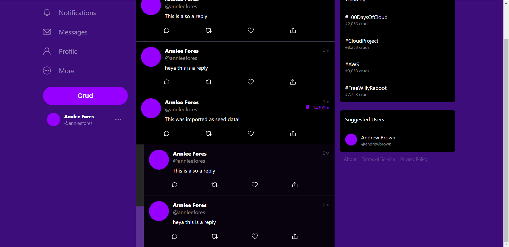
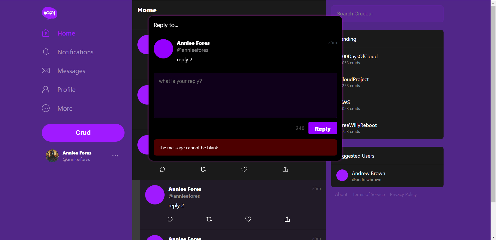
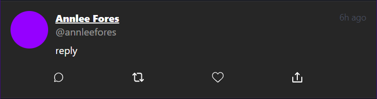
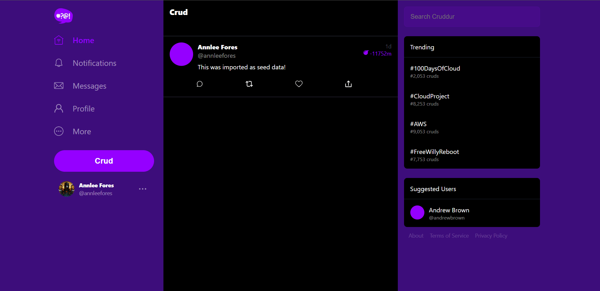
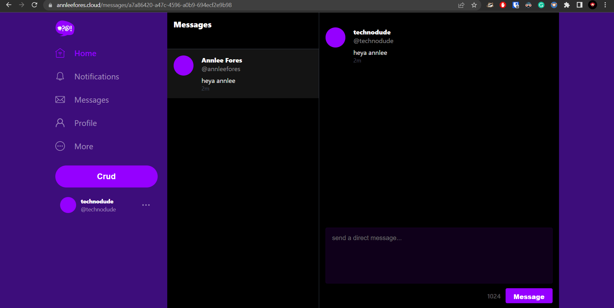

# Week X — Final

## Required Homework

- [Sync tool for static website hosting](#sync-tool-for-static-website-hosting)
- [Reconnect Database and Post Confirmation Lambda](#reconnect-database-and-post-confirmation-lambda)
- [Use CORS for Service](#use-cors-for-service)
- [CICD Pipeline and Create Activity](#cicd-pipeline-and-create-activity)
- [Refactor JWT to use a decorator](#refactor-jwt-to-use-a-decorator)
- [Refactor AppPy](#refactor-apppy)
- [Refactor Flask Routes](#refactor-flask-routes)
- [Replies Work In Progress](#replies-work-in-progress)
- [Refactor Error Handling and Fetch Requests](#refactor-error-handling-and-fetch-requests)
- [Activity Show Page](#activity-show-page)
- [Week-X Cleanup](#week-x-cleanup)
- [Cleanup Part 2](#cleanup-part-2)

## Homework Challenges

- [GitHub Actions Frontend Sync](#github-actions-frontend-sync)
- [Cruddur Frontend 2.0 - NextJS, Tailwind, Typescript](#cruddur-frontend-20---nextjs-tailwind-typescript)

---

## Required Homework

### Sync tool for static website hosting

#### Setting up frontend build

Create a static build bash script for frontend and chmod it  

```bash
#! /usr/bin/bash

ABS_FILEPATH="$ABS_PATH/frontend-react-js/"
DIR=$(realpath --relative-base="$PWD" "$ABS_FILEPATH")

cd $DIR

npm run build
```

Create a file named `.env.production` within the frontend directory and include all the environment variables specific to the frontend.

Execute the build script to generate a production build of the React app with the embedded environment variables.

#### Upload Build Files to CloudFront S3 Bucket

- Upload the build files to the bucket associated with the root domain.
- Visit the domain to access and view the static frontend website.

#### S3 Sync Tool

Create a file named `sync` within the `bin/frontend` directory.

```bash
#!/usr/bin/env ruby

require 'aws_s3_website_sync'
require 'dotenv'

env_path = File.expand_path('../../../sync.env', __FILE__)
Dotenv.load(env_path)

puts ">>> configuration <<<"
puts "aws_default_region:      #{ENV["AWS_DEFAULT_REGION"]}"
puts "s3_bucket:               #{ENV["SYNC_S3_BUCKET"]}"
puts "distribution_id:         #{ENV["SYNC_CLOUDFRONT_DISTRUBTION_ID"]}"
puts "build_dir:               #{ENV["SYNC_BUILD_DIR"]}"

changeset_path = ENV["SYNC_OUTPUT_CHANGESET_PATH"]
changeset_path = changeset_path.sub(".json","-#{Time.now.to_i}.json")

puts "output_changset_path: #{changeset_path}"
puts "auto_approve:         #{ENV["SYNC_AUTO_APPROVE"]}"

puts "sync =="
AwsS3WebsiteSync::Runner.run(
  aws_access_key_id:     ENV["AWS_ACCESS_KEY_ID"],
  aws_secret_access_key: ENV["AWS_SECRET_ACCESS_KEY"],
  aws_default_region:    ENV["AWS_DEFAULT_REGION"],
  s3_bucket:             ENV["SYNC_S3_BUCKET"],
  distribution_id:       ENV["SYNC_CLOUDFRONT_DISTRUBTION_ID"],
  build_dir:             ENV["SYNC_BUILD_DIR"],
  output_changset_path:  changeset_path,
  auto_approve:          ENV["SYNC_AUTO_APPROVE"],
  silent: "ignore,no_change",
  ignore_files: [
    'stylesheets/index',
    'android-chrome-192x192.png',
    'android-chrome-256x256.png',
    'apple-touch-icon-precomposed.png',
    'apple-touch-icon.png',
    'site.webmanifest',
    'error.html',
    'favicon-16x16.png',
    'favicon-32x32.png',
    'favicon.ico',
    'robots.txt',
    'safari-pinned-tab.svg'
  ]
)
```

Install the required dependency by executing the command `gem install aws_s3_website_sync dotenv`.

Create a new erb file named `sync.env.erb` to generate the environment variables.

```toml
SYNC_S3_BUCKET=
SYNC_CLOUDFRONT_DISTRUBTION_ID=
SYNC_BUILD_DIR=<%= ENV['THEIA_WORKSPACE_ROOT'] %>/frontend-react-js/build
SYNC_OUTPUT_CHANGESET_PATH=<%=  ENV['THEIA_WORKSPACE_ROOT'] %>/tmp/sync-changeset.json
SYNC_AUTO_APPROVE=false
```

Add this to the `frontend generate-env` script.

```ruby
template = File.read 'erb/sync.env.erb'
content = ERB.new(template).result(binding)
filename = "sync.env"
File.write(filename, content)
```

Run the script to generate the `sync.env` file in the root directory.

Execute the static-build script, followed by the sync script. Confirm the upload of the contents to S3 and the invalidation of the CloudFront cache.

#### GitHub Action CICD - Frontend

Create two files, Gemfile and Rakefile, in the root of the project.

- Gemfile

```ruby
source 'https://rubygems.org'

git_source(:github) do |repo_name|
  repo_name = "#{repo_name}/#{repo_name}" unless repo_name.include?("/")
  "https://github.com/#{repo_name}.git"
end

gem 'rake'
gem 'aws_s3_website_sync', tag: '1.0.1'
gem 'dotenv', groups: [:development, :test]
```

- Rakefile

```ruby
require 'aws_s3_website_sync'
require 'dotenv'

task :sync do
  puts "sync =="
  AwsS3WebsiteSync::Runner.run(
    aws_access_key_id:     ENV["AWS_ACCESS_KEY_ID"],
    aws_secret_access_key: ENV["AWS_SECRET_ACCESS_KEY"],
    aws_default_region:    ENV["AWS_DEFAULT_REGION"],
    s3_bucket:             ENV["S3_BUCKET"],
    distribution_id:       ENV["CLOUDFRONT_DISTRUBTION_ID"],
    build_dir:             ENV["BUILD_DIR"],
    output_changset_path:  ENV["OUTPUT_CHANGESET_PATH"],
    auto_approve:          ENV["AUTO_APPROVE"],
    silent: "ignore,no_change",
    ignore_files: [
      'stylesheets/index',
      'android-chrome-192x192.png',
      'android-chrome-256x256.png',
      'apple-touch-icon-precomposed.png',
      'apple-touch-icon.png',
      'site.webmanifest',
      'error.html',
      'favicon-16x16.png',
      'favicon-32x32.png',
      'favicon.ico',
      'robots.txt',
      'safari-pinned-tab.svg'
    ]
  )
end
```

Create a directory named `.github/workflows`. Inside this directory, create a YAML file called `sync.yaml`.

```yaml
name: Sync-Prod-Frontend

on:
  push:
    branches: [prod]
  pull_request:
    branches: [prod]

jobs:
  build:
    name: Statically Build Files
    runs-on: ubuntu-latest
    strategy:
      matrix:
        node-version: [18.x]
    steps:
      - uses: actions/checkout@v3
      - name: Use Node.js ${{ matrix.node-version }}
        uses: actions/setup-node@v3
        with:
          node-version: ${{ matrix.node-version }}
      - run: cd frontend-react-js
      - run: npm ci
      - run: npm run build
  deploy:
    name: Sync Static Build to S3 Bucket
    runs-on: ubuntu-latest
    # These permissions are needed to interact with GitHub's OIDC Token endpoint.
    permissions:
      id-token: write
      contents: read
    steps:
      - name: Checkout
        uses: actions/checkout@v3
      - name: Configure AWS credentials from Test account
        uses: aws-actions/configure-aws-credentials@v2
        with:
          role-to-assume: arn:aws:iam::<AWS_ACCOUNT_ID>:role/CrdSyncRole-Role-15HSTGN6QSC9D
          aws-region: us-east-1
      - uses: actions/checkout@v3
      - name: Set up Ruby
        uses: ruby/setup-ruby@ec02537da5712d66d4d50a0f33b7eb52773b5ed1
        with:
          ruby-version: "3.1"
      - name: Install dependencies
        run: bundle install
      - name: Run tests
        run: bundle exec rake sync
```

Create a CloudFormation (CFN) template to deploy the necessary permissions and other resources required to establish the connection between GitHub actions and AWS.

Create two files, `aws/cfn/sync/template.yaml` and `config.toml`.

```yaml
AWSTemplateFormatVersion: 2010-09-09
Parameters:
  GitHubOrg:
    Description: Name of GitHub organization/user (case sensitive)
    Type: String
  RepositoryName:
    Description: Name of GitHub repository (case sensitive)
    Type: String
    Default: 'aws-bootcamp-cruddur-2023'
  OIDCProviderArn:
    Description: Arn for the GitHub OIDC Provider.
    Default: ""
    Type: String
  OIDCAudience:
    Description: Audience supplied to configure-aws-credentials.
    Default: "sts.amazonaws.com"
    Type: String

Conditions:
  CreateOIDCProvider: !Equals 
    - !Ref OIDCProviderArn
    - ""

Resources:
  Role:
    Type: AWS::IAM::Role
    Properties:
      AssumeRolePolicyDocument:
        Statement:
          - Effect: Allow
            Action: sts:AssumeRoleWithWebIdentity
            Principal:
              Federated: !If 
                - CreateOIDCProvider
                - !Ref GithubOidc
                - !Ref OIDCProviderArn
            Condition:
              StringEquals:
                token.actions.githubusercontent.com:aud: !Ref OIDCAudience
              StringLike:
                token.actions.githubusercontent.com:sub: !Sub repo:${GitHubOrg}/${RepositoryName}:*

  GithubOidc:
    Type: AWS::IAM::OIDCProvider
    Condition: CreateOIDCProvider
    Properties:
      Url: https://token.actions.githubusercontent.com
      ClientIdList: 
        - sts.amazonaws.com
      ThumbprintList:
        - 6938fd4d98bab03faadb97b34396831e3780aea1

Outputs:
  Role:
    Value: !GetAtt Role.Arn
```

```toml
[deploy]
bucket = ''
region = ''
stack_name = 'CrdSyncRole'

[parameters]
GitHubOrg = ''
RepositoryName = 'aws-bootcamp-cruddur-2023'
OIDCProviderArn = ''
```

Create a script to deploy this template

```bash
#! /usr/bin/bash

set -e # stop execution if anything fails

abs_template_filepath="$ABS_PATH/aws/cfn/sync/template.yaml"
TemplateFilePath=$(realpath --relative-base="$PWD" "$abs_template_filepath")

abs_config_filepath="$ABS_PATH/aws/cfn/sync/config.toml"
ConfigFilePath=$(realpath --relative-base="$PWD" "$abs_config_filepath")

BUCKET=$(cfn-toml key deploy.bucket -t $ConfigFilePath)
REGION=$(cfn-toml key deploy.region -t $ConfigFilePath)
STACK_NAME=$(cfn-toml key deploy.stack_name -t $ConfigFilePath)
PARAMETERS=$(cfn-toml params v2 -t $ConfigFilePath)

cfn-lint $TemplateFilePath

aws cloudformation deploy \
  --stack-name "$STACK_NAME" \
  --s3-bucket "$BUCKET" \
  --s3-prefix sync \
  --region $REGION \
  --template-file $TemplateFilePath \
  --no-execute-changeset \
  --tags group=cruddur-sync \
  --parameter-overrides $PARAMETERS \
  --capabilities CAPABILITY_NAMED_IAM
```

Perform `bundle install` or `bundle update --bundler` before proceeding with the stack deployment using `./bin/cfn/sync`.

Update the role-to-assume in the GitHub Action YAML file with the ARN (Amazon Resource Name) of this role.

```json
{
    "Version": "2012-10-17",
    "Statement": [
        {
            "Sid": "VisualEditor0",
            "Effect": "Allow",
            "Action": [
                "s3:PutObject",
                "s3:GetObject",
                "s3:ListBucket",
                "s3:DeleteObject"
            ],
            "Resource": [
                "arn:aws:s3:::annleefores.cloud/*",
                "arn:aws:s3:::annleefores.cloud"
            ]
        }
    ]
}
```

### Reconnect Database and Post Confirmation Lambda

#### Reconnect DB

- Configure the DB URL and update the security group (SG) for the new RDS DB.
- Perform a schema load on the RDS.
- Execute the following command to perform migrations on the production DB:

```
CONNECTION_URL=$PROD_CONNECTION_URL ./bin/db/migrate
```

#### Fix CloudFront distribution for SPA

Update the Distribution resource in the frontend `template.yaml` file to include an error page:

```bash
CustomErrorResponses:
	- ErrorCode: 403
	  ResponseCode: 200
	  ResponsePagePath: /index.html
```

#### Update Post Confirmation Lambda

- Update Connection URL ENV VAR of post confirmation lambda to use the new DB Connection URL
- Update VPC for lambda to use the VPC created for cruddur
    - Choose Public Subnets
    - Go to EC2 Security Group and create a new security group with outbound all rule
    - Go to `CrdDbRdsSG` and add a new inbound rule for PSQL, set source to Post Confirmation lambda SG
    - Update the lambda VPC SG with this new CognitoPostConf SG
    - Wait for the update to finish
- Login and try posting a crud

## Use CORS for Service

Update the service template backend and frontend URLs in `config.toml` to use the exact values with `https://` instead of `*`. Use parameters to specify these values.

Ensure to update the deploy script to include the necessary parameters.

## CICD Pipeline and Create Activity

### Fix Activities user_handle

Update data_activities route

```python
@app.route("/api/activities", methods=["POST", "OPTIONS"])
@cross_origin()
def data_activities():
    claims = request.environ["claims"]
    cognito_user_id = claims["sub"]

    message = request.json["message"]
    ttl = request.json["ttl"]
    model = CreateActivity.run(message, cognito_user_id, ttl)
    if model["errors"] is not None:
        return model["errors"], 422
    else:
        return model["data"], 200
```

Update create_activity service to use cognito_user_id instead of user_handle

```python
from datetime import datetime, timedelta, timezone

from lib.db import db

class CreateActivity:
    def run(message, cognito_user_id, ttl):
        model = {"errors": None, "data": None}

        now = datetime.now(timezone.utc).astimezone()

        if ttl == "30-days":
            ttl_offset = timedelta(days=30)
        elif ttl == "7-days":
            ttl_offset = timedelta(days=7)
        elif ttl == "3-days":
            ttl_offset = timedelta(days=3)
        elif ttl == "1-day":
            ttl_offset = timedelta(days=1)
        elif ttl == "12-hours":
            ttl_offset = timedelta(hours=12)
        elif ttl == "3-hours":
            ttl_offset = timedelta(hours=3)
        elif ttl == "1-hour":
            ttl_offset = timedelta(hours=1)
        else:
            model["errors"] = ["ttl_blank"]

        if cognito_user_id == None or len(cognito_user_id) < 1:
            model["errors"] = ["cognito_user_id_blank"]

        if message == None or len(message) < 1:
            model["errors"] = ["message_blank"]
        elif len(message) > 280:
            model["errors"] = ["message_exceed_max_chars"]

        if model["errors"]:
            model["data"] = {"cognito_user_id": cognito_user_id, "message": message}
        else:
            expires_at = now + ttl_offset
            uuid = CreateActivity.create_activity(cognito_user_id, message, expires_at)

            object_json = CreateActivity.query_object_activity(uuid)
            model["data"] = object_json
        return model

    def create_activity(cognito_user_id, message, expires_at):
        sql = db.template("activities", "create")
        uuid = db.query_commit(
            sql,
            {
                "cognito_user_id": cognito_user_id,
                "message": message,
                "expires_at": expires_at,
            },
        )
        return uuid

    def query_object_activity(uuid):
        sql = db.template("activities", "object")
        return db.query_object_json(sql, {"uuid": uuid})
```

Update `backend-flask/db/sql/activities/create.sql` also to use `cognito_user_id` instead of user_handle

Do a `./bin/db/setup` to update changes in DB

In real we should have different cognito user pool for prod and dev

### Fix CFN CICD Template

Delete old pipeline implementation

Update codebuild nested stack output

```yaml
Outputs:
  CodeBuildProjectName:
    Description: "CodeBuildProjectName"
    Value: !Ref CodeBuild
```

Add `codebuild:BatchGetBuilds` to codebuild permissions in template.yaml

Add this permission to both pipeline template and codebuild template

```yaml
- PolicyName: !Sub ${AWS::StackName}S3ArtifactsAccess
	  PolicyDocument:
	    Version: '2012-10-17'
	    Statement:
	      - Action:
	        - s3:*
	        Effect: Allow
	        Resource:
	        - !Sub arn:aws:s3:::${ArtifactBucketName}
	        - !Sub arn:aws:s3:::${ArtifactBucketName}/*
```

Pass parameter from main template to codebuild template by adding this in properties referencing nested stack

```yaml
Parameters:
  ArtifactBucketName: !Ref ArtifactBucketName
```

Add this parameter in codebuild template

```yaml
ArtifactBucketName:
   Type: String
```

Specify buildspec file like this `backend-flask/buildspec.yml`

## Refactor JWT to use a decorator

### Reply Closing

To enable closing reply form add this function to `frontend-react-js/src/components/ReplyForm.js`

```jsx
const close = (event) => {
    if (event.target.classList.contains("reply_popup")) {
      props.setPopped(false);
    }
  };
```

Add close function to the html

```jsx
<div className="popup_form_wrap reply_popup" onClick={close}>
```

### JWT Auth decorator

Add this to the end of `backend-flask/lib/cognito_jwt_token.py`

```python
from functools import wraps, partial
from flask import request, g

def jwt_required(f=None, on_error=None):
    if f is None:
        return partial(jwt_required, on_error=on_error)

    @wraps(f)
    def decorated_function(*args, **kwargs):
        cognito_jwt_token = CognitoJwtToken(
            user_pool_id=os.getenv("AWS_COGNITO_USER_POOL_ID"), 
            user_pool_client_id=os.getenv("AWS_COGNITO_USER_POOL_CLIENT_ID"),
            region=os.getenv("AWS_DEFAULT_REGION")
        )
        access_token = extract_access_token(request.headers)
        try:
            claims = cognito_jwt_token.verify(access_token)
            # is this a bad idea using a global?
            g.cognito_user_id = claims['sub']  # storing the user_id in the global g object
        except TokenVerifyError as e:
            # unauthenticated request
            app.logger.debug(e)
            if on_error:
                return on_error(e)
            return {}, 401
        return f(*args, **kwargs)
    return decorated_function
```

In app.py

```python
from lib.cognito_jwt_token import jwt_required
from flask import request, g
```

Update home route like this

```python
@app.route("/api/activities/home", methods=["GET"])
@jwt_required(on_error=default_home_feed)
def data_home():
    data = HomeActivities.run(cognito_user_id=g.cognito_user_id)
    return data, 200
```

Similarly replace all jwt call in other routes with decorator

## Refactor AppPy

Use this function to refactor model error checking

```python
def model_json(model):
    if model["errors"] is not None:
        return model["errors"], 422
    else:
        return model["data"], 200
```

Refactor rollbar specific files into this file `backend-flask/lib/rollbar.py`

```python
from flask import got_request_exception
from time import strftime
import os
import rollbar
import rollbar.contrib.flask

def init_rollbar(app):
  rollbar_access_token = os.getenv('ROLLBAR_ACCESS_TOKEN')
  rollbar.init(
      # access token
      rollbar_access_token,
      # environment name
      'production',
      # server root directory, makes tracebacks prettier
      root=os.path.dirname(os.path.realpath(__file__)),
      # flask already sets up logging
      allow_logging_basic_config=False)
  # send exceptions from `app` to rollbar, using flask's signal system.
  got_request_exception.connect(rollbar.contrib.flask.report_exception, app)
  return rollbar
```

For xray specific code `backend-flask/lib/xray.py`

```python
import os
from aws_xray_sdk.core import xray_recorder
from aws_xray_sdk.ext.flask.middleware import XRayMiddleware

def init_xray(app):
    xray_url = os.getenv("AWS_XRAY_URL")
    xray_recorder.configure(service="backend-flask", dynamic_naming=xray_url)
    XRayMiddleware(app, xray_recorder)
```

## Refactor Flask Routes

Create `backend-flask/routes`

Create `activities.py`

```python
## flask
from flask import request, g

## decorators
from aws_xray_sdk.core import xray_recorder
from lib.cognito_jwt_token import jwt_required
from flask_cors import cross_origin

## services
from services.home_activities import *
from services.notifications_activities import *
from services.create_activity import *
from services.search_activities import *
from services.show_activity import *
from services.create_reply import *

## helpers
from lib.helpers import model_json

def load(app):
  def default_home_feed(e):
    app.logger.debug(e)
    app.logger.debug("unauthenicated")
    data = HomeActivities.run()
    return data, 200

  @app.route("/api/activities/home", methods=['GET'])
  #@xray_recorder.capture('activities_home')
  @jwt_required(on_error=default_home_feed)
  def data_home():
    data = HomeActivities.run(cognito_user_id=g.cognito_user_id)
    return data, 200

  @app.route("/api/activities/notifications", methods=['GET'])
  def data_notifications():
    data = NotificationsActivities.run()
    return data, 200

  @app.route("/api/activities/search", methods=['GET'])
  def data_search():
    term = request.args.get('term')
    model = SearchActivities.run(term)
    return model_json(model)

  @app.route("/api/activities", methods=['POST','OPTIONS'])
  @cross_origin()
  @jwt_required()
  def data_activities():
    message = request.json['message']
    ttl = request.json['ttl']
    model = CreateActivity.run(message, g.cognito_user_id, ttl)
    return model_json(model)

  @app.route("/api/activities/<string:activity_uuid>", methods=['GET'])
  @xray_recorder.capture('activities_show')
  def data_show_activity(activity_uuid):
    data = ShowActivity.run(activity_uuid=activity_uuid)
    return data, 200

  @app.route("/api/activities/<string:activity_uuid>/reply", methods=['POST','OPTIONS'])
  @cross_origin()
  def data_activities_reply(activity_uuid):
    user_handle  = 'andrewbrown'
    message = request.json['message']
    model = CreateReply.run(message, user_handle, activity_uuid)
    return model_json(model)
```

## Replies Work In Progress

Add  Auth token to `ReplyForm.js`

Update message body

```jsx
body: JSON.stringify({
   
```

Convert activity to use cognito_user_id instead of user_handle

Add this create and query function to the end of `backend-flask/services/create_reply.py`

```python
def create_activity(cognito_user_id, activity_uuid, message):
    sql = db.template("activities", "reply")
    uuid = db.query_commit(
        sql,
        {
            "cognito_user_id": cognito_user_id,
            "reply_to_activity_uuid": activity_uuid,
            "message": message,
        },
    )
    return uuid

def query_object_activity(uuid):
    sql = db.template("activities", "object")
    return db.query_object_json(sql, {"uuid": uuid})
```

Update the else statement

```python
else:
    uuid = CreateReply.create_reply(cognito_user_id, message)
    object_json = CreateReply.query_object_activity(uuid)
    model["data"] = object_json
return model
```

Create `backend-flask/db/sql/activities/reply.sql`

```sql
INSERT INTO public.activities (
  user_uuid,
  message,
  reply_to_activity_uuid
)
VALUES (
  (SELECT uuid 
    FROM public.users 
    WHERE users.cognito_user_id = %(cognito_user_id)s
    LIMIT 1
  ),
  %(message)s,
  %(reply_to_activity_uuid)s
) RETURNING uuid;
```

Add this to SELECT in `object.sql`

```sql
activities.reply_to_activity_uuid
```

Create a new migration by running `./bin/generate/migration reply_to_activity_uuid_to_string` and update it

```sql
from lib.db import db

class ReplyToActivityUuidToStringMigration:
    def migrate_sql():
        data = """
    ALTER TABLE activities
    ALTER COLUMN reply_to_activity_uuid TYPE uuid USING reply_to_activity_uuid::uuid;
    """
        return data

    def rollback_sql():
        data = """
    ALTER TABLE activities
    ALTER COLUMN reply_to_activity_uuid TYPE integer USING (reply_to_activity_uuid::integer);
    """
        return data

    def migrate():
        db.query_commit(ReplyToActivityUuidToStringMigration.migrate_sql(), {})

    def rollback():
        db.query_commit(ReplyToActivityUuidToStringMigration.rollback_sql(), {})

migration = ReplyToActivityUuidToStringMigration
```

Run the migration `./bin/db/migrate`

Add this to SELECT in `home.sql`

```sql
(SELECT COALESCE(array_to_json(array_agg(row_to_json(array_row))),'[]'::json) FROM (
  SELECT
    replies.uuid,
    reply_users.display_name,
    reply_users.handle,
    replies.message,
    replies.replies_count,
    replies.reposts_count,
    replies.likes_count,
    replies.reply_to_activity_uuid,
    replies.created_at
  FROM public.activities replies
  LEFT JOIN public.users reply_users ON reply_users.uuid = replies.user_uuid
  WHERE
    replies.reply_to_activity_uuid = activities.uuid
  ORDER BY  activities.created_at ASC
  ) array_row) as replies
```



## Refactor Error Handling and Fetch Requests



## Activity Show Page

### Fix Migration

Update `migrations/<datetime>_reply_to_activity_uuid_to_string.py`

```python
def migrate_sql():
    data = """
ALTER TABLE activities DROP COLUMN reply_to_activity_uuid;
ALTER TABLE activities ADD COLUMN reply_to_activity_uuid uuid;
"""
    return data

def rollback_sql():
    data = """
ALTER TABLE activities DROP COLUMN reply_to_activity_uuid;
ALTER TABLE activities ADD COLUMN reply_to_activity_uuid integer;
"""
    return data
```

### Activity Show Page



## Week-X Cleanup

Add an additional crud seed data to `seed.sql` 

```sql
( (
        SELECT uuid
        from public.users
        WHERE
            users.handle = 'technodude'
        LIMIT
            1
    ), 'I am the other me! ', current_timestamp + interval '10 day'
)
```

Update `db.query_array_json` to `db.query_object_json` in `show_activitiy.py`

Replace `Link` with `useNavigate` in `frontend-react-js/src/components/ActivityItem.js`

```jsx
import './ActivityItem.css';

import { useNavigate  } from "react-router-dom";

export default function ActivityItem(props) {
  const navigate = useNavigate()

  const click = (event) => {
    event.preventDefault()
    const url = `/@${props.activity.handle}/status/${props.activity.uuid}`
    navigate(url)
    return false;
  }

  let expanded_meta;
  if (props.expanded === true) {
    1:56 PM · May 23, 2023
  }

  const attrs = {}
  let item
  if (props.expanded === true) {
    attrs.className = 'activity_item expanded'
  } else {
    attrs.className = 'activity_item clickable'
    attrs.onClick = click
  }
  return (
    <div {...attrs}>
      <div className="acitivty_main">
        <ActivityContent activity={props.activity} />
        {expanded_meta}
        <div className="activity_actions">
          <ActivityActionReply setReplyActivity={props.setReplyActivity} activity={props.activity} setPopped={props.setPopped} activity_uuid={props.activity.uuid} count={props.activity.replies_count}/>
          <ActivityActionRepost activity_uuid={props.activity.uuid} count={props.activity.reposts_count}/>
          <ActivityActionLike activity_uuid={props.activity.uuid} count={props.activity.likes_count}/>
          <ActivityActionShare activity_uuid={props.activity.uuid} />
        </div>
      </div>
    </div>
  )
}
```

Remove unwanted console logs from frontend

Add this `expanded={true}` to `ActivityItem` component in `frontend-react-js/src/pages/ActivityShowPage.js`

Update  `ActivityContent.js`  to 

```jsx
import './ActivityContent.css';

import { Link } from "react-router-dom";
import { format_datetime, time_ago } from '../lib/DateTimeFormats';
import {ReactComponent as BombIcon} from './svg/bomb.svg';

export default function ActivityContent(props) {

  let expires_at;
  if (props.activity.expires_at) {
    expires_at =  <div className="expires_at" title={format_datetime(props.activity.expires_at)}>
                    <BombIcon className='icon' />
                    <span className='ago'>{time_ago(props.activity.expires_at)}</span>
                  </div>

  }

  return (
    <div className='activity_content_wrap'>
      <Link className='activity_avatar'to={`/@`+props.activity.handle} ></Link>
      <div className='activity_content'>
        <div className='activity_meta'>
          <div className='activity_identity' >
            <Link className='display_name' to={`/@`+props.activity.handle}>{props.activity.display_name}</Link>
            <Link className="handle" to={`/@`+props.activity.handle}>@{props.activity.handle}</Link>
          </div>{/* activity_identity */}
          <div className='activity_times'>
            <div className="created_at" title={format_datetime(props.activity.created_at)}>
              <span className='ago'>{time_ago(props.activity.created_at)}</span> 
            </div>
            {expires_at}
          </div>{/* activity_times */}
        </div>{/* activity_meta */}
        <div className="message">{props.activity.message}</div>
      </div>{/* activity_content */}
    </div>
  );
}
```

Update `MessageGroupItem.js`

```jsx
import './MessageGroupItem.css';
import { Link } from "react-router-dom";
import { format_datetime, message_time_ago } from '../lib/DateTimeFormats';
import { useParams } from 'react-router-dom';

export default function MessageGroupItem(props) {
  const params = useParams();

  const classes = () => {
    let classes = ["message_group_item"];
    if (params.message_group_uuid === props.message_group.uuid){
      classes.push('active')
    }
    return classes.join(' ');
  }

  return (
    <Link className={classes()} to={`/messages/`+props.message_group.uuid}>
      <div className='message_group_avatar'></div>
      <div className='message_content'>
        <div classsName='message_group_meta'>
          <div className='message_group_identity'>
            <div className='display_name'>{props.message_group.display_name}</div>
            <div className="handle">@{props.message_group.handle}</div>
          </div>{/* activity_identity */}
        </div>{/* message_meta */}
        <div className="message">{props.message_group.message}</div>
        <div className="created_at" title={format_datetime(props.message_group.created_at)}>
          <span className='ago'>{format_time_created_at(props.message_group.created_at)}</span> 
        </div>{/* created_at */}
      </div>{/* message_content */}
    </Link>
  );
}
```

Update `MessageItem.js`

```jsx
import './MessageItem.css';
import { Link } from "react-router-dom";
import { format_datetime, message_time_ago } from '../lib/DateTimeFormats';

export default function MessageItem(props) {
  return (
    <div className='message_item'>
      <Link className='message_avatar' to={`/messages/@`+props.message.handle}></Link>
      <div className='message_content'>
        <div classsName='message_meta'>
          <div className='message_identity'>
            <div className='display_name'>{props.message.display_name}</div>
            <div className="handle">@{props.message.handle}</div>
          </div>{/* activity_identity */}
        </div>{/* message_meta */}
        <div className="message">{props.message.message}</div>
        <div className="created_at" title={format_datetime(props.message.created_at)}>
          <span className='ago'>{message_time_ago(props.message.created_at)}</span> 
        </div>{/* created_at */}
      </div>{/* message_content */}
    </div>
  );
}
```



## Cleanup Part 2

- Run migration on production DB
- Build and sync frontend to S3 backend
- Pull Request merge to prod branch to trigger a new backend build

### Prod DynamoDB

Update `ddb.py`  env vars to use the new DDB

```python
table_name = os.getenv("DDB_MESSAGE_TABLE")
```

Add this to backend env file

```
DDB_MESSAGE_TABLE=cruddur-messages
```

Add this env var to service template

```yaml
DDBMessageTable:
    Type: String
    Default: cruddur-messages

............
............
Environment:
    - Name: DDB_MESSAGE_TABLE
      Value: !Ref DDBMessageTable
```

Include table name in service config.toml

```toml
DDBMessageTable = '<DDB_TABLE_NAME>'
```

Create a new deployment for stack using CFN

### Create Machine User for DDB

The user that we deploy the application that use AWS creds should never have admin access cause of security concerns. So always make a separate machine user for deployment.

Create `aws/cfn/machine-user/template.yaml`

```yaml
AWSTemplateFormatVersion: '2010-09-09'
Resources:
  CruddurMachineUser:
    Type: 'AWS::IAM::User'
    Properties: 
      UserName: 'cruddur_machine_user'
  DynamoDBFullAccessPolicy: 
    Type: 'AWS::IAM::Policy'
    Properties: 
      PolicyName: 'DynamoDBFullAccessPolicy'
      PolicyDocument:
        Version: '2012-10-17'
        Statement: 
          - Effect: Allow
            Action: 
              - dynamodb:PutItem
              - dynamodb:GetItem
              - dynamodb:Scan
              - dynamodb:Query
              - dynamodb:UpdateItem
              - dynamodb:DeleteItem
              - dynamodb:BatchWriteItem
            Resource: '*'
      Users:
        - !Ref CruddurMachineUser
```

`config.toml`

```toml
[deploy]
bucket = 'cfn-artifacts-annlee'
region = 'us-east-1'
stack_name = 'CrdMachineUser'
```

Create `bin/cfn/machineuser`

```bash
#! /usr/bin/bash

set -e # stop execution if anything fails

abs_template_filepath="$ABS_PATH/aws/cfn/machine-user/template.yaml"
TemplateFilePath=$(realpath --relative-base="$PWD" "$abs_template_filepath")

abs_config_filepath="$ABS_PATH/aws/cfn/machine-user/config.toml"
ConfigFilePath=$(realpath --relative-base="$PWD" "$abs_config_filepath")

BUCKET=$(cfn-toml key deploy.bucket -t $ConfigFilePath)
REGION=$(cfn-toml key deploy.region -t $ConfigFilePath)
STACK_NAME=$(cfn-toml key deploy.stack_name -t $ConfigFilePath)

cfn-lint $TemplateFilePath

echo ">>> Deploy CFN <<<"

aws cloudformation deploy \
  --stack-name "$STACK_NAME" \
  --s3-bucket "$BUCKET" \
  --s3-prefix db \
  --region $REGION \
  --template-file $TemplateFilePath \
  --no-execute-changeset \
  --tags group=cruddur-machine-user \
  --capabilities CAPABILITY_NAMED_IAM
```

Create new Access Key for this user via console

Go to parameter store and update Access Key and ID with new creds

Make a new codepipeline deployment



## Homework Challenges

### GitHub Actions Frontend Sync

Ensure that the CrdSync role CloudFormation (CFN) is deleted. We are not utilizing it in this CI/CD pipeline because the Access credentials returned do not function properly with the sync tool.

Create the `.github/workflows/sync.yml` file.

```yaml
name: Sync-Prod-Frontend

on:
  workflow_dispatch:
  push:
    branches:
      - prod
    paths:
      - "frontend-react-js/**"
  pull_request:
    branches:
      - prod
    paths:
      - "frontend-react-js/**"

jobs:
  build_and_deploy:
    name: Statically build and deploy
    runs-on: ubuntu-latest
    defaults:
      run:
        working-directory: ./frontend-react-js/
    steps:
      - name: checkout branch
        uses: actions/checkout@v3

      - name: Setup Node
        uses: actions/setup-node@v3
        with:
          node-version: 18.x
          cache: "npm"
          cache-dependency-path: ./frontend-react-js/package-lock.json
      - name: Install deps
        run: npm ci
      - name: Build
        run: npm run build --if-present
        env:
          CI: false
          REACT_APP_BACKEND_URL: ${{ secrets.REACT_APP_BACKEND_URL }}
          REACT_APP_FRONTEND_URL: ${{ secrets.REACT_APP_FRONTEND_URL }}
          REACT_APP_AWS_PROJECT_REGION: ${{ secrets.REGION }}
          REACT_APP_AWS_COGNITO_REGION: ${{ secrets.REGION }}
          REACT_APP_AWS_USER_POOLS_ID: ${{ secrets.REACT_APP_AWS_USER_POOLS_ID }}
          REACT_APP_CLIENT_ID: ${{ secrets.REACT_APP_CLIENT_ID }}
          REACT_APP_API_GATEWAY_ENDPOINT_URL: ${{ secrets.REACT_APP_API_GATEWAY_ENDPOINT_URL }}

      - name: Set up Ruby
        uses: ruby/setup-ruby@v1.150.0
        with:
          ruby-version: "3.0"
          bundler-cache: true
      - name: Install dependencies & Run Sync
        run: |
          cd ..
          export SYNC_BUILD_DIR="$(pwd)/${{ vars.SYNC_BUILD_DIR }}"
          export SYNC_OUTPUT_CHANGESET_PATH="$(pwd)/${{ vars.SYNC_OUTPUT_CHANGESET_PATH }}"
          bundle install
          bundle exec rake sync
        env:
          AWS_REGION: ${{ secrets.REGION }}
          AWS_ACCESS_KEY_ID: ${{ secrets.AWS_ACCESS_KEY_ID }}
          AWS_SECRET_ACCESS_KEY: ${{ secrets.AWS_SECRET_ACCESS_KEY }}
          SYNC_S3_BUCKET: ${{ vars.SYNC_S3_BUCKET }}
          SYNC_CLOUDFRONT_DISTRUBTION_ID: ${{ vars.SYNC_CLOUDFRONT_DISTRUBTION_ID }}
          SYNC_AUTO_APPROVE: ${{ vars.SYNC_AUTO_APPROVE }}
```

The `working-directory: ./frontend-react-js` directive is used to set the default path for all run commands.

Please note that this configuration will only impact the `run` steps in your job. If you are utilizing third-party actions, you may need to separately set the working directory for those actions by passing the appropriate input parameter. For instance, if you are using the `actions/checkout@v2` action, you can set the working directory as shown below:

```yaml
steps:
- uses: actions/checkout@v3
- uses: actions/setup-node@v3
  with:
    node-version: 18
    working-directory: frontend-react-js
- run: npm ci
- run: npm test
```

Add environment variables for the frontend build to the repository variables:

```
REACT_APP_BACKEND_URL: 
REACT_APP_FRONTEND_URL: 
REACT_APP_AWS_PROJECT_REGION: 
REACT_APP_AWS_COGNITO_REGION: 
REACT_APP_AWS_USER_POOLS_ID: 
REACT_APP_CLIENT_ID: 
REACT_APP_API_GATEWAY_ENDPOINT_URL: 
```

Add an environment variable for sync:

```
SYNC_S3_BUCKET= <root_bucket_name>
SYNC_CLOUDFRONT_DISTRUBTION_ID= <cloudfront_distribution>
SYNC_BUILD_DIR= frontend-react-js/build
SYNC_OUTPUT_CHANGESET_PATH= tmp/sync-changeset.json
SYNC_AUTO_APPROVE= true
```

To push a file to S3, you need to add the following permissions to the `machine_user` CloudFormation (CFN):

```yaml
S3FullAccessPolicy: 
    Type: 'AWS::IAM::Policy'
    Properties: 
      PolicyName: 'S3_Machine_User_AccessPolicy'
      PolicyDocument:
        Version: '2012-10-17'
        Statement: 
          - Effect: Allow
            Action: 
              - s3:PutObject
              - s3:GetObject
              - s3:ListBucket
              - s3:DeleteObject
            Resource:
              - arn:aws:s3:::annleefores.cloud/*
              - arn:aws:s3:::annleefores.cloud
      Users:
        - !Ref CruddurMachineUser
```

For invalidating CloudFront, add the following permission to the `machine_user` CloudFormation (CFN) and deploy:

```yaml
CloudFrontAccessPolicy: 
    Type: 'AWS::IAM::Policy'
    Properties: 
      PolicyName: 'Cloudfront_Machine_User_AccessPolicy'
      PolicyDocument:
        Version: '2012-10-17'
        Statement: 
          - Effect: Allow
            Action: 
              - cloudfront:CreateInvalidation
            Resource:
              - !Sub arn:aws:cloudfront::${AWS::AccountId}:distribution/${DistributionId}
      Users:
        - !Ref CruddurMachineUser
```

Save the `machine_user` access credentials to GitHub repository secrets. These credentials will be used to configure services via GitHub Actions.

### Cruddur Frontend 2.0 - NextJS, Tailwind, Typescript

<video src="media/weekx/frontend-2-video.mp4" controls title="Title"></video>

Cruddur is an application that required a revamped UI with additional features like commenting, liking posts, and fetching data from the backend. I created this new UI for Cruddur with the intention of learning the new NextJS app router and improving my skills in TypeScript.

To achieve this, I used various technologies and tools, which are described below.

**Technologies and Libraries Used**

1. **NextJS**: I chose NextJS to take advantage of its app router and server-side rendering capabilities, which improve performance and SEO.
2. **TypeScript**: I used TypeScript to add static typing to my JavaScript codebase, enhancing code quality and maintainability.
3. **TailwindCSS**: TailwindCSS enabled me to quickly style the UI, making it responsive and resembling the design of Twitter.
4. **Axios**: I utilized Axios for making HTTP requests to the backend, enabling smooth data communication between the front-end and server.
5. **State Context**: React context was used to manage global state for user authentication, allowing easy access to user information throughout the app.
6. **Zod Form Validation**: I implemented Zod for form validation, ensuring data integrity and improving the overall user experience.
7. **SWR**: To optimize data fetching, caching, and revalidation, I integrated SWR into the app, which helped reduce unnecessary requests to the backend.

**UI Development**

I started the UI development from scratch, taking inspiration from the original design but making several updates to ensure a responsive and user-friendly interface. My goal was to create a UI that feels similar to Twitter but tailored to Cruddur's specific requirements.

**Backend Modifications**

To accommodate new features like commenting and liking posts, I made changes to the RDS schema and DynamoDB in the backend. Additionally, I added/updated backend routes to handle data retrieval for the new functionalities.

**Deployment Process**

Initially, I attempted to deploy the application using AWS Amplify. However, due to certain limitations and the discovery of inclusivity issues with another service provider, I opted for an alternative solution. Upon Andrew's suggestion, I decided to deploy the app on AWS Lambda and CloudFront using aws-lambda-web-adapter.

**Automating Deployment with Terraform and GitHub Actions**

To streamline the deployment process and ensure consistency, I created a Terraform module that automated the deployment of the NextJS app on Lambda and CloudFront. Additionally, I implemented GitHub Actions for continuous integration and continuous deployment (CICD).

For further insights into the Terraform module and deployment process, I have also written a blog article available here: https://annleefores.com/blog/run-nextjs-on-lambda